# Лекція 1. Еволюція систем управління даними

## Вступ

Сучасний світ неможливо уявити без інформаційних систем, які оперують величезними обсягами даних. Від банківських операцій до соціальних мереж, від медичних записів до інтернет-магазинів — усі ці системи спираються на ефективне зберігання та управління даними. Розуміння того, як розвивалися системи управління даними, допомагає зрозуміти сучасні підходи та технології баз даних.

Основні визначення:

- **База даних (БД)** — організована колекція взаємопов'язаних даних, що зберігаються в комп'ютерній системі та служать для задоволення інформаційних потреб організації.
- **Система управління базами даних (СУБД)** — комплекс програмних засобів, призначених для створення структури нової бази даних, наповнення її змістом, редагування змісту та візуалізації інформації.
- **Дані** — факти, що можуть бути записані та мають неявне значення.
- **Інформація** — оброблені дані, що мають значення та цінність для користувача.

## Історичний розвиток систем обробки даних

### Доісторія комп'ютерної обробки даних (1890-1940 роки)

Перші системи обробки даних з'явилися задовго до комп'ютерів. У 1890 році Герман Холлеріт створив систему табулювання на основі перфокарт для перепису населення США. Ця система вже містила базові принципи систематизованого зберігання та обробки інформації.

**Основні характеристики періоду:**

- Механічні пристрої для обробки інформації
- Перфокарти як носії інформації
- Обмежені можливості пошуку та аналізу даних

### Ера мейнфреймів та файлових систем (1950-1960 роки)

З появою перших комп'ютерів виникла необхідність в електронному зберіганні даних. Початкові системи були орієнтовані на обробку окремих завдань і використовували прості файлові структури.

#### Характеристики файлових систем того періоду

**1. Централізована обробка**
Усі дані оброблялися на центральному комп'ютері (мейнфреймі), який обслуговував кілька терміналів. Користувачі не мали прямого доступу до файлів — усі операції виконувалися через спеціалізовані програми.

**2. Орієнтованість на конкретні застосування**
Кожна програма мала власні файли даних, структура яких була тісно пов'язана з логікою конкретного застосування.

**Приклад структури файлової системи 1960-х років:**

```
PAYROLL_SYSTEM/
├── EMPLOYEES.DAT      (дані про співробітників)
├── DEPARTMENTS.DAT    (дані про відділи)
├── SALARIES.DAT       (дані про зарплати)
└── REPORTS.DAT        (звіти)

INVENTORY_SYSTEM/
├── PRODUCTS.DAT       (дані про товари)
├── SUPPLIERS.DAT      (дані про постачальників)
├── ORDERS.DAT         (дані про замовлення)
└── STOCK.DAT         (залишки на складі)
```

**3. Послідовний доступ**
Більшість файлів зберігалися на магнітних стрічках, що обумовлювало послідовний доступ до даних. Для отримання запису посередині файлу потрібно було прочитати всі попередні записи.

**4. Пакетна обробка**
Дані оброблялися в пакетному режимі — накопичувалися протягом дня, а потім оброблялися вночі одним великим завданням.

### Перехід до дискового зберігання (1960-ті роки)

Поява жорстких дисків революціонізувала зберігання даних, надавши можливість прямого доступу до будь-якого запису.

**Основні переваги дискового зберігання:**

- Швидкий доступ до довільного запису
- Можливість оновлення даних на місці
- Інтерактивна робота з даними

**Перші системи управління файлами:**

- IBM ISAM (Indexed Sequential Access Method)
- Burroughs B5000 Master Control Program
- UNIVAC File Management System

### Виникнення мережевих та ієрархічних моделей (1960-1970 роки)

#### Ієрархічна модель

Перша спроба структуризації даних на логічному рівні. Дані організовувалися у вигляді дерева з кореневим елементом на вершині.

**Приклад ієрархічної структури для університету:**

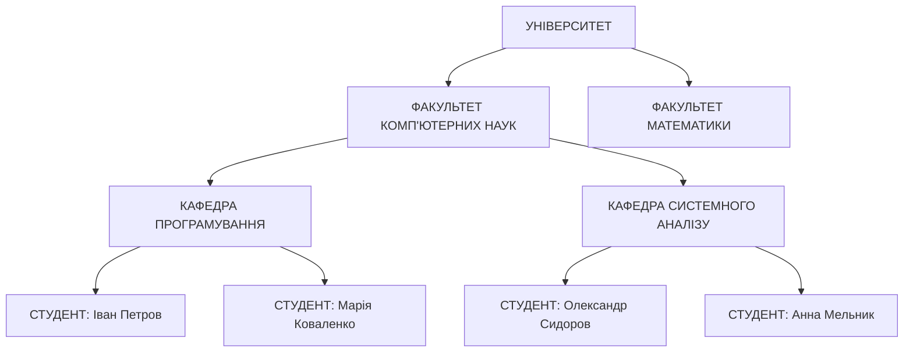

**Переваги ієрархічної моделі:**

- Швидкий доступ по ієрархічному шляху
- Природна для багатьох предметних областей
- Ефективне використання пам'яті

**Недоліки:**

- Складність представлення зв'язків "багато-до-багатьох"
- Жорстка структура, складна для модифікації
- Дублювання даних при наявності різних ієрархій

**Представник:** IBM IMS (Information Management System), 1968 рік

#### Мережева модель

Розроблена групою CODASYL (Conference on Data Systems Languages) у 1969 році як розширення ієрархічної моделі для підтримки складніших зв'язків.

**Приклад мережевої структури:**

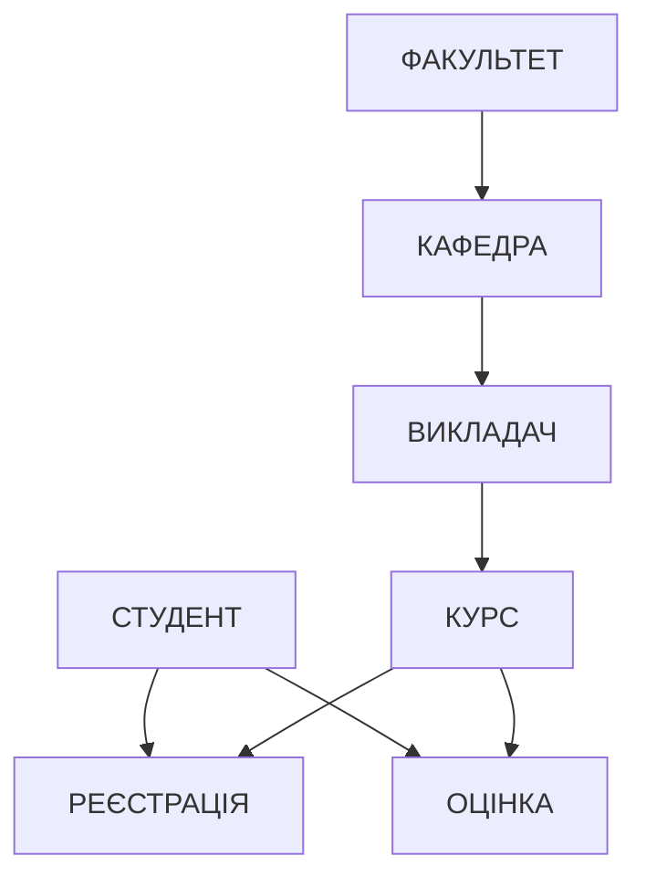

**Переваги мережевої моделі:**

- Підтримка складних зв'язків між сутностями
- Менше дублювання даних порівняно з ієрархічною моделлю
- Більша гнучкість у структуруванні даних

**Недоліки:**

- Складність навігації по мережі зв'язків
- Необхідність знання фізичної структури для програмування
- Складність адміністрування

**Представник:** IDMS (Integrated Database Management System) від Cullinet

### Реляційна революція (1970 рік)

У червні 1970 року Едгар Кодд з IBM Research опублікував статтю "A Relational Model of Data for Large Shared Data Banks", яка заклала основи реляційної моделі даних.

#### Ключові ідеї Кодда

**1. Математична основа**
Реляційна модель базувалася на теорії множин та реляційній алгебрі, що забезпечувало її математичну строгість.

**2. Логічна та фізична незалежність**
Користувач мав справу з логічною структурою даних, не турбуючись про фізичну організацію зберігання.

**3. Декларативний підхід**
Замість опису того, "як" отримати дані, користувач описував, "які" дані потрібні.

#### Основні принципи реляційної моделі

**1. Таблична організація**
Усі дані представляються у вигляді таблиць (відношень), де кожен рядок — це запис (кортеж), а кожен стовпець — атрибут.

**Приклад таблиці СТУДЕНТИ:**

| student_id | name      | surname   | group_name | email                   |
| ---------- | --------- | --------- | ---------- | ----------------------- |
| 1001       | Іван      | Петров    | КН-21      | ivan.petrov@email.com   |
| 1002       | Марія     | Коваленко | КН-21      | maria.kovalen@email.com |
| 1003       | Олександр | Сидоров   | КН-22      | alex.sidorov@email.com  |

**2. Атомарність значень**
Кожна комірка таблиці містить атомарне (неподільне) значення.

**3. Унікальність рядків**
Кожен рядок у таблиці є унікальним.

**4. Невпорядкованість**
Рядки та стовпці не мають визначеного порядку.

#### 12 правил Кодда

Пізніше, у 1985 році, Едгар Кодд сформулював 12 правил, яким має відповідати справжня реляційна СУБД:

**Правило 0:** Система повинна кваліфікуватися як реляційна, база даних і система управління.

**Правило 1 (Правило інформації):** Уся інформація в реляційній базі даних представлена виключно значеннями в таблицях.

**Правило 2 (Правило гарантованого доступу):** Кожне атомарне значення даних має бути логічно доступним через комбінацію назви таблиці, первинного ключа та назви стовпця.

**Правило 3 (Систематичне оброблення null-значень):** Null-значення повинні оброблятися систематично як "невідома інформація", незалежно від типу даних.

**Правило 4 (Динамічний онлайн-каталог):** Опис бази даних має зберігатися на логічному рівні як звичайні дані.

**Правило 5 (Повнота підмови даних):** Має існувати принаймні одна мова, що підтримує визначення даних, маніпулювання даними, обмеження безпеки і цілісності.

**Правило 6 (Правило оновлення представлень):** Усі представлення, які теоретично можна оновлювати, мають підтримувати оновлення системою.

**Правило 7 (Вставка, оновлення та видалення на високому рівні):** Можливість обробляти базовий набір відношень як єдиний операнд застосовується не тільки до витяження даних, але й до операцій вставки, оновлення та видалення.

**Правило 8 (Фізична незалежність даних):** Програми користувачів і термінальні активності залишаються логічно незмінними при будь-яких змінах способів зберігання або методів доступу.

**Правило 9 (Логічна незалежність даних):** Програми користувачів і термінальні активності залишаються логічно незмінними при внесенні в базові таблиці змін, що зберігають інформацію.

**Правило 10 (Незалежність цілісності):** Обмеження цілісності мають визначатися в каталозі бази даних, а не в програмах користувача.

**Правило 11 (Незалежність розподілу):** Мова маніпулювання даними системи не повинна залежати від того, чи розподілена база даних, чи ні.

**Правило 12 (Правило неруйнування):** Якщо система має мову низького рівня, то ця мова не повинна порушувати або обходити правила та обмеження цілісності.

### Розвиток комерційних СУБД (1970-1980 роки)

#### System R (IBM, 1974-1979)

Перший серйозний прототип реляційної СУБД, розроблений в IBM San Jose Research Laboratory.

**Ключові досягнення System R:**

- Перша реалізація SQL (тоді SEQUEL — Structured English Query Language)
- Алгоритм оптимізації запитів
- Система контролю паралельного доступу
- Механізм відновлення після збоїв

#### Ingres (University of California, Berkeley, 1973-1985)

Академічний проєкт під керівництвом Майкла Стоунбрейкера, який став основою для багатьох комерційних СУБД.

**Особливості Ingres:**

- Власна мова запитів QUEL
- Концепція представлень з можливістю оновлення
- Розподілена обробка запитів

#### Перші комерційні СУБД

**Oracle (1979):** Перша комерційна SQL СУБД, випередила IBM у виході на ринок.

**IBM DB2 (1982):** Комерційна версія System R для мейнфреймів.

**Ingres (1982):** Комерційна версія університетського прототипу.

## Проблеми файлово-орієнтованих систем

Перш ніж розглянути переваги сучасних СУБД, важливо зрозуміти, які проблеми виникали при використанні файлових систем для зберігання даних.

### 1. Надмірність даних (Data Redundancy)

#### Суть проблеми

У файлово-орієнтованих системах одна й та сама інформація часто зберігалася в кількох різних файлах, що призводило до дублювання даних.

**Приклад дублювання в корпоративній системі:**

```
ФАЙЛ: EMPLOYEES.DAT
+---------+----------+-----------+------------+
| emp_id  | name     | dept_name | dept_phone |
+---------+----------+-----------+------------+
| E001    | Петров І.| ІТ Відділ | 555-1234   |
| E002    | Іваненко | ІТ Відділ | 555-1234   |
| E003    | Коваленко| Маркетинг | 555-5678   |
+---------+----------+-----------+------------+

ФАЙЛ: DEPARTMENTS.DAT
+-----------+----------+------------+----------+
| dept_name | manager  | dept_phone | budget   |
+-----------+----------+------------+----------+
| ІТ Відділ | Сидоров  | 555-1234   | 500000   |
| Маркетинг | Петренко | 555-5678   | 300000   |
+-----------+----------+------------+----------+
```

У цьому прикладі назва відділу та телефон зберігаються в обох файлах, що створює надмірність.

#### Наслідки надмірності

**1. Марнотратство простору**

- Збільшення об'єму дискового простору
- Зростання вартості зберігання даних
- Уповільнення операцій резервного копіювання

**2. Проблеми з оновленням**

- Необхідність оновлювати дані в кількох місцях
- Ризик виникнення неузгодженості
- Збільшення часу на обслуговування

**3. Складність супроводу**

- Потреба відстежувати всі місця зберігання даних
- Ускладнення процедур перевірки цілісності
- Збільшення імовірності помилок

### 2. Залежність від структури файлів

#### Проблема тісного зв'язку

У файлових системах програми були тісно пов'язані з фізичною структурою файлів. Будь-яка зміна в структурі файлу вимагала модифікації всіх програм, які з ним працювали.

**Приклад коду програми на COBOL (1960-ті роки):**

```cobol
01 EMPLOYEE-RECORD.
   05 EMP-ID          PIC X(5).
   05 EMP-NAME        PIC X(30).
   05 EMP-SALARY      PIC 9(7)V99.
   05 DEPT-CODE       PIC X(3).

PROCEDURE DIVISION.
READ-EMPLOYEE.
    READ EMPLOYEE-FILE
        AT END MOVE 'Y' TO EOF-FLAG
        NOT AT END PERFORM PROCESS-EMPLOYEE.
```

Якщо потрібно було додати поле "дата прийняття на роботу", доводилося:
1. Змінити структуру запису
2. Модифікувати всі програми
3. Конвертувати існуючі дані
4. Перекомпілювати та перетестувати всі програми

#### Наслідки тісного зв'язку

**1. Висока вартість змін**

- Тривалий цикл розробки модифікацій
- Необхідність координації між різними командами
- Ризик внесення помилок у діючі програми

**2. Обмежена гнучкість**

- Складність адаптації до нових вимог бізнесу
- Неможливість швидкого додавання нової функціональності
- Залежність від програмістів при простих змінах

### 3. Складності інтеграції даних

#### Проблема ізольованих систем

Кожна програма мала власні файли даних, що створювало "острови інформації". Інтеграція даних з різних систем була складним та трудомістким процесом.

**Приклад проблеми інтеграції:**

```
СИСТЕМА КАДРІВ:          СИСТЕМА ЗАРПЛАТИ:        СИСТЕМА ПРОЄКТІВ:
employee.dat             payroll.dat              projects.dat
├── emp_code             ├── employee_num         ├── worker_id
├── full_name            ├── emp_name             ├── person_name
├── position             ├── position             ├── role
└── hire_date            ├── salary               └── project_code
                         └── bonus
```

Для створення звіту про зайнятість співробітників у проєктах потрібно було:
1. Вручну встановити відповідність між ключами (emp_code, employee_num, worker_id)
2. Написати спеціальну програму для зведення даних
3. Розв'язувати конфлікти в різних представленнях тих самих даних

#### Наслідки відсутності інтеграції

**1. Аналітичні складності**

- Неможливість створення комплексних звітів
- Складність отримання цілісної картини бізнес-процесів
- Дублювання аналітичних зусиль

**2. Операційні проблеми**

- Неузгодженість даних між системами
- Складність синхронізації оновлень
- Затримки в отриманні актуальної інформації

### 4. Проблеми безпеки та доступу

#### Обмежені механізми контролю доступу

У файлових системах безпека забезпечувалася переважно на рівні операційної системи, що не давало гнучкого контролю доступу до окремих частин інформації.

**Обмеження файлової безпеки:**

- Контроль лише на рівні файлу повністю
- Відсутність розмежування доступу до окремих записів
- Складність аудиту операцій з даними
- Неможливість реалізації складних політик безпеки

### 5. Проблеми паралельного доступу

#### Відсутність механізмів синхронізації

Файлові системи не мали вбудованих механізмів для забезпечення коректної роботи кількох програм з одними й тими самими даними одночасно.

**Типові проблеми:**

- Втрата оновлень (Lost Update Problem)
- Читання "брудних" даних
- Неповторювані читання
- Фантомні записи

**Приклад проблеми втрати оновлення:**

```
Час | Програма A          | Програма B          | Значення в файлі
----|--------------------|--------------------|------------------
T1  | READ balance=1000  |                    | 1000
T2  |                    | READ balance=1000  | 1000
T3  | balance=balance-100|                    | 1000
T4  |                    | balance=balance-50 | 1000
T5  | WRITE balance=900  |                    | 900
T6  |                    | WRITE balance=950  | 950 (втрата -100)
```

### 6. Складності відновлення після збоїв

#### Відсутність транзакційної моделі

Файлові системи не підтримували концепцію транзакцій, що ускладнювало відновлення після збоїв та забезпечення цілісності даних.

**Проблеми:**

- Часткові оновлення при збоях системи
- Складність визначення стану даних після збою
- Необхідність ручного відновлення цілісності
- Довгі простої системи при відновленні

## Концепція баз даних

### Фундаментальні принципи

Концепція баз даних виникла як відповідь на проблеми файлово-орієнтованих систем. Вона базується на кількох ключових принципах.

#### 1. Централізоване зберігання

**Концепція "єдиного джерела істини"** — основна ідея полягає в тому, що кожний фрагмент інформації зберігається в одному місці та має один авторитетний запис.

**Переваги централізованого зберігання:**

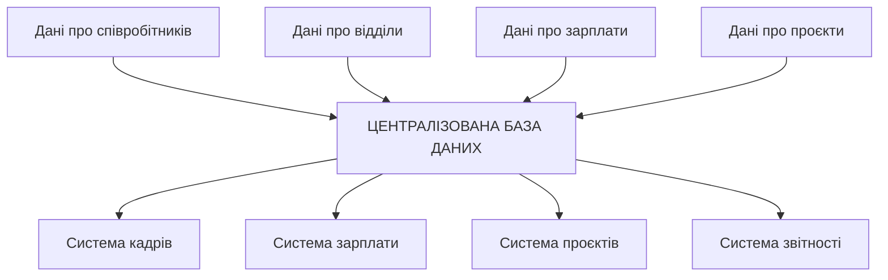

**Результати:**

- Ліквідація дублювання даних
- Гарантія узгодженості інформації
- Спрощення процедур оновлення
- Централізоване адміністрування

#### 2. Незалежність даних

**Логічна незалежність** означає, що зміни в логічній структурі бази даних (додавання таблиць, змінення зв'язків) не впливають на існуючі програми, якщо ці зміни не торкаються даних, які вони використовують.

**Фізична незалежність** означає, що зміни у способах зберігання даних (індекси, методи доступу, розміщення файлів) не впливають на програми користувачів.

**Приклад незалежності даних:**

```sql
-- Логічне представлення для програми
SELECT employee_name, department_name, salary
FROM employee_view;

-- Фізична реалізація може змінюватися без впливу на програму:
-- 1. Таблиці можуть бути розділені
-- 2. Можуть додаватися індекси
-- 3. Дані можуть переноситися на інші диски
-- 4. Може змінюватися алгоритм зберігання
```

#### 3. Інтегрованість

База даних інтегрує дані з різних функціональних областей організації, забезпечуючи цілісне представлення інформації.

**Аспекти інтеграції:**

**Структурна інтеграція:**

- Уніфіковані формати даних
- Стандартизовані назви полів
- Узгоджені типи даних

**Семантична інтеграція:**

- Однозначне трактування понять
- Стандартизована термінологія
- Узгоджені бізнес-правила

**Часова інтеграція:**

- Синхронізація оновлень
- Узгодженість стану в часі
- Єдина система версіонування

#### 4. Керованість

База даних керується системою управління базами даних (СУБД), яка забезпечує:

**Контроль доступу:**

- Автентифікація користувачів
- Авторизація операцій
- Аудит дій користувачів

**Забезпечення цілісності:**

- Перевірка обмежень
- Підтримка консистентності
- Контроль посилальної цілісності

**Управління транзакціями:**

- Атомарність операцій
- Ізольованість транзакцій
- Довговічність змін

### Архітектура ANSI-SPARC

У 1975 році Американський національний інститут стандартів (ANSI) та Комітет з планування та вимог для дослідження (SPARC) запропонували трирівневу архітектуру баз даних, яка стала стандартом для розуміння організації СУБД.

#### Три рівні архітектури

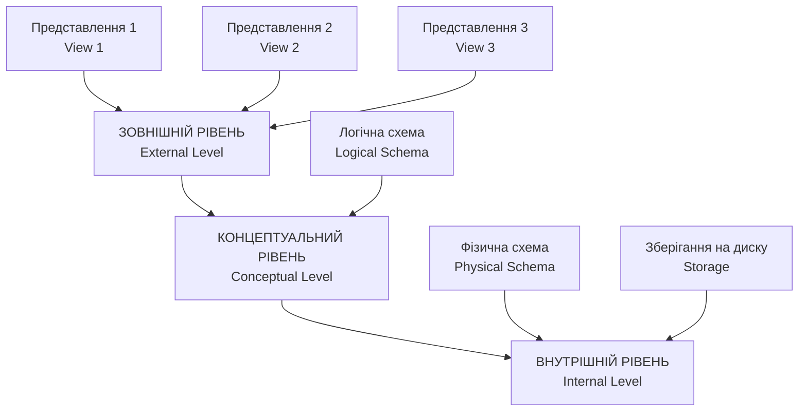

**1. Зовнішній рівень (External Level)**

Рівень індивідуальних користувачів. Кожен користувач або група користувачів має власний погляд на базу даних.

**Характеристики:**

- Містить тільки ті дані, які потрібні конкретному користувачу
- Приховує складність повної схеми
- Може включати обчислювані поля
- Забезпечує безпеку через обмеження доступу

**Приклад представлення для відділу кадрів:**

```sql
CREATE VIEW HR_EMPLOYEES AS
SELECT
    employee_id,
    first_name,
    last_name,
    position,
    hire_date,
    department
FROM employees
WHERE status = 'ACTIVE';
-- Приховує зарплату та інші конфіденційні дані
```

**2. Концептуальний рівень (Conceptual Level)**

Рівень спільноти користувачів. Описує, які дані зберігаються в базі та зв'язки між ними.

**Характеристики:**

- Повне логічне представлення бази даних
- Незалежність від фізичної реалізації
- Опис обмежень цілісності
- Стабільна структура, що рідко змінюється

**Приклад концептуальної схеми:**

```sql
-- Таблиця співробітників
CREATE TABLE employees (
    employee_id INT PRIMARY KEY,
    first_name VARCHAR(50) NOT NULL,
    last_name VARCHAR(50) NOT NULL,
    email VARCHAR(100) UNIQUE,
    hire_date DATE NOT NULL,
    position_id INT,
    department_id INT,
    salary DECIMAL(10,2),
    FOREIGN KEY (position_id) REFERENCES positions(position_id),
    FOREIGN KEY (department_id) REFERENCES departments(department_id)
);

-- Таблиця відділів
CREATE TABLE departments (
    department_id INT PRIMARY KEY,
    department_name VARCHAR(100) NOT NULL,
    manager_id INT,
    budget DECIMAL(15,2),
    FOREIGN KEY (manager_id) REFERENCES employees(employee_id)
);
```

**3. Внутрішній рівень (Internal Level)**

Рівень фізичного зберігання. Описує, як дані фізично зберігаються в системі.

**Характеристики:**

- Структури зберігання даних
- Методи доступу та індексування
- Розміщення файлів
- Оптимізація продуктивності

**Приклад внутрішніх структур:**

```sql
-- Створення індексів для оптимізації пошуку
CREATE INDEX idx_employee_department ON employees(department_id);
CREATE INDEX idx_employee_email ON employees(email);

-- Фізичні параметри зберігання
ALTER TABLE employees
STORAGE (
    INITIAL 1M
    NEXT 512K
    PCTINCREASE 0
    PCTFREE 10
    PCTUSED 80
);
```

#### Переваги трирівневої архітектури

**1. Незалежність даних**

- Зміни на внутрішньому рівні не впливають на концептуальний
- Зміни на концептуальному рівні не впливають на зовнішній
- Можливість еволюції системи без впливу на користувачів

**2. Гнучкість представлень**

- Різні користувачі можуть мати різні погляди на ті самі дані
- Можливість створення спеціалізованих інтерфейсів
- Приховування складності від кінцевих користувачів

**3. Безпека**

- Контроль доступу на рівні представлень
- Приховування чутливої інформації
- Обмеження операцій для різних ролей користувачів

**4. Продуктивність**

- Можливість оптимізації на внутрішньому рівні
- Незалежне налаштування фізичних параметрів
- Адаптація до характеристик обладнання

### Компоненти системи управління базами даних

Сучасна СУБД складається з кількох взаємопов'язаних компонентів, кожен з яких відповідає за певні аспекти управління даними.

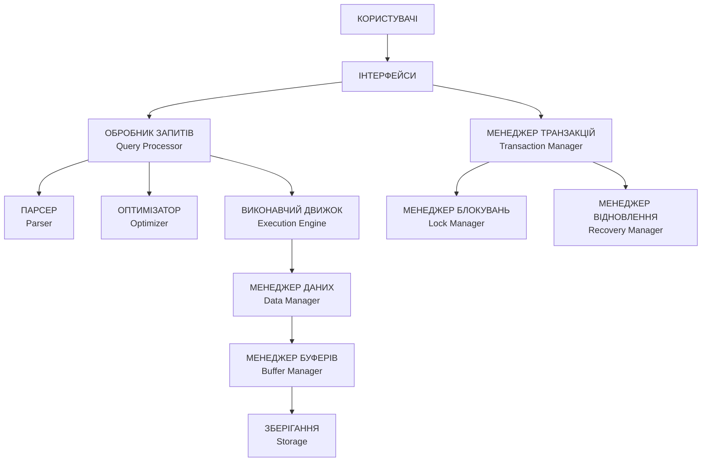

#### Основні компоненти

**1. Обробник запитів (Query Processor)**

Відповідає за обробку запитів користувачів від їх отримання до виконання.

**Підкомпоненти:**

*Парсер (Parser):*
- Синтаксичний аналіз запитів
- Перевірка коректності SQL
- Побудова дерева запиту

*Оптимізатор (Optimizer):*
- Аналіз можливих стратегій виконання
- Вибір найефективнішого плану
- Врахування статистики та індексів

*Виконавчий движок (Execution Engine):*
- Реалізація плану запиту
- Взаємодія з підсистемою зберігання
- Формування результату

**Приклад роботи обробника запитів:**

```sql
-- Початковий запит користувача
SELECT e.name, d.department_name, e.salary
FROM employees e
JOIN departments d ON e.department_id = d.department_id
WHERE e.salary > 50000
ORDER BY e.salary DESC;

-- Дерево запиту після парсингу
/*
ORDER BY (salary DESC)
  └── PROJECTION (name, department_name, salary)
      └── SELECTION (salary > 50000)
          └── JOIN (e.department_id = d.department_id)
              ├── TABLE SCAN (employees)
              └── TABLE SCAN (departments)
*/

-- Оптимізований план виконання
/*
SORT (salary DESC)
  └── NESTED LOOP JOIN
      ├── INDEX SCAN (employees, salary_idx) WHERE salary > 50000
      └── INDEX LOOKUP (departments, pk_dept)
*/
```

**2. Менеджер транзакцій (Transaction Manager)**

Забезпечує властивості ACID (Atomicity, Consistency, Isolation, Durability) для транзакцій.

**Основні функції:**

*Контроль паралельності:*

- Планування виконання транзакцій
- Виявлення та розв'язання конфліктів
- Запобігання взаємним блокуванням (deadlock)

*Відновлення після збоїв:*

- Ведення журналу транзакцій
- Відкат незавершених транзакцій
- Повторне виконання підтверджених операцій

**Приклад транзакції переведення коштів:**

```sql
BEGIN TRANSACTION;
-- Зняти кошти з рахунку A
UPDATE accounts SET balance = balance - 1000 WHERE account_id = 'A123';
-- Перевірити достатність коштів
IF (SELECT balance FROM accounts WHERE account_id = 'A123') >= 0 THEN
    -- Додати кошти на рахунок B
    UPDATE accounts SET balance = balance + 1000 WHERE account_id = 'B456';
    COMMIT;
ELSE
    ROLLBACK;
END IF;
```

**3. Менеджер даних (Data Manager)**

Керує фізичним зберіганням даних та забезпечує доступ до них.

**Функції:**

- Управління файлами та сторінками
- Реалізація методів доступу
- Підтримка індексних структур
- Стиснення та архівування даних

**4. Менеджер буферів (Buffer Manager)**

Керує оперативною пам'яттю, яка використовується як кеш для дискових даних.

**Стратегії заміщення сторінок:**

- LRU (Least Recently Used) — витиснення найдавніше використаних
- FIFO (First In, First Out) — витиснення найстаріших
- Clock Algorithm — компроміс між ефективністю та простотою

## Класифікація СУБД за моделями даних та архітектурою

### Класифікація за моделями даних

#### 1. Ієрархічні СУБД

**Принципи організації:**

- Дані організовані у вигляді дерева
- Кожен запис має не більше одного батьківського запису
- Зв'язки "один-до-багатьох"
- Навігація по заранее визначених шляхах

**Приклад структури ієрархічної бази даних:**

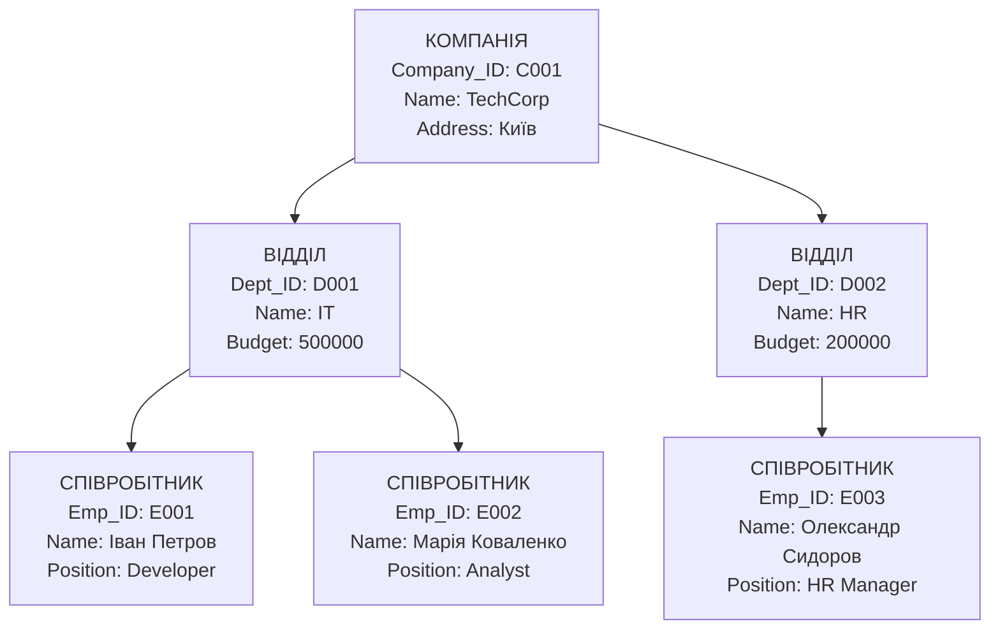

**Переваги ієрархічної моделі:**

- Високу швидкість доступу по ієрархічних шляхах
- Природне відображення організаційних структур
- Ефективне використання пам'яті
- Простота розуміння структури

**Недоліки:**

- Складність моделювання зв'язків "багато-до-багатьох"
- Жорсткість структури
- Дублювання даних при різних ієрархіях
- Складність реорганізації

**Сфери застосування:**

- Файлові системи операційних систем
- Організаційні структури
- Системи класифікації товарів
- XML-документи

**Представники:** IBM IMS, System 2000

#### 2. Мережеві СУБД

**Принципи організації:**

- Розширення ієрархічної моделі
- Підтримка зв'язків "багато-до-багатьох"
- Записи можуть мати кілька батьківських записів
- Складна навігаційна модель

**Приклад мережевої структури:**

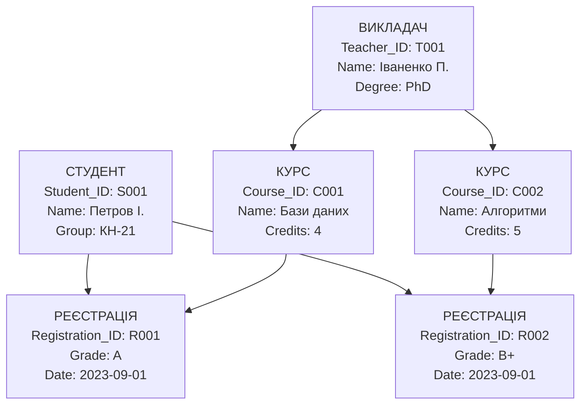

**Переваги мережевої моделі:**

- Підтримка складних зв'язків
- Менше дублювання даних
- Гнучкість у моделюванні
- Ефективність навігації

**Недоліки:**

- Складність програмування
- Необхідність знання фізичної структури
- Складність адміністрування
- Залежність від конкретної СУБД

**Представники:** IDMS, IDS, System 2000

#### 3. Реляційні СУБД

Найпоширеніший тип сучасних СУБД, заснований на реляційній моделі даних.

**Основні принципи:**

- Дані зберігаються в таблицях (відношеннях)
- Зв'язки через загальні атрибути (зовнішні ключі)
- Декларативна мова запитів (SQL)
- Математична основа (реляційна алгебра)

**Приклад реляційної схеми:**

```sql
-- Таблиця студентів
CREATE TABLE students (
    student_id INT PRIMARY KEY,
    first_name VARCHAR(50) NOT NULL,
    last_name VARCHAR(50) NOT NULL,
    group_name VARCHAR(10),
    birth_date DATE,
    email VARCHAR(100) UNIQUE
);

-- Таблиця курсів
CREATE TABLE courses (
    course_id INT PRIMARY KEY,
    course_name VARCHAR(100) NOT NULL,
    credits INT CHECK (credits > 0),
    teacher_id INT,
    FOREIGN KEY (teacher_id) REFERENCES teachers(teacher_id)
);

-- Таблиця реєстрацій (зв'язок багато-до-багатьох)
CREATE TABLE enrollments (
    enrollment_id INT PRIMARY KEY,
    student_id INT,
    course_id INT,
    enrollment_date DATE DEFAULT CURRENT_DATE,
    grade CHAR(2),
    FOREIGN KEY (student_id) REFERENCES students(student_id),
    FOREIGN KEY (course_id) REFERENCES courses(course_id),
    UNIQUE(student_id, course_id)
);
```

**Переваги реляційної моделі:**

- Математична строгість
- Незалежність даних
- Потужна мова запитів
- Стандартизація (SQL)
- Гнучкість структури
- Широка підтримка інструментів

**Недоліки:**

- Об'єктно-реляційний розрив (impedance mismatch)
- Складність оптимізації складних запитів
- Обмеження при роботі з нереляційними даними
- Потреба в нормалізації

**Представники:** Oracle, MySQL, PostgreSQL, Microsoft SQL Server, IBM DB2

#### 4. Об'єктно-орієнтовані СУБД

**Принципи організації:**

- Дані зберігаються як об'єкти
- Підтримка інкапсуляції, успадкування, поліморфізму
- Об'єкти мають стан (атрибути) та поведінку (методи)
- Складні типи даних та колекції

**Приклад об'єктної схеми:**

```sql
-- Визначення класу Person
CREATE TYPE Person AS (
    person_id INTEGER,
    first_name VARCHAR(50),
    last_name VARCHAR(50),
    birth_date DATE,

    -- Методи
    MEMBER FUNCTION get_full_name() RETURN VARCHAR,
    MEMBER FUNCTION get_age() RETURN INTEGER
);

-- Визначення класу Student (успадкування від Person)
CREATE TYPE Student UNDER Person (
    student_number VARCHAR(10),
    group_name VARCHAR(10),
    courses REF ARRAY OF Course,

    MEMBER FUNCTION get_gpa() RETURN DECIMAL,
    MEMBER FUNCTION enroll_course(course REF Course)
);

-- Визначення класу Course
CREATE TYPE Course AS (
    course_id INTEGER,
    course_name VARCHAR(100),
    credits INTEGER,
    students REF ARRAY OF Student,

    MEMBER FUNCTION get_enrollment_count() RETURN INTEGER
);
```

**Переваги об'єктно-орієнтованої моделі:**

- Природне моделювання складних структур
- Повторне використання коду
- Інкапсуляція бізнес-логіки
- Підтримка складних типів даних

**Недоліки:**

- Складність реалізації
- Відсутність стандартизації
- Обмежена підтримка SQL
- Складність налаштування продуктивності

**Представники:** ObjectDB, Versant, ObjectStore

#### 5. Об'єктно-реляційні СУБД

Гібридна модель, що поєднує переваги реляційної та об'єктно-орієнтованої моделей.

**Основні особливості:**

- Розширення реляційної моделі об'єктними можливостями
- Підтримка складних типів даних
- Користувацькі функції та процедури
- Збереження сумісності з SQL

**Приклад об'єктно-реляційних можливостей:**

```sql
-- Створення користувацького типу
CREATE TYPE address_type AS (
    street VARCHAR(100),
    city VARCHAR(50),
    postal_code VARCHAR(10),
    country VARCHAR(50)
);

-- Створення типу з методами
CREATE TYPE person_type AS (
    first_name VARCHAR(50),
    last_name VARCHAR(50),
    birth_date DATE
) NOT FINAL;

-- Додавання методу до типу
ALTER TYPE person_type ADD MEMBER FUNCTION get_age() RETURN INTEGER;

-- Використання в таблиці
CREATE TABLE employees (
    employee_id INT PRIMARY KEY,
    personal_info person_type,
    work_address address_type,
    home_address address_type,
    skills ARRAY[VARCHAR(50)]
);

-- Запит з використанням об'єктних можливостей
SELECT e.employee_id,
       e.personal_info.first_name,
       e.personal_info.last_name,
       e.personal_info.get_age() as age,
       e.work_address.city
FROM employees e
WHERE e.work_address.country = 'Ukraine';
```

**Представники:** Oracle, PostgreSQL, IBM DB2

#### 6. NoSQL СУБД

Клас баз даних, розроблених для роботи з великими обсягами розподілених даних.

**Типи NoSQL баз даних:**

**Document-орієнтовані:**
```json
// Приклад документу в MongoDB
{
  "_id": ObjectId("507f1f77bcf86cd799439011"),
  "student_id": "S001",
  "name": {
    "first": "Іван",
    "last": "Петров"
  },
  "group": "КН-21",
  "courses": [
    {
      "course_id": "C001",
      "name": "Бази даних",
      "grade": "A",
      "credits": 4
    },
    {
      "course_id": "C002",
      "name": "Алгоритми",
      "grade": "B+",
      "credits": 5
    }
  ],
  "address": {
    "street": "вул. Хрещатик, 1",
    "city": "Київ",
    "country": "України"
  }
}
```

**Key-Value сховища:**
```python
# Приклад роботи з Redis
import redis
r = redis.Redis()

# Зберігання простих значень
r.set("user:1001:name", "Іван Петров")
r.set("user:1001:email", "ivan.petrov@email.com")

# Зберігання структурованих даних
r.hset("user:1001", mapping={
    "name": "Іван Петров",
    "email": "ivan.petrov@email.com",
    "group": "КН-21",
    "status": "active"
})

# Робота зі списками
r.lpush("user:1001:courses", "Бази даних", "Алгоритми", "Веб-технології")
```

**Представники:** MongoDB (документо-орієнтована), Redis (key-value), Cassandra (стовпчикова), Neo4j (графова)

### Класифікація за архітектурою

#### 1. Централізовані СУБД

**Архітектура:**

- Вся база даних зберігається на одному сервері
- Клієнти підключаються до центрального сервера
- Централізоване управління та адміністрування

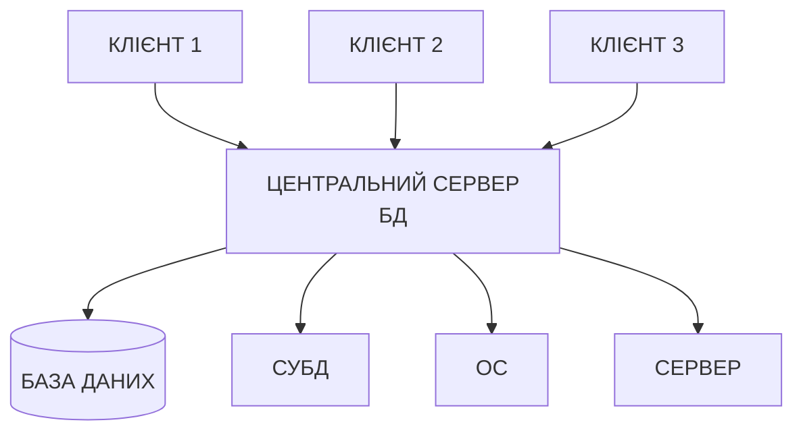

Переваги:

- Простота адміністрування
- Централізований контроль безпеки
- Легкість забезпечення цілісності
- Ефективність транзакцій

Недоліки:

- Єдина точка відмови
- Обмеження масштабованості
- Вузьке місце мережі
- Географічні обмеження

#### 2. Розподілені СУБД

**Принципи:**

- База даних розподілена по кількох вузлах
- Прозорість розподілу для користувачів
- Координація між вузлами
- Розподілена обробка запитів

**Типи розподілення:**

**Горизонтальне розбиття (Sharding):**
```sql
-- Розподіл студентів за групами
-- Вузол 1: студенти груп КН-21, КН-22
-- Вузол 2: студенти груп КН-23, КН-24
-- Вузол 3: студенти груп КН-25, КН-26

-- Запит може виконуватися на одному вузлі
SELECT * FROM students WHERE group_name = 'КН-21'; -- Вузол 1

-- Або на кількох вузлах з агрегацією
SELECT COUNT(*) FROM students; -- Всі вузли → агрегація
```

**Вертикальне розбиття:**
```sql
-- Розподіл атрибутів студентів
-- Вузол 1: особиста інформація
CREATE TABLE students_personal (
    student_id INT PRIMARY KEY,
    first_name VARCHAR(50),
    last_name VARCHAR(50),
    birth_date DATE
);

-- Вузол 2: академічна інформація
CREATE TABLE students_academic (
    student_id INT PRIMARY KEY,
    group_name VARCHAR(10),
    year_enrolled INT,
    gpa DECIMAL(3,2)
);
```

**Реплікація:**
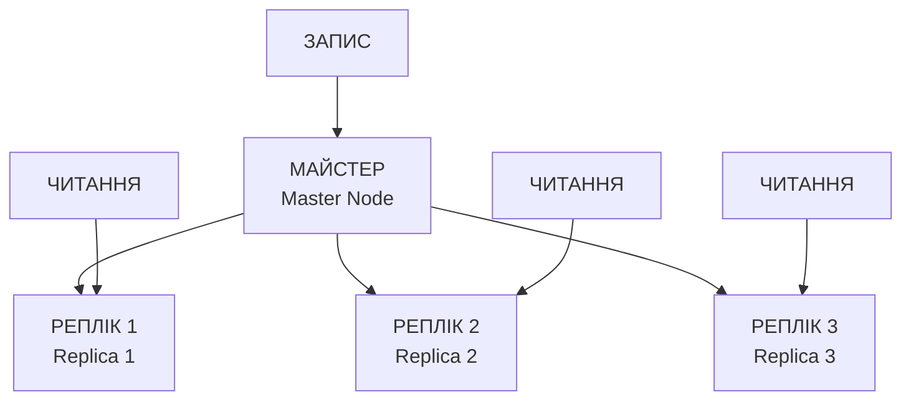

**Переваги розподіленої архітектури:**

- Масштабованість
- Відмовостійкість
- Географічний розподіл
- Розподілення навантаження

**Недоліки:**

- Складність адміністрування
- Проблеми консистентності
- Мережеві затримки
- Складність транзакцій

#### 3. Паралельні СУБД

**Архітектурні моделі:**

**Shared-Nothing:**
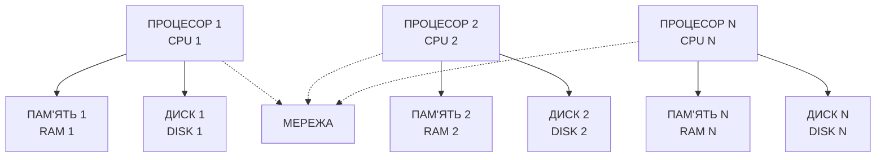

Переваги: Лінійна масштабованість, відсутність конкуренції за ресурси

**Shared-Disk:**

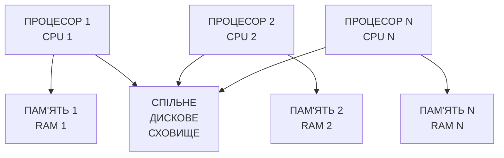

Переваги: Простота розширення, спільний доступ до даних

**Shared-Memory:**
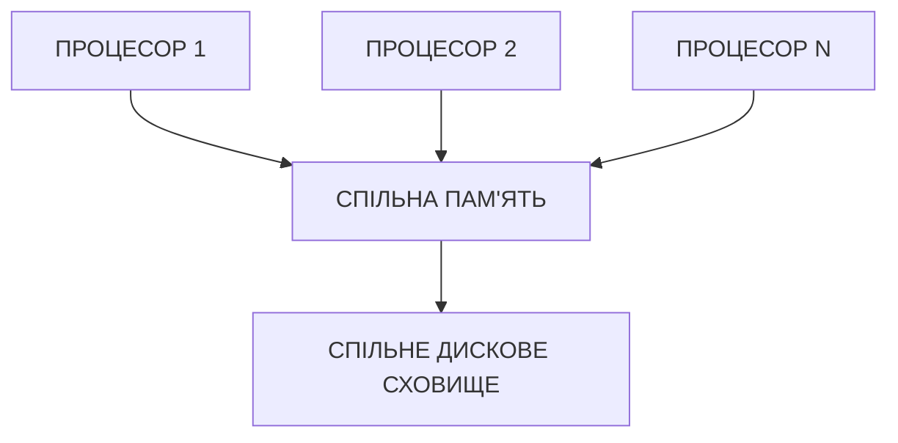

Переваги: Швидка комунікація між процесорами

#### 4. Хмарні СУБД

Database as a Service (DBaaS):

- Amazon RDS, Aurora
- Google Cloud SQL, Firestore
- Microsoft Azure SQL Database
- MongoDB Atlas

Переваги хмарних СУБД:

- Автоматичне масштабування
- Керована інфраструктура
- Глобальна доступність
- Оплата за використання
- Вбудована відмовостійкість


## Висновки

Еволюція систем управління даними пройшла довгий шлях від простих файлових систем до сучасних розподілених баз даних. Основні етапи цієї еволюції:

1. **Файлові системи (1950-1960)** — перші спроби структурування електронних даних, що виявили фундаментальні проблеми надмірності, залежності та складності інтеграції.
2. **Ієрархічні та мережеві моделі (1960-1970)** — перші кроки до створення СУБД, що вирішили частину проблем, але залишили складність навігаційного програмування.
3. **Реляційна модель (1970-дотепер)** — революційний підхід, що забезпечив математичну строгість, незалежність даних та декларативні мови запитів.
4. **Об'єктно-орієнтовані та NoSQL системи (1990-дотепер)** — відповідь на потреби роботи зі складними структурами даних та великими обсягами інформації.
5. **Хмарні та розподілені системи (2000-дотепер)** — забезпечення масштабованості та доступності на глобальному рівні.

Кожен тип СУБД має свої переваги та недоліки, тому вибір конкретної системи залежить від специфічних вимог проєкту: типу даних, обсягу, навантаження, вимог до консистентності та доступності.

Розуміння історичного розвитку та принципів організації різних типів СУБД є фундаментом для вивчення сучасних баз даних та прийняття обґрунтованих архітектурних рішень при проектуванні інформаційних систем.
