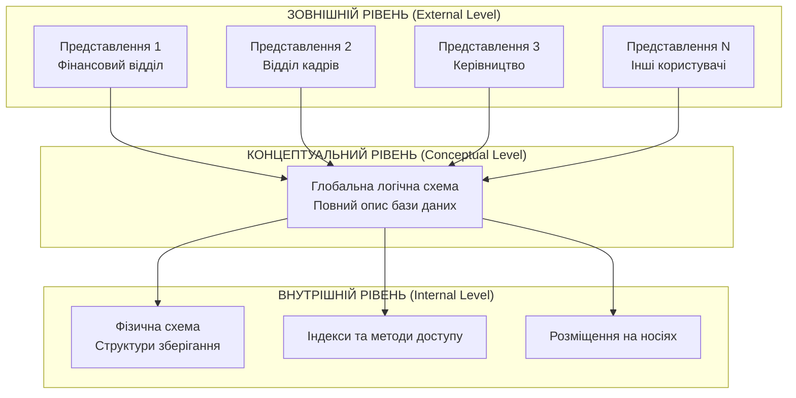
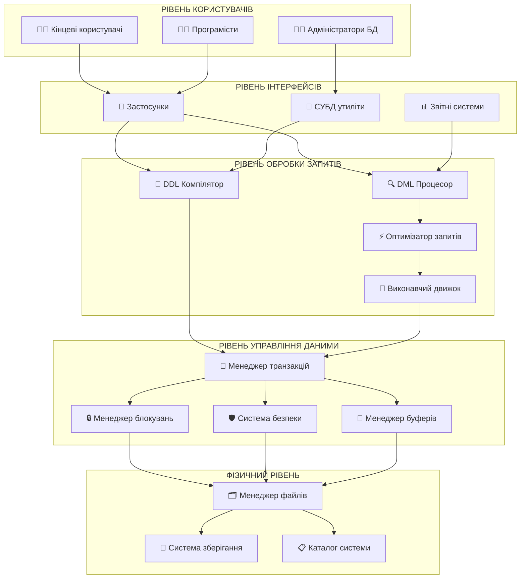
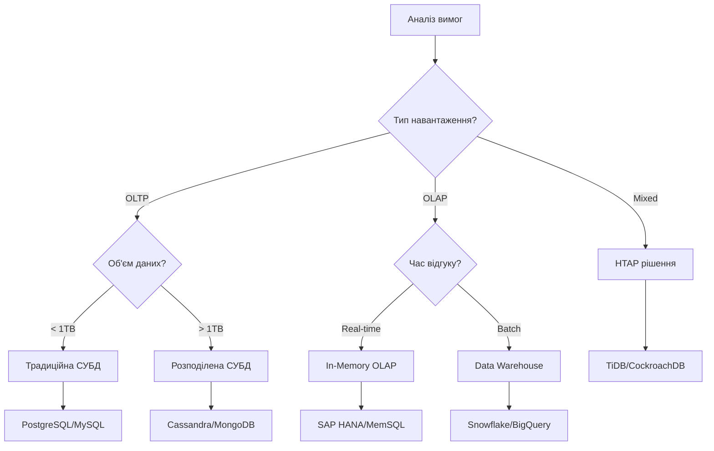

# Лекція 2. Архітектура систем управління базами даних

## Вступ

Розуміння архітектури систем управління базами даних є ключовим для ефективного проєктування, впровадження та адміністрування баз даних. Архітектура СУБД визначає, як організовуються та взаємодіють різні компоненти системи, як забезпечується незалежність даних та як реалізуються основні функції управління даними.

Сучасні СУБД є складними програмними комплексами, що складаються з множини взаємопов'язаних підсистем. Кожна підсистема відповідає за певний аспект управління даними: від фізичного зберігання до обробки запитів користувачів. Розуміння цієї архітектури дозволяє розробникам та адміністраторам баз даних приймати обґрунтовані рішення щодо оптимізації продуктивності, забезпечення безпеки та масштабованості систем.

## Трирівнева архітектура ANSI/SPARC

### Історія та передумови створення

У 1975 році Американський національний інститут стандартів (ANSI) та Комітет з планування та вимог для дослідження (SPARC) запропонували стандартизовану трирівневу архітектуру баз даних. Ця архітектура була розроблена як відповідь на проблеми, що виникали в ранніх системах управління даними, зокрема:

- Тісний зв'язок між програмами користувачів та фізичною структурою даних.
- Складність модифікації структури баз даних без впливу на існуючі програми.
- Відсутність стандартизованого підходу до організації СУБД.
- Проблеми забезпечення безпеки та контролю доступу на різних рівнях.

**Трирівнева архітектура ANSI/SPARC** — це концептуальна модель, що описує організацію СУБД у вигляді трьох логічно незалежних рівнів: зовнішнього, концептуального та внутрішнього.



### Зовнішній рівень (External Level)

**Зовнішній рівень** — це рівень індивідуальних користувачів або груп користувачів, що забезпечує персоналізовані представлення бази даних залежно від потреб конкретних користувачів або застосувань.

#### Основні характеристики зовнішнього рівня

**1. Індивідуалізація доступу**

Кожен користувач або група користувачів має власне представлення (view) бази даних, яке містить тільки ту інформацію, що необхідна для виконання їхніх функціональних обов'язків.

**Приклад представлення для відділу кадрів:**

```sql
-- Представлення для HR-менеджера
CREATE VIEW hr_employee_info AS
SELECT
    e.employee_id,
    e.first_name,
    e.last_name,
    e.position,
    e.hire_date,
    e.department_id,
    d.department_name,
    e.phone,
    e.email,
    e.status
FROM employees e
JOIN departments d ON e.department_id = d.department_id
WHERE e.status IN ('ACTIVE', 'ON_LEAVE');

-- Використання представлення
SELECT * FROM hr_employee_info
WHERE department_name = 'Інформаційні технології';
```

**2. Безпека через обмеження доступу**

Зовнішні представлення природно обмежують доступ користувачів тільки до авторизованої інформації, приховуючи конфіденційні дані.

**Приклад представлення для лінійних менеджерів:**

```sql
-- Менеджери не бачать зарплатну інформацію
CREATE VIEW manager_team_view AS
SELECT
    e.employee_id,
    e.first_name,
    e.last_name,
    e.position,
    e.hire_date,
    e.phone,
    e.email,
    p.project_name,
    p.start_date,
    p.end_date
FROM employees e
LEFT JOIN project_assignments pa ON e.employee_id = pa.employee_id
LEFT JOIN projects p ON pa.project_id = p.project_id
WHERE e.manager_id = USER_ID(); -- Функція поточного користувача
```

**3. Спрощення складності**

Зовнішні представлення приховують складність повної структури бази даних, надаючи користувачам простий та інтуїтивно зрозумілий інтерфейс.

**Приклад спрощеного представлення:**

```sql
-- Складна структура з множинними зв'язками спрощена до одного представлення
CREATE VIEW employee_summary AS
SELECT
    CONCAT(e.first_name, ' ', e.last_name) AS full_name,
    d.department_name,
    pos.position_title,
    pos.salary_range,
    COUNT(DISTINCT pa.project_id) AS active_projects,
    AVG(pr.rating) AS average_rating
FROM employees e
JOIN departments d ON e.department_id = d.department_id
JOIN positions pos ON e.position_id = pos.position_id
LEFT JOIN project_assignments pa ON e.employee_id = pa.employee_id
    AND pa.status = 'ACTIVE'
LEFT JOIN performance_reviews pr ON e.employee_id = pr.employee_id
    AND pr.review_year = YEAR(CURRENT_DATE)
GROUP BY e.employee_id, e.first_name, e.last_name,
         d.department_name, pos.position_title, pos.salary_range;
```

**4. Обчислювані поля та агрегація**

Зовнішні представлення можуть містити обчислювані поля та агреговану інформацію, яка не зберігається фізично в базі даних.

**Приклад представлення з обчислюваними полями:**

```sql
CREATE VIEW department_statistics AS
SELECT
    d.department_id,
    d.department_name,
    COUNT(e.employee_id) AS employee_count,
    AVG(DATEDIFF(CURRENT_DATE, e.hire_date) / 365.25) AS avg_years_service,
    SUM(CASE WHEN e.status = 'ACTIVE' THEN 1 ELSE 0 END) AS active_employees,
    SUM(CASE WHEN e.status = 'ON_LEAVE' THEN 1 ELSE 0 END) AS on_leave_count,
    MAX(e.hire_date) AS most_recent_hire,
    MIN(e.hire_date) AS longest_serving_hire
FROM departments d
LEFT JOIN employees e ON d.department_id = e.department_id
GROUP BY d.department_id, d.department_name;
```

#### Типи зовнішніх представлень

**1. Селективні представлення**

Містять підмножину стовпців та/або рядків з базових таблиць.

```sql
-- Тільки активні співробітники ІТ-відділу
CREATE VIEW it_active_employees AS
SELECT employee_id, first_name, last_name, position, email
FROM employees
WHERE department_id = (SELECT department_id FROM departments
                      WHERE department_name = 'ІТ')
  AND status = 'ACTIVE';
```

**2. З'єднувальні представлення**

Об'єднують дані з кількох пов'язаних таблиць.

```sql
-- Інформація про проєкти з деталями команди
CREATE VIEW project_team_details AS
SELECT
    p.project_id,
    p.project_name,
    p.start_date,
    p.deadline,
    p.status AS project_status,
    e.employee_id,
    CONCAT(e.first_name, ' ', e.last_name) AS team_member,
    pos.position_title,
    pa.role_in_project,
    pa.allocation_percentage
FROM projects p
JOIN project_assignments pa ON p.project_id = pa.project_id
JOIN employees e ON pa.employee_id = e.employee_id
JOIN positions pos ON e.position_id = pos.position_id
WHERE pa.status = 'ACTIVE';
```

**3. Агрегатні представлення**

Містять підсумкову та статистичну інформацію.

```sql
-- Фінансовий звіт по проєктах
CREATE VIEW project_financial_summary AS
SELECT
    p.project_id,
    p.project_name,
    p.budget,
    SUM(pa.allocation_percentage / 100 * pos.average_salary / 12) AS monthly_team_cost,
    p.budget - SUM(pa.allocation_percentage / 100 * pos.average_salary / 12) *
        DATEDIFF(p.deadline, p.start_date) / 30 AS estimated_profit,
    COUNT(pa.employee_id) AS team_size
FROM projects p
JOIN project_assignments pa ON p.project_id = pa.project_id
JOIN employees e ON pa.employee_id = e.employee_id
JOIN positions pos ON e.position_id = pos.position_id
WHERE pa.status = 'ACTIVE'
GROUP BY p.project_id, p.project_name, p.budget, p.start_date, p.deadline;
```

### Концептуальний рівень (Conceptual Level)

**Концептуальний рівень** — це рівень спільноти користувачів, який містить повний логічний опис структури бази даних, незалежний від особливостей фізичної реалізації та від потреб конкретних користувачів.

#### Основні характеристики концептуального рівня

**1. Повнота опису**

Концептуальна схема містить опис усіх сутностей, атрибутів, зв'язків та обмежень цілісності, що існують в базі даних.

**Приклад повної концептуальної схеми:**

```sql
-- Основні сутності системи управління персоналом

-- Департаменти
CREATE TABLE departments (
    department_id INT PRIMARY KEY AUTO_INCREMENT,
    department_name VARCHAR(100) NOT NULL UNIQUE,
    department_code VARCHAR(10) NOT NULL UNIQUE,
    manager_id INT,
    budget DECIMAL(15,2) CHECK (budget >= 0),
    location VARCHAR(100),
    phone VARCHAR(20),
    created_date TIMESTAMP DEFAULT CURRENT_TIMESTAMP,
    CONSTRAINT chk_dept_name_length CHECK (LENGTH(department_name) >= 3)
);

-- Посади
CREATE TABLE positions (
    position_id INT PRIMARY KEY AUTO_INCREMENT,
    position_title VARCHAR(100) NOT NULL,
    position_code VARCHAR(20) NOT NULL UNIQUE,
    min_salary DECIMAL(10,2) NOT NULL CHECK (min_salary > 0),
    max_salary DECIMAL(10,2) NOT NULL,
    department_id INT NOT NULL,
    required_experience_years INT DEFAULT 0,
    FOREIGN KEY (department_id) REFERENCES departments(department_id),
    CONSTRAINT chk_salary_range CHECK (max_salary >= min_salary),
    CONSTRAINT chk_experience CHECK (required_experience_years >= 0)
);

-- Співробітники
CREATE TABLE employees (
    employee_id INT PRIMARY KEY AUTO_INCREMENT,
    employee_number VARCHAR(20) NOT NULL UNIQUE,
    first_name VARCHAR(50) NOT NULL,
    last_name VARCHAR(50) NOT NULL,
    middle_name VARCHAR(50),
    birth_date DATE NOT NULL,
    hire_date DATE NOT NULL DEFAULT (CURRENT_DATE),
    termination_date DATE NULL,
    position_id INT NOT NULL,
    department_id INT NOT NULL,
    manager_id INT NULL,
    salary DECIMAL(10,2) NOT NULL CHECK (salary > 0),
    phone VARCHAR(20),
    email VARCHAR(100) NOT NULL UNIQUE,
    address TEXT,
    status ENUM('ACTIVE', 'ON_LEAVE', 'TERMINATED') DEFAULT 'ACTIVE',

    FOREIGN KEY (position_id) REFERENCES positions(position_id),
    FOREIGN KEY (department_id) REFERENCES departments(department_id),
    FOREIGN KEY (manager_id) REFERENCES employees(employee_id),

    CONSTRAINT chk_birth_date CHECK (birth_date <= DATE_SUB(CURRENT_DATE, INTERVAL 16 YEAR)),
    CONSTRAINT chk_hire_date CHECK (hire_date >= birth_date),
    CONSTRAINT chk_termination CHECK (termination_date IS NULL OR termination_date >= hire_date),
    CONSTRAINT chk_email_format CHECK (email REGEXP '^[A-Za-z0-9._%+-]+@[A-Za-z0-9.-]+\\.[A-Za-z]{2,}$')
);
```

**2. Логічна структура зв'язків**

Концептуальна схема визначає всі типи зв'язків між сутностями та їх кардинальність.

**Приклад складних зв'язків:**

```sql
-- Проєкти
CREATE TABLE projects (
    project_id INT PRIMARY KEY AUTO_INCREMENT,
    project_name VARCHAR(200) NOT NULL,
    project_code VARCHAR(20) NOT NULL UNIQUE,
    description TEXT,
    start_date DATE NOT NULL,
    planned_end_date DATE NOT NULL,
    actual_end_date DATE NULL,
    budget DECIMAL(15,2) NOT NULL CHECK (budget > 0),
    client_id INT,
    project_manager_id INT NOT NULL,
    status ENUM('PLANNING', 'ACTIVE', 'ON_HOLD', 'COMPLETED', 'CANCELLED') DEFAULT 'PLANNING',

    FOREIGN KEY (project_manager_id) REFERENCES employees(employee_id),
    CONSTRAINT chk_project_dates CHECK (planned_end_date > start_date),
    CONSTRAINT chk_actual_end CHECK (actual_end_date IS NULL OR actual_end_date >= start_date)
);

-- Призначення співробітників на проєкти (зв'язок багато-до-багатьох)
CREATE TABLE project_assignments (
    assignment_id INT PRIMARY KEY AUTO_INCREMENT,
    project_id INT NOT NULL,
    employee_id INT NOT NULL,
    role_in_project VARCHAR(100) NOT NULL,
    assignment_date DATE NOT NULL DEFAULT (CURRENT_DATE),
    end_date DATE NULL,
    allocation_percentage DECIMAL(5,2) NOT NULL DEFAULT 100.00,
    hourly_rate DECIMAL(8,2),
    status ENUM('ACTIVE', 'COMPLETED', 'SUSPENDED') DEFAULT 'ACTIVE',

    FOREIGN KEY (project_id) REFERENCES projects(project_id) ON DELETE CASCADE,
    FOREIGN KEY (employee_id) REFERENCES employees(employee_id),

    UNIQUE KEY unique_active_assignment (project_id, employee_id, status),
    CONSTRAINT chk_allocation CHECK (allocation_percentage > 0 AND allocation_percentage <= 100),
    CONSTRAINT chk_assignment_dates CHECK (end_date IS NULL OR end_date >= assignment_date),
    CONSTRAINT chk_hourly_rate CHECK (hourly_rate IS NULL OR hourly_rate > 0)
);
```

**3. Бізнес-правила та обмеження цілісності**

Концептуальний рівень містить всі бізнес-правила, що регулюють коректність та консистентність даних.

**Приклади складних бізнес-правил:**

```sql
-- Тригер для перевірки, що менеджер департаменту працює в цьому департаменті
DELIMITER //
CREATE TRIGGER trg_check_department_manager
BEFORE UPDATE ON departments
FOR EACH ROW
BEGIN
    IF NEW.manager_id IS NOT NULL THEN
        IF NOT EXISTS (
            SELECT 1 FROM employees
            WHERE employee_id = NEW.manager_id
            AND department_id = NEW.department_id
            AND status = 'ACTIVE'
        ) THEN
            SIGNAL SQLSTATE '45000'
            SET MESSAGE_TEXT = 'Менеджер департаменту повинен працювати в цьому департаменті';
        END IF;
    END IF;
END //
DELIMITER ;

-- Тригер для контролю навантаження співробітника
DELIMITER //
CREATE TRIGGER trg_check_employee_workload
BEFORE INSERT ON project_assignments
FOR EACH ROW
BEGIN
    DECLARE total_allocation DECIMAL(5,2);

    SELECT COALESCE(SUM(allocation_percentage), 0) INTO total_allocation
    FROM project_assignments
    WHERE employee_id = NEW.employee_id
    AND status = 'ACTIVE'
    AND (end_date IS NULL OR end_date >= CURRENT_DATE);

    IF (total_allocation + NEW.allocation_percentage) > 100 THEN
        SIGNAL SQLSTATE '45000'
        SET MESSAGE_TEXT = 'Загальне навантаження співробітника не може перевищувати 100%';
    END IF;
END //
DELIMITER ;
```

**4. Метадані та каталогізація**

Концептуальна схема також включає описи метаданих — інформації про структуру самої бази даних.

```sql
-- Таблиця для зберігання історії змін структури
CREATE TABLE schema_changes (
    change_id INT PRIMARY KEY AUTO_INCREMENT,
    table_name VARCHAR(100) NOT NULL,
    change_type ENUM('CREATE', 'ALTER', 'DROP', 'INDEX') NOT NULL,
    change_description TEXT NOT NULL,
    applied_by VARCHAR(100) NOT NULL,
    applied_date TIMESTAMP DEFAULT CURRENT_TIMESTAMP,
    sql_statement TEXT,
    rollback_statement TEXT
);

-- Таблиця для конфігурації системи
CREATE TABLE system_configuration (
    config_id INT PRIMARY KEY AUTO_INCREMENT,
    config_key VARCHAR(100) NOT NULL UNIQUE,
    config_value TEXT NOT NULL,
    description TEXT,
    data_type ENUM('STRING', 'INTEGER', 'BOOLEAN', 'JSON') DEFAULT 'STRING',
    last_modified TIMESTAMP DEFAULT CURRENT_TIMESTAMP ON UPDATE CURRENT_TIMESTAMP,
    modified_by VARCHAR(100)
);
```

#### Незалежність концептуального рівня

Концептуальна схема залишається стабільною при змінах на зовнішньому та внутрішньому рівнях:

- **Незалежність від зовнішніх представлень**: додавання нових представлень або модифікація існуючих не впливає на концептуальну схему.
- **Незалежність від фізичної реалізації**: зміни в методах зберігання, індексації або розміщення даних не вимагають змін у концептуальній схемі.

### Внутрішній рівень (Internal Level)

**Внутрішній рівень** — це рівень фізичного зберігання даних, який описує, як дані насправді зберігаються на фізичних носіях інформації та як організований доступ до них.

#### Основні характеристики внутрішнього рівня

**1. Фізичні структури даних**

Внутрішній рівень визначає конкретні способи зберігання даних на дисках, в пам'яті та інших носіях.

**Приклади фізичних структур:**

```sql
-- Специфікація фізичних параметрів таблиці
CREATE TABLE employees (
    -- ... визначення стовпців ...
) ENGINE=InnoDB
  DEFAULT CHARSET=utf8mb4
  COLLATE=utf8mb4_unicode_ci
  ROW_FORMAT=DYNAMIC
  KEY_BLOCK_SIZE=16
  TABLESPACE=hr_tablespace;

-- Параметри зберігання для великої таблиці
ALTER TABLE employees
PARTITION BY RANGE (YEAR(hire_date)) (
    PARTITION p_before_2000 VALUES LESS THAN (2000)
        DATA DIRECTORY = '/data/archive/',
    PARTITION p_2000_2010 VALUES LESS THAN (2010)
        DATA DIRECTORY = '/data/old/',
    PARTITION p_2010_2020 VALUES LESS THAN (2020)
        DATA DIRECTORY = '/data/current/',
    PARTITION p_recent VALUES LESS THAN MAXVALUE
        DATA DIRECTORY = '/data/hot/'
);
```

**2. Методи доступу та індексування**

Внутрішній рівень визначає, які індекси створити для оптимізації доступу до даних.

**Стратегії індексування:**

```sql
-- Первинний індекс (кластерний)
CREATE TABLE employees (
    employee_id INT PRIMARY KEY AUTO_INCREMENT,
    -- ... інші поля ...
);

-- Вторинні індекси для часто використовуваних запитів
CREATE INDEX idx_employee_department ON employees(department_id);
CREATE INDEX idx_employee_hire_date ON employees(hire_date);
CREATE INDEX idx_employee_status ON employees(status);

-- Композитний індекс для складних запитів
CREATE INDEX idx_dept_status_hire ON employees(department_id, status, hire_date);

-- Унікальні індекси для забезпечення цілісності
CREATE UNIQUE INDEX idx_employee_number ON employees(employee_number);
CREATE UNIQUE INDEX idx_employee_email ON employees(email);

-- Часткові індекси для оптимізації специфічних запитів
CREATE INDEX idx_active_employees ON employees(department_id, hire_date)
WHERE status = 'ACTIVE';

-- Функціональні індекси
CREATE INDEX idx_employee_full_name ON employees((CONCAT(first_name, ' ', last_name)));

-- Повнотекстові індекси для пошуку
CREATE FULLTEXT INDEX idx_employee_search
ON employees(first_name, last_name, email);
```

**3. Типи індексів та їх характеристики:**

**B-Tree індекси** (найпоширеніші):
- Підходять для точних пошуків та діапазонів.
- Підтримують сортування.
- Ефективні для операцій =, <, >, BETWEEN.

```sql
-- Оптимальні запити для B-Tree індексу
SELECT * FROM employees WHERE employee_id = 12345;
SELECT * FROM employees WHERE hire_date BETWEEN '2020-01-01' AND '2022-12-31';
SELECT * FROM employees WHERE department_id = 5 ORDER BY hire_date;
```

**Hash індекси**:
- Дуже швидкі для точних пошуків.
- Не підтримують діапазони та сортування.

```sql
-- Створення hash індексу (MySQL Memory engine)
CREATE TABLE temp_lookup (
    id INT,
    value VARCHAR(100),
    INDEX USING HASH (id)
) ENGINE=MEMORY;
```

**Bitmap індекси** (Oracle, PostgreSQL):
- Ефективні для колонок з низькою кардинальністю.
- Швидкі логічні операції (AND, OR, NOT).

```sql
-- PostgreSQL приклад
CREATE INDEX idx_employee_gender ON employees USING BITMAP (gender);
CREATE INDEX idx_employee_status ON employees USING BITMAP (status);

-- Швидкий запит з комбінуванням умов
SELECT * FROM employees
WHERE gender = 'F' AND status = 'ACTIVE' AND department_id IN (1,2,3);
```

**4. Буферизація та кешування**

Внутрішній рівень керує використанням оперативної пам'яті для прискорення доступу до даних.

**Налаштування буферного пулу:**

```sql
-- MySQL InnoDB налаштування
SET GLOBAL innodb_buffer_pool_size = 2147483648; -- 2GB
SET GLOBAL innodb_buffer_pool_instances = 8;

-- Налаштування кешу запитів
SET GLOBAL query_cache_type = ON;
SET GLOBAL query_cache_size = 268435456; -- 256MB

-- Контроль flush операцій
SET GLOBAL innodb_flush_log_at_trx_commit = 2;
SET GLOBAL innodb_flush_method = 'O_DIRECT';
```

**5. Стратегії розміщення файлів**

```sql
-- Розміщення різних типів файлів на різних дисках
CREATE TABLESPACE fast_ssd
LOCATION '/ssd/mysql/data/';

CREATE TABLESPACE archive_hdd
LOCATION '/archive/mysql/data/';

-- Переміщення активних таблиць на швидкі диски
ALTER TABLE employees TABLESPACE fast_ssd;

-- Архівні дані на повільніші, але більші диски
ALTER TABLE employee_history TABLESPACE archive_hdd;
```

#### Оптимізація продуктивності на внутрішньому рівні

**1. Партиціювання великих таблиць**

```sql
-- Горизонтальне партиціювання по даті
CREATE TABLE project_logs (
    log_id BIGINT AUTO_INCREMENT,
    project_id INT NOT NULL,
    log_date DATE NOT NULL,
    log_message TEXT,
    PRIMARY KEY (log_id, log_date)
)
PARTITION BY RANGE (YEAR(log_date)) (
    PARTITION p_2020 VALUES LESS THAN (2021),
    PARTITION p_2021 VALUES LESS THAN (2022),
    PARTITION p_2022 VALUES LESS THAN (2023),
    PARTITION p_2023 VALUES LESS THAN (2024),
    PARTITION p_future VALUES LESS THAN MAXVALUE
);

-- Партиціювання по hash для рівномірного розподілу
CREATE TABLE user_sessions (
    session_id VARCHAR(128) PRIMARY KEY,
    user_id INT NOT NULL,
    created_at TIMESTAMP DEFAULT CURRENT_TIMESTAMP,
    data TEXT
)
PARTITION BY HASH(user_id) PARTITIONS 16;
```

**2. Стиснення даних**

```sql
-- Увімкнення стиснення для економії місця
ALTER TABLE employee_history ROW_FORMAT=COMPRESSED KEY_BLOCK_SIZE=8;

-- Стиснення архівних партицій
ALTER TABLE project_logs
PARTITION (p_2020, p_2021) ROW_FORMAT=COMPRESSED;
```

**3. Моніторинг та статистика**

```sql
-- Збір статистики для оптимізатора запитів
ANALYZE TABLE employees;
ANALYZE TABLE projects;
ANALYZE TABLE project_assignments;

-- Перегляд інформації про використання індексів
SELECT
    TABLE_SCHEMA,
    TABLE_NAME,
    INDEX_NAME,
    SEQ_IN_INDEX,
    COLUMN_NAME,
    CARDINALITY,
    SUB_PART,
    NULLABLE,
    INDEX_TYPE
FROM INFORMATION_SCHEMA.STATISTICS
WHERE TABLE_SCHEMA = 'company_db'
ORDER BY TABLE_NAME, INDEX_NAME, SEQ_IN_INDEX;
```

## Логічна та фізична незалежність даних

### Логічна незалежність даних

**Логічна незалежність даних** — це можливість модифікувати концептуальну схему бази даних без необхідності змінювати існуючі зовнішні схеми (представлення) та програми користувачів.

#### Принципи логічної незалежності

**1. Додавання нових сутностей**

Нові таблиці можуть додаватися до бази даних без впливу на існуючі програми.

**Приклад:**

```sql
-- Існуюча концептуальна схема
CREATE TABLE employees (
    employee_id INT PRIMARY KEY,
    first_name VARCHAR(50),
    last_name VARCHAR(50),
    department_id INT
);

CREATE TABLE departments (
    department_id INT PRIMARY KEY,
    department_name VARCHAR(100)
);

-- Існуюче представлення працює без змін
CREATE VIEW employee_list AS
SELECT e.first_name, e.last_name, d.department_name
FROM employees e
JOIN departments d ON e.department_id = d.department_id;

-- ДОДАВАННЯ НОВОЇ ТАБЛИЦІ НЕ ВПЛИВАЄ НА ПРЕДСТАВЛЕННЯ
CREATE TABLE employee_skills (
    skill_id INT PRIMARY KEY,
    employee_id INT,
    skill_name VARCHAR(100),
    skill_level ENUM('BEGINNER', 'INTERMEDIATE', 'ADVANCED'),
    FOREIGN KEY (employee_id) REFERENCES employees(employee_id)
);

-- employee_list продовжує працювати без модифікацій
SELECT * FROM employee_list; -- Працює як і раніше
```

**2. Додавання нових атрибутів**

Нові стовпці можуть додаватися до існуючих таблиць без впливу на програми, що їх не використовують.

```sql
-- Додавання нових стовпців до існуючої таблиці
ALTER TABLE employees
ADD COLUMN birth_date DATE,
ADD COLUMN phone VARCHAR(20),
ADD COLUMN hire_date DATE DEFAULT (CURRENT_DATE);

-- Існуючі представлення та запити продовжують працювати
SELECT * FROM employee_list; -- Не використовує нові поля, тому працює

-- Нові програми можуть використовувати розширену інформацію
CREATE VIEW detailed_employee_info AS
SELECT
    e.first_name,
    e.last_name,
    e.birth_date,
    e.phone,
    e.hire_date,
    d.department_name
FROM employees e
JOIN departments d ON e.department_id = d.department_id;
```

**3. Модифікація зв'язків між таблицями**

Зміни в структурі зв'язків можуть не впливати на представлення, що їх не використовують.

```sql
-- Додавання нової таблиці для нормалізації
CREATE TABLE positions (
    position_id INT PRIMARY KEY,
    position_title VARCHAR(100),
    department_id INT,
    FOREIGN KEY (department_id) REFERENCES departments(department_id)
);

-- Модифікація існуючої таблиці
ALTER TABLE employees
ADD COLUMN position_id INT,
ADD FOREIGN KEY (position_id) REFERENCES positions(position_id);

-- Старе представлення продовжує працювати
CREATE VIEW simple_employee_view AS
SELECT first_name, last_name, department_id
FROM employees; -- Не використовує position_id

-- Нове представлення використовує розширену структуру
CREATE VIEW complete_employee_info AS
SELECT
    e.first_name,
    e.last_name,
    d.department_name,
    p.position_title
FROM employees e
JOIN departments d ON e.department_id = d.department_id
LEFT JOIN positions p ON e.position_id = p.position_id;
```

#### Обмеження логічної незалежності

Логічна незалежність не є повною. Деякі зміни в концептуальній схемі можуть вимагати модифікації зовнішніх представлень:

**1. Видалення таблиць або стовпців**

```sql
-- Це призведе до помилок у представленнях, що використовують ці дані
-- ALTER TABLE employees DROP COLUMN department_id; -- НЕБЕЗПЕЧНО!

-- Правильний підхід - спочатку перевірити залежності
SELECT
    VIEW_NAME,
    VIEW_DEFINITION
FROM INFORMATION_SCHEMA.VIEWS
WHERE VIEW_DEFINITION LIKE '%department_id%';
```

**2. Зміна типів даних**

```sql
-- Може вплинути на представлення з обчисленнями
-- ALTER TABLE employees MODIFY COLUMN salary VARCHAR(20); -- Може бути проблематично

-- Безпечніший підхід через поетапну міграцію
ALTER TABLE employees ADD COLUMN salary_new DECIMAL(10,2);
-- Міграція даних...
-- UPDATE employees SET salary_new = CAST(salary AS DECIMAL(10,2));
-- Оновлення представлень...
-- ALTER TABLE employees DROP COLUMN salary;
-- ALTER TABLE employees CHANGE salary_new salary DECIMAL(10,2);
```

### Фізична незалежність даних

**Фізична незалежність даних** — це можливість змінювати внутрішню схему (фізичну структуру зберігання) без впливу на концептуальну схему та програми користувачів.

#### Принципи фізичної незалежності

**1. Зміна методів зберігання**

Дані можуть переноситися між різними типами носіїв без впливу на логічну структуру.

```sql
-- Перенесення таблиці на SSD диск
CREATE TABLESPACE ssd_space LOCATION '/ssd/mysql/data';
ALTER TABLE employees TABLESPACE ssd_space;

-- Логічні запити залишаються незмінними
SELECT * FROM employees WHERE department_id = 5; -- Працює як і раніше
```

**2. Додавання та видалення індексів**

Індекси можуть створюватися та видалятися для оптимізації продуктивності без змін у програмах користувачів.

```sql
-- Додавання індексів для прискорення запитів
CREATE INDEX idx_employee_hire_date ON employees(hire_date);
CREATE INDEX idx_employee_department_status ON employees(department_id, status);

-- Видалення непотрібних індексів
DROP INDEX idx_old_composite ON employees;

-- Реорганізація існуючих індексів
ALTER TABLE employees DROP INDEX idx_department,
                      ADD INDEX idx_department_optimized (department_id, hire_date);

-- Програми користувачів працюють без змін
SELECT * FROM employees WHERE department_id = 3 AND hire_date > '2020-01-01';
```

**3. Зміна параметрів зберігання**

Фізичні характеристики таблиць можуть налаштовуватися без впливу на логічну структуру.

```sql
-- Зміна механізму зберігання
ALTER TABLE employees ENGINE=InnoDB;

-- Налаштування стиснення
ALTER TABLE employee_history ROW_FORMAT=COMPRESSED;

-- Зміна розміру блоків
ALTER TABLE large_log_table KEY_BLOCK_SIZE=16;

-- Налаштування автоматичного розширення
ALTER TABLE employees AUTO_INCREMENT=50000;

-- Всі логічні операції залишаються незмінними
INSERT INTO employees (first_name, last_name, department_id)
VALUES ('Іван', 'Петров', 1);
```

**4. Партиціювання та розпаралелювання**

Великі таблиці можуть розбиватися на частини для поліпшення продуктивності.

```sql
-- Партиціювання існуючої таблиці по роках
ALTER TABLE project_logs
PARTITION BY RANGE (YEAR(created_date)) (
    PARTITION p_2021 VALUES LESS THAN (2022),
    PARTITION p_2022 VALUES LESS THAN (2023),
    PARTITION p_2023 VALUES LESS THAN (2024),
    PARTITION p_current VALUES LESS THAN MAXVALUE
);

-- Запити працюють прозоро
SELECT * FROM project_logs WHERE created_date BETWEEN '2022-01-01' AND '2022-12-31';
-- СУБД автоматично використовує тільки потрібну партицію
```

#### Переваги фізичної незалежності

**1. Оптимізація продуктивності**

```sql
-- Моніторинг використання індексів
SELECT
    TABLE_SCHEMA,
    TABLE_NAME,
    INDEX_NAME,
    ROUND(STAT_VALUE * @@innodb_page_size / 1024 / 1024, 2) AS size_mb
FROM mysql.innodb_index_stats
WHERE stat_name = 'size'
AND TABLE_SCHEMA = 'company_db'
ORDER BY size_mb DESC;

-- Оптимізація на основі статистики
-- Видалення неефективних індексів
DROP INDEX idx_rarely_used ON employees;

-- Додавання індексів для часто використовуваних запитів
CREATE INDEX idx_active_employees_by_dept
ON employees(department_id, hire_date) WHERE status = 'ACTIVE';
```

**2. Масштабування системи**

```sql
-- Розподіл навантаження через read replicas
-- Налаштування реплікації (концептуально)
-- Master: запис операцій
-- Slave1, Slave2: читання операцій

-- Програми можуть використовувати різні підключення
-- без зміни логіки запитів
```

**3. Адаптація до обладнання**

```sql
-- Налаштування під конкретне обладнання
SET GLOBAL innodb_buffer_pool_size = 8589934592; -- 8GB для сервера з 16GB RAM
SET GLOBAL innodb_io_capacity = 2000; -- Для SSD дисків
SET GLOBAL innodb_flush_neighbors = 0; -- Оптимізація для SSD

-- Налаштування під HDD диски
-- SET GLOBAL innodb_flush_neighbors = 1;
-- SET GLOBAL innodb_io_capacity = 200;
```

## Компонентна архітектура СУБД

### Загальна структура компонентів

Сучасна СУБД складається з множини взаємопов'язаних підсистем, кожна з яких виконує специфічні функції в процесі управління даними.



### DDL/DML компілятори

#### DDL Компілятор (Data Definition Language)

**DDL Компілятор** відповідає за обробку команд визначення структури даних: створення, модифікацію та видалення об'єктів бази даних.

**Основні функції DDL компілятора:**

**1. Синтаксичний аналіз команд DDL**

```sql
-- Приклад обробки DDL команди
CREATE TABLE employees (
    employee_id INT PRIMARY KEY AUTO_INCREMENT,
    first_name VARCHAR(50) NOT NULL,
    last_name VARCHAR(50) NOT NULL,
    email VARCHAR(100) UNIQUE,
    department_id INT,
    hire_date DATE DEFAULT (CURRENT_DATE),
    salary DECIMAL(10,2) CHECK (salary > 0),
    FOREIGN KEY (department_id) REFERENCES departments(department_id)
);

-- DDL компілятор виконує:
-- 1. Перевірку синтаксису
-- 2. Валідацію типів даних
-- 3. Перевірку обмежень
-- 4. Перевірку посилань на інші об'єкти
-- 5. Генерацію метаданих
```

**2. Управління схемою бази даних**

```sql
-- Модифікація структури
ALTER TABLE employees
ADD COLUMN middle_name VARCHAR(50),
ADD COLUMN phone VARCHAR(20),
MODIFY COLUMN salary DECIMAL(12,2),
DROP COLUMN old_field;

-- DDL компілятор:
-- - Перевіряє можливість виконання операції
-- - Оцінює вплив на існуючі дані
-- - Планує міграцію даних при необхідності
-- - Оновлює метадані в каталозі системи
```

**3. Створення та управління індексами**

```sql
-- Створення індексів
CREATE INDEX idx_employee_name ON employees(last_name, first_name);
CREATE UNIQUE INDEX idx_employee_email ON employees(email);

-- DDL компілятор:
-- - Аналізує структуру таблиці
-- - Вибирає оптимальний тип індексу
-- - Планує створення індексу (онлайн або офлайн)
-- - Оновлює статистику оптимізатора
```

**4. Управління обмеженнями цілісності**

```sql
-- Додавання складних обмежень
ALTER TABLE employees
ADD CONSTRAINT chk_hire_date
CHECK (hire_date <= CURRENT_DATE AND hire_date >= '1900-01-01'),

ADD CONSTRAINT chk_salary_position
CHECK (
    (position_id = 1 AND salary BETWEEN 30000 AND 60000) OR
    (position_id = 2 AND salary BETWEEN 50000 AND 90000) OR
    (position_id = 3 AND salary BETWEEN 80000 AND 150000)
);

-- DDL компілятор генерує код для перевірки обмежень
```

#### DML Процесор (Data Manipulation Language)

**DML Процесор** обробляє команди маніпулювання даними: вставка, оновлення, видалення та вибірка записів.

**Основні компоненти DML процесора:**

**1. Парсер запитів**

```sql
-- Складний запит для аналізу
SELECT
    d.department_name,
    COUNT(e.employee_id) as employee_count,
    AVG(e.salary) as avg_salary,
    MAX(e.hire_date) as latest_hire
FROM departments d
LEFT JOIN employees e ON d.department_id = e.department_id
    AND e.status = 'ACTIVE'
WHERE d.budget > 100000
GROUP BY d.department_id, d.department_name
HAVING COUNT(e.employee_id) > 5
ORDER BY avg_salary DESC
LIMIT 10;

-- Парсер створює дерево запиту:
/*
LIMIT(10)
  └── ORDER BY(avg_salary DESC)
      └── HAVING(COUNT > 5)
          └── GROUP BY(dept_id, dept_name)
              └── AGGREGATE(COUNT, AVG, MAX)
                  └── SELECTION(d.budget > 100000, e.status = 'ACTIVE')
                      └── JOIN(LEFT JOIN ON d.department_id = e.department_id)
                          ├── SCAN(departments d)
                          └── SCAN(employees e)
*/
```

**2. Семантичний аналізатор**

Перевіряє правильність запиту з точки зору логіки бази даних:

```sql
-- Перевірка існування об'єктів
SELECT e.first_name, d.department_name, p.position_title
FROM employees e
JOIN departments d ON e.department_id = d.department_id
JOIN positions p ON e.position_id = p.position_id;

-- Семантичний аналізатор перевіряє:
-- - Чи існують таблиці employees, departments, positions
-- - Чи існують стовпці first_name, department_name, etc.
-- - Чи можна виконати JOIN операції
-- - Чи сумісні типи даних для порівнянь
-- - Чи має користувач права доступу до об'єктів
```

**3. Обробник операцій модифікації**

```sql
-- Складна операція оновлення
UPDATE employees e1
SET salary = salary * 1.10,
    last_modified = CURRENT_TIMESTAMP
WHERE department_id IN (
    SELECT DISTINCT e2.department_id
    FROM employees e2
    JOIN performance_reviews pr ON e2.employee_id = pr.employee_id
    WHERE pr.rating >= 4.5 AND pr.review_year = 2023
    GROUP BY e2.department_id
    HAVING AVG(pr.rating) >= 4.0
)
AND e1.hire_date <= DATE_SUB(CURRENT_DATE, INTERVAL 1 YEAR);

-- DML процесор:
-- 1. Ідентифікує записи для оновлення
-- 2. Перевіряє обмеження цілісності
-- 3. Блокує необхідні ресурси
-- 4. Виконує оновлення транзакційно
-- 5. Оновлює індекси
-- 6. Записує в журнал транзакцій
```

### Оптимізатор запитів

**Оптимізатор запитів** — це ключовий компонент СУБД, що відповідає за вибір найефективнішого способу виконання запиту з множини можливих альтернатив.

#### Типи оптимізації

**1. Статистична оптимізація**

Використовує статистичну інформацію про дані для прийняття рішень:

```sql
-- Збір статистики про таблицю
ANALYZE TABLE employees UPDATE HISTOGRAM ON department_id, hire_date;

-- Приклад використання статистики
SELECT * FROM employees e
WHERE e.department_id = 5  -- Оптимізатор знає: 500 записів із 10000
  AND e.salary > 50000;    -- Оптимізатор знає: 30% записів відповідають

-- На основі статистики оптимізатор може вибрати:
-- Варіант 1: Спочатку фільтр по department_id, потім по salary
-- Варіант 2: Спочатку фільтр по salary, потім по department_id
-- Вибір залежить від кількості записів, що відповідають кожному критерію
```

**2. Алгебраїчна оптимізація**

Використовує правила реляційної алгебри для трансформації запитів:

```sql
-- Оригінальний запит
SELECT e.first_name, e.last_name
FROM employees e
JOIN departments d ON e.department_id = d.department_id
WHERE d.department_name = 'ІТ';

-- Оптимізатор може застосувати правила:
-- 1. Проштовхування селекції (selection pushdown):
--    Спочатку знайти ІТ департамент, потім JOIN

-- 2. Проштовхування проекції (projection pushdown):
--    Вибирати тільки необхідні стовпці на кожному етапі

-- Оптимізований план:
-- PROJECT(first_name, last_name)
--   └── JOIN
--       ├── PROJECT(employee_id, department_id, first_name, last_name)
--       │   └── SCAN(employees)
--       └── PROJECT(department_id)
--           └── SELECTION(department_name = 'ІТ')
--               └── SCAN(departments)
```

**3. Оптимізація JOIN операцій**

Вибір найкращого алгоритму з'єднання таблиць:

```sql
-- Запит з множинними JOIN
SELECT
    e.first_name,
    e.last_name,
    d.department_name,
    p.project_name
FROM employees e
JOIN departments d ON e.department_id = d.department_id
JOIN project_assignments pa ON e.employee_id = pa.employee_id
JOIN projects p ON pa.project_id = p.project_id
WHERE d.location = 'Київ'
  AND p.status = 'ACTIVE';

-- Варіанти JOIN алгоритмів:

-- Nested Loop Join (для малих таблиць):
FOR each row in employees
  FOR each row in departments
    IF employee.dept_id = department.dept_id THEN output

-- Hash Join (для середніх таблиць):
-- 1. Побудова hash таблиці для меншої таблиці
-- 2. Пошук співпадінь у більшій таблиці

-- Sort-Merge Join (для великих відсортованих таблиць):
-- 1. Сортування обох таблиць по ключу JOIN
-- 2. Злиття відсортованих потоків
```

#### Структура оптимізатора

**1. Генератор планів**

```sql
-- Для запиту може існувати багато планів виконання
SELECT COUNT(*)
FROM employees e, departments d, projects p, project_assignments pa
WHERE e.department_id = d.department_id
  AND e.employee_id = pa.employee_id
  AND pa.project_id = p.project_id
  AND d.budget > 500000;

-- Можливі порядки JOIN:
-- Plan 1: ((employees ⋈ departments) ⋈ project_assignments) ⋈ projects
-- Plan 2: ((employees ⋈ project_assignments) ⋈ projects) ⋈ departments
-- Plan 3: ((departments ⋈ employees) ⋈ projects) ⋈ project_assignments
-- ... та багато інших варіантів
```

**2. Оцінка вартості планів**

```sql
-- Модель вартості для різних операцій
-- Cost = CPU_cost + I/O_cost + Network_cost

-- Приклад оцінки:
-- Table Scan: rows * 0.01 (CPU) + pages * 1.0 (I/O)
-- Index Scan: height * 1.0 + selectivity * rows * 0.01
-- Hash Join: (rows1 + rows2) * 0.02 + build_cost
-- Sort: rows * log(rows) * 0.05

EXPLAIN FORMAT=JSON
SELECT e.first_name, d.department_name
FROM employees e
JOIN departments d ON e.department_id = d.department_id
WHERE e.salary > 50000;

-- Результат показує оцінку вартості кожного кроку
```

**3. Адаптивна оптимізація**

Сучасні СУБД можуть коригувати плани виконання під час роботи:

```sql
-- Планы можуть змінюватися на основі реальної статистики
-- Приклад: якщо оптимізатор очікував 100 рядків, а отримав 10000

-- Adaptive Query Optimization може:
-- 1. Переключитися з Nested Loop на Hash Join
-- 2. Змінити порядок JOIN операцій
-- 3. Використати інші індекси
-- 4. Застосувати паралельне виконання
```

### Менеджер буферів

**Менеджер буферів** керує оперативною пам'яттю, яка використовується як кеш для дискових даних, мінімізуючи кількість дискових операцій.

#### Основні функції

**1. Управління буферним пулом**

```sql
-- Налаштування розміру буферного пулу
SET GLOBAL innodb_buffer_pool_size = 8589934592; -- 8GB

-- Кількість екземплярів буферного пулу для зменшення конкуренції
SET GLOBAL innodb_buffer_pool_instances = 8;

-- Моніторинг використання буферного пулу
SELECT
    POOL_ID,
    POOL_SIZE,
    FREE_BUFFERS,
    DATABASE_PAGES,
    OLD_DATABASE_PAGES,
    MODIFIED_DATABASE_PAGES
FROM INFORMATION_SCHEMA.INNODB_BUFFER_POOL_STATS;
```

**2. Алгоритми заміщення сторінок**

**LRU (Least Recently Used) з модифікаціями:**

```sql
-- InnoDB використовує модифікований LRU алгоритм
-- з поділом на young і old сублісти

-- Налаштування параметрів LRU
SET GLOBAL innodb_old_blocks_pct = 37;  -- 37% для old сублісту
SET GLOBAL innodb_old_blocks_time = 1000; -- час в мілісекундах

-- Моніторинг ефективності
SELECT
    VARIABLE_NAME,
    VARIABLE_VALUE
FROM PERFORMANCE_SCHEMA.GLOBAL_STATUS
WHERE VARIABLE_NAME IN (
    'Innodb_buffer_pool_reads',
    'Innodb_buffer_pool_read_requests',
    'Innodb_buffer_pool_pages_dirty',
    'Innodb_buffer_pool_pages_flushed'
);

-- Розрахунок коефіцієнта попадань в буфер
-- Hit Ratio = (read_requests - reads) / read_requests * 100
```

**3. Стратегії читання та запису**

**Read-ahead (попереднє читання):**

```sql
-- Налаштування linear read-ahead
SET GLOBAL innodb_read_ahead_threshold = 56; -- тригер для послідовного читання

-- Налаштування random read-ahead
SET GLOBAL innodb_random_read_ahead = OFF; -- зазвичай вимкнено для SSD

-- Моніторинг ефективності read-ahead
SELECT
    VARIABLE_NAME,
    VARIABLE_VALUE
FROM PERFORMANCE_SCHEMA.GLOBAL_STATUS
WHERE VARIABLE_NAME LIKE '%read_ahead%';
```

**Flush стратегії:**

```sql
-- Налаштування flush операцій
SET GLOBAL innodb_flush_log_at_trx_commit = 1; -- максимальна надійність
SET GLOBAL innodb_flush_method = 'O_DIRECT';   -- мінімізація подвійного буферування

-- Адаптивна flush стратегія
SET GLOBAL innodb_adaptive_flushing = ON;
SET GLOBAL innodb_adaptive_flushing_lwm = 10; -- нижня межа
SET GLOBAL innodb_max_dirty_pages_pct = 90;   -- максимум "брудних" сторінок
```

**4. Управління "брудними" сторінками**

```sql
-- Моніторинг брудних сторінок
SELECT
    POOL_ID,
    MODIFIED_DATABASE_PAGES,
    POOL_SIZE,
    (MODIFIED_DATABASE_PAGES / POOL_SIZE * 100) AS dirty_pct
FROM INFORMATION_SCHEMA.INNODB_BUFFER_POOL_STATS;

-- Форсоване очищення буферного пулу (для тестування)
-- УВАГА: Використовувати тільки в тестових середовищах!
-- SET GLOBAL innodb_buffer_pool_dump_now = ON;
-- SET GLOBAL innodb_buffer_pool_load_now = ON;
```

### Менеджер транзакцій

**Менеджер транзакцій** забезпечує виконання властивостей ACID для всіх транзакцій у системі.

#### Управління властивостями ACID

**1. Atomicity (Атомарність)**

```sql
-- Приклад атомарної транзакції переведення коштів
START TRANSACTION;

-- Зменшення балансу відправника
UPDATE accounts
SET balance = balance - 1000,
    last_modified = CURRENT_TIMESTAMP
WHERE account_id = 'ACC001';

-- Перевірка достатності коштів
SET @sender_balance = (SELECT balance FROM accounts WHERE account_id = 'ACC001');

IF @sender_balance < 0 THEN
    ROLLBACK;
    SIGNAL SQLSTATE '45000' SET MESSAGE_TEXT = 'Недостатньо коштів';
END IF;

-- Збільшення балансу отримувача
UPDATE accounts
SET balance = balance + 1000,
    last_modified = CURRENT_TIMESTAMP
WHERE account_id = 'ACC002';

-- Запис в журнал транзакцій
INSERT INTO transaction_log (from_account, to_account, amount, transaction_date)
VALUES ('ACC001', 'ACC002', 1000, CURRENT_TIMESTAMP);

COMMIT;
```

**2. Consistency (Консистентність)**

```sql
-- Обмеження консистентності на рівні бази даних
ALTER TABLE accounts
ADD CONSTRAINT chk_positive_balance CHECK (balance >= 0);

-- Тригер для підтримки консистентності
DELIMITER //
CREATE TRIGGER trg_account_consistency
BEFORE UPDATE ON accounts
FOR EACH ROW
BEGIN
    -- Перевірка ліміту транзакції
    IF ABS(NEW.balance - OLD.balance) > 10000 THEN
        SIGNAL SQLSTATE '45000'
        SET MESSAGE_TEXT = 'Транзакція перевищує дозволений ліміт';
    END IF;

    -- Перевірка активності рахунку
    IF NEW.status != 'ACTIVE' AND NEW.balance != OLD.balance THEN
        SIGNAL SQLSTATE '45000'
        SET MESSAGE_TEXT = 'Операції заборонені для неактивних рахунків';
    END IF;
END //
DELIMITER ;
```

**3. Isolation (Ізольованість)**

```sql
-- Налаштування рівнів ізоляції
-- READ UNCOMMITTED - найнижчий рівень
SET SESSION TRANSACTION ISOLATION LEVEL READ UNCOMMITTED;

-- READ COMMITTED - запобігає брудному читанню
SET SESSION TRANSACTION ISOLATION LEVEL READ COMMITTED;

-- REPEATABLE READ - запобігає неповторюваним читанням (за замовчуванням в MySQL)
SET SESSION TRANSACTION ISOLATION LEVEL REPEATABLE READ;

-- SERIALIZABLE - найвищий рівень ізоляції
SET SESSION TRANSACTION ISOLATION LEVEL SERIALIZABLE;

-- Приклад проблем ізоляції та їх розв'язання
-- Проблема: Phantom Reads
-- Транзакція 1:
START TRANSACTION;
SELECT COUNT(*) FROM employees WHERE salary > 50000; -- Результат: 150
-- ... інші операції ...
SELECT COUNT(*) FROM employees WHERE salary > 50000; -- Результат: 151 (phantom!)
COMMIT;

-- Транзакція 2 (паралельно):
START TRANSACTION;
INSERT INTO employees (first_name, last_name, salary, department_id)
VALUES ('Новий', 'Співробітник', 55000, 1);
COMMIT;
```

**4. Durability (Довговічність)**

```sql
-- Налаштування журналювання для забезпечення довговічності
SET GLOBAL innodb_flush_log_at_trx_commit = 1; -- Синхронний запис логу
SET GLOBAL sync_binlog = 1; -- Синхронізація бінарного логу

-- Налаштування розміру лог файлів
SET GLOBAL innodb_log_file_size = 268435456; -- 256MB на файл
SET GLOBAL innodb_log_files_in_group = 3;    -- 3 файли в групі

-- Моніторинг записів в лог
SELECT
    VARIABLE_NAME,
    VARIABLE_VALUE
FROM PERFORMANCE_SCHEMA.GLOBAL_STATUS
WHERE VARIABLE_NAME IN (
    'Innodb_log_writes',
    'Innodb_log_write_requests',
    'Innodb_os_log_fsyncs',
    'Innodb_os_log_written'
);
```

#### Контроль паралельного доступу

**1. Блокування (Locking)**

```sql
-- Явне блокування таблиць
LOCK TABLES employees READ, departments WRITE;

-- Операції з заблокованими таблицями
SELECT * FROM employees WHERE department_id = 1;
UPDATE departments SET budget = budget * 1.1 WHERE department_id = 1;

UNLOCK TABLES;

-- Блокування на рівні рядків (InnoDB автоматично)
START TRANSACTION;

-- Блокування для оновлення (SELECT ... FOR UPDATE)
SELECT * FROM accounts WHERE account_id = 'ACC001' FOR UPDATE;

-- Тепер інші транзакції чекатимуть завершення цієї
UPDATE accounts SET balance = balance - 500 WHERE account_id = 'ACC001';

COMMIT; -- Звільнення блокувань
```

**2. Виявлення та розв'язання взаємних блокувань (Deadlocks)**

```sql
-- Приклад ситуації deadlock
-- Транзакція A:
START TRANSACTION;
UPDATE accounts SET balance = balance - 100 WHERE account_id = 'ACC001';
-- Чекає блокування ACC002...
UPDATE accounts SET balance = balance + 100 WHERE account_id = 'ACC002';
COMMIT;

-- Транзакція B (одночасно):
START TRANSACTION;
UPDATE accounts SET balance = balance - 50 WHERE account_id = 'ACC002';
-- Чекає блокування ACC001... DEADLOCK!
UPDATE accounts SET balance = balance + 50 WHERE account_id = 'ACC001';
COMMIT;

-- MySQL автоматично виявляє deadlock та відкочує одну з транзакцій

-- Моніторинг deadlock'ів
SELECT
    VARIABLE_NAME,
    VARIABLE_VALUE
FROM PERFORMANCE_SCHEMA.GLOBAL_STATUS
WHERE VARIABLE_NAME LIKE '%deadlock%';

-- SHOW ENGINE INNODB STATUS; -- Детальна інформація про останній deadlock
```

**3. Багатоверсійний контроль паралельності (MVCC)**

```sql
-- MVCC дозволяє читанням не блокувати записи та навпаки
-- Приклад роботи MVCC:

-- Транзакція 1 (довга операція читання):
START TRANSACTION;
SELECT employee_id, first_name, last_name, salary
FROM employees
WHERE department_id = 5;
-- ... повільна обробка результатів ...
-- Читання бачить консистентний знімок даних

-- Транзакція 2 (одночасне оновлення):
START TRANSACTION;
UPDATE employees
SET salary = salary * 1.05
WHERE department_id = 5; -- Не блокується читанням!
COMMIT;

-- Транзакція 1 продовжує бачити старі значення до завершення
COMMIT;
```

### Менеджер відновлення

**Менеджер відновлення** забезпечує можливість відновлення бази даних після різних типів збоїв.

#### Типи збоїв та стратегії відновлення

**1. Відмова транзакції**

```sql
-- Автоматичне відкочування при помилці
START TRANSACTION;

UPDATE accounts SET balance = balance - 1000 WHERE account_id = 'ACC001';

-- Помилка: порушення обмеження
UPDATE accounts SET balance = -500 WHERE account_id = 'ACC002';
-- ERROR: Check constraint violation

-- MySQL автоматично виконує ROLLBACK всієї транзакції
-- Всі зміни скасовуються за допомогою undo логу
```

**2. Відмова системи**

```sql
-- Налаштування для швидкого відновлення після збою системи
SET GLOBAL innodb_fast_shutdown = 1; -- Стандартне завершення
-- SET GLOBAL innodb_fast_shutdown = 0; -- Повне очищення перед завершенням
-- SET GLOBAL innodb_fast_shutdown = 2; -- Швидке завершення (може потребувати відновлення)

-- Налаштування checkpoint'ів для зменшення часу відновлення
SET GLOBAL innodb_adaptive_flushing = ON;
SET GLOBAL innodb_max_dirty_pages_pct = 75; -- Процент "брудних" сторінок

-- При старті після збою MySQL автоматично:
-- 1. Аналізує redo лог
-- 2. Повторює підтверджені транзакції (REDO)
-- 3. Відкочує незавершені транзакції (UNDO)
```

**3. Відмова носіїв даних**

```sql
-- Налаштування бінарного логування для реплікації та відновлення
SET GLOBAL log_bin = ON;
SET GLOBAL binlog_format = 'ROW'; -- Найбільш надійний формат
SET GLOBAL expire_logs_days = 7;  -- Зберігання логів протягом тижня

-- Створення резервних копій
-- mysqldump --single-transaction --routines --triggers company_db > backup.sql

-- Відновлення з резервної копії та бінарних логів:
-- 1. Відновлення з backup.sql
-- 2. Застосування бінарних логів після часу створення backup
-- mysql company_db < backup.sql
-- mysqlbinlog --start-datetime="2024-01-01 10:00:00" binlog.000001 | mysql company_db
```

#### Журналювання транзакцій

**1. Write-Ahead Logging (WAL)**

```sql
-- Принцип WAL: лог записується перед даними
-- Налаштування redo логів
SET GLOBAL innodb_log_buffer_size = 16777216; -- 16MB буфер логу
SET GLOBAL innodb_log_file_size = 1073741824; -- 1GB файл логу
SET GLOBAL innodb_log_files_in_group = 2;     -- 2 файли в групі

-- Контроль частоти запису логу
SET GLOBAL innodb_flush_log_at_timeout = 1; -- Кожну секунду
SET GLOBAL innodb_flush_log_at_trx_commit = 1; -- При кожному COMMIT
```

**2. Undo логування**

```sql
-- Налаштування undo логів для відкочування транзакцій
SET GLOBAL innodb_undo_log_truncate = ON;
SET GLOBAL innodb_max_undo_log_size = 1073741824; -- 1GB
SET GLOBAL innodb_undo_tablespaces = 2; -- Кількість undo tablespace'ів

-- Моніторинг активних транзакцій та undo записів
SELECT
    trx_id,
    trx_state,
    trx_started,
    trx_requested_lock_id,
    trx_wait_started,
    trx_mysql_thread_id
FROM INFORMATION_SCHEMA.INNODB_TRX
WHERE trx_state = 'RUNNING';
```

## Каталог системи (метабаза)

### Структура та призначення

**Каталог системи** (системний каталог, метабаза) — це сукупність системних таблиць, що містять метадані про структуру бази даних, користувачів, права доступу та інші системні параметри.

#### Основні компоненти каталогу

**1. Метадані схеми бази даних**

```sql
-- Інформація про бази даних
SELECT
    SCHEMA_NAME as database_name,
    DEFAULT_CHARACTER_SET_NAME as charset,
    DEFAULT_COLLATION_NAME as collation
FROM INFORMATION_SCHEMA.SCHEMATA
WHERE SCHEMA_NAME NOT IN ('information_schema', 'performance_schema', 'mysql', 'sys');

-- Інформація про таблиці
SELECT
    TABLE_SCHEMA,
    TABLE_NAME,
    TABLE_TYPE,
    ENGINE,
    VERSION,
    ROW_FORMAT,
    TABLE_ROWS,
    AVG_ROW_LENGTH,
    DATA_LENGTH,
    INDEX_LENGTH,
    CREATE_TIME,
    UPDATE_TIME,
    TABLE_COMMENT
FROM INFORMATION_SCHEMA.TABLES
WHERE TABLE_SCHEMA = 'company_db'
ORDER BY TABLE_NAME;
```

**2. Опис стовпців та типів даних**

```sql
-- Детальна інформація про стовпці таблиць
SELECT
    TABLE_SCHEMA,
    TABLE_NAME,
    COLUMN_NAME,
    ORDINAL_POSITION,
    COLUMN_DEFAULT,
    IS_NULLABLE,
    DATA_TYPE,
    CHARACTER_MAXIMUM_LENGTH,
    NUMERIC_PRECISION,
    NUMERIC_SCALE,
    CHARACTER_SET_NAME,
    COLLATION_NAME,
    COLUMN_TYPE,
    COLUMN_KEY,
    EXTRA,
    COLUMN_COMMENT
FROM INFORMATION_SCHEMA.COLUMNS
WHERE TABLE_SCHEMA = 'company_db'
  AND TABLE_NAME = 'employees'
ORDER BY ORDINAL_POSITION;

-- Практичний приклад використання метаданих
-- Генерація DDL команди для створення таблиці
SELECT
    CONCAT('CREATE TABLE ', TABLE_NAME, ' (') as ddl_start,
    GROUP_CONCAT(
        CONCAT(
            '  ', COLUMN_NAME, ' ',
            COLUMN_TYPE,
            CASE WHEN IS_NULLABLE = 'NO' THEN ' NOT NULL' ELSE '' END,
            CASE WHEN COLUMN_DEFAULT IS NOT NULL
                 THEN CONCAT(' DEFAULT ', COLUMN_DEFAULT)
                 ELSE '' END
        )
        ORDER BY ORDINAL_POSITION
        SEPARATOR ',\n'
    ) as columns,
    ');' as ddl_end
FROM INFORMATION_SCHEMA.COLUMNS
WHERE TABLE_SCHEMA = 'company_db' AND TABLE_NAME = 'employees'
GROUP BY TABLE_NAME;
```

**3. Індекси та обмеження**

```sql
-- Інформація про індекси
SELECT
    TABLE_SCHEMA,
    TABLE_NAME,
    INDEX_NAME,
    NON_UNIQUE,
    SEQ_IN_INDEX,
    COLUMN_NAME,
    COLLATION,
    CARDINALITY,
    SUB_PART,
    PACKED,
    NULLABLE,
    INDEX_TYPE,
    COMMENT
FROM INFORMATION_SCHEMA.STATISTICS
WHERE TABLE_SCHEMA = 'company_db'
ORDER BY TABLE_NAME, INDEX_NAME, SEQ_IN_INDEX;

-- Аналіз ефективності індексів
SELECT
    s.TABLE_SCHEMA,
    s.TABLE_NAME,
    s.INDEX_NAME,
    GROUP_CONCAT(s.COLUMN_NAME ORDER BY s.SEQ_IN_INDEX) as index_columns,
    s.INDEX_TYPE,
    t.TABLE_ROWS,
    ROUND(s.CARDINALITY / t.TABLE_ROWS * 100, 2) as selectivity_percent
FROM INFORMATION_SCHEMA.STATISTICS s
JOIN INFORMATION_SCHEMA.TABLES t ON s.TABLE_SCHEMA = t.TABLE_SCHEMA
    AND s.TABLE_NAME = t.TABLE_NAME
WHERE s.TABLE_SCHEMA = 'company_db'
  AND s.INDEX_NAME != 'PRIMARY'
  AND t.TABLE_ROWS > 0
GROUP BY s.TABLE_SCHEMA, s.TABLE_NAME, s.INDEX_NAME
HAVING selectivity_percent IS NOT NULL
ORDER BY selectivity_percent DESC;
```

**4. Обмеження цілісності**

```sql
-- Інформація про зовнішні ключі
SELECT
    CONSTRAINT_SCHEMA,
    CONSTRAINT_NAME,
    TABLE_NAME,
    COLUMN_NAME,
    REFERENCED_TABLE_SCHEMA,
    REFERENCED_TABLE_NAME,
    REFERENCED_COLUMN_NAME,
    DELETE_RULE,
    UPDATE_RULE
FROM INFORMATION_SCHEMA.KEY_COLUMN_USAGE
WHERE CONSTRAINT_SCHEMA = 'company_db'
  AND REFERENCED_TABLE_NAME IS NOT NULL
ORDER BY TABLE_NAME, CONSTRAINT_NAME;

-- Перевірочні обмеження (CHECK constraints)
SELECT
    CONSTRAINT_SCHEMA,
    CONSTRAINT_NAME,
    TABLE_NAME,
    CHECK_CLAUSE
FROM INFORMATION_SCHEMA.CHECK_CONSTRAINTS
WHERE CONSTRAINT_SCHEMA = 'company_db';
```

#### Використання каталогу для адміністрування

**1. Моніторинг розміру бази даних**

```sql
-- Розмір таблиць та індексів
SELECT
    TABLE_SCHEMA as 'Database',
    TABLE_NAME as 'Table',
    ROUND(((DATA_LENGTH + INDEX_LENGTH) / 1024 / 1024), 2) as 'Size (MB)',
    ROUND((DATA_LENGTH / 1024 / 1024), 2) as 'Data (MB)',
    ROUND((INDEX_LENGTH / 1024 / 1024), 2) as 'Index (MB)',
    TABLE_ROWS as 'Rows',
    ROUND((INDEX_LENGTH / DATA_LENGTH), 2) as 'Index/Data Ratio'
FROM INFORMATION_SCHEMA.TABLES
WHERE TABLE_SCHEMA = 'company_db'
  AND TABLE_TYPE = 'BASE TABLE'
ORDER BY (DATA_LENGTH + INDEX_LENGTH) DESC;

-- Загальний розмір бази даних
SELECT
    TABLE_SCHEMA as 'Database',
    COUNT(*) as 'Tables',
    ROUND(SUM((DATA_LENGTH + INDEX_LENGTH) / 1024 / 1024), 2) as 'Total Size (MB)',
    ROUND(SUM(DATA_LENGTH / 1024 / 1024), 2) as 'Data Size (MB)',
    ROUND(SUM(INDEX_LENGTH / 1024 / 1024), 2) as 'Index Size (MB)'
FROM INFORMATION_SCHEMA.TABLES
WHERE TABLE_SCHEMA = 'company_db'
GROUP BY TABLE_SCHEMA;
```

**2. Аналіз використання стовпців**

```sql
-- Виявлення таблиць з великою кількістю NULL значень
SELECT
    TABLE_SCHEMA,
    TABLE_NAME,
    COLUMN_NAME,
    IS_NULLABLE,
    DATA_TYPE,
    COLUMN_DEFAULT
FROM INFORMATION_SCHEMA.COLUMNS
WHERE TABLE_SCHEMA = 'company_db'
  AND IS_NULLABLE = 'YES'
  AND COLUMN_DEFAULT IS NULL
  AND DATA_TYPE IN ('TEXT', 'VARCHAR', 'CHAR')
ORDER BY TABLE_NAME, COLUMN_NAME;

-- Пошук дублікатних індексів
SELECT
    a.TABLE_SCHEMA,
    a.TABLE_NAME,
    a.INDEX_NAME as index1,
    b.INDEX_NAME as index2,
    GROUP_CONCAT(a.COLUMN_NAME ORDER BY a.SEQ_IN_INDEX) as columns
FROM INFORMATION_SCHEMA.STATISTICS a
JOIN INFORMATION_SCHEMA.STATISTICS b ON (
    a.TABLE_SCHEMA = b.TABLE_SCHEMA
    AND a.TABLE_NAME = b.TABLE_NAME
    AND a.INDEX_NAME < b.INDEX_NAME
    AND a.COLUMN_NAME = b.COLUMN_NAME
    AND a.SEQ_IN_INDEX = b.SEQ_IN_INDEX
)
WHERE a.TABLE_SCHEMA = 'company_db'
GROUP BY a.TABLE_SCHEMA, a.TABLE_NAME, a.INDEX_NAME, b.INDEX_NAME
HAVING COUNT(*) = (
    SELECT COUNT(*)
    FROM INFORMATION_SCHEMA.STATISTICS
    WHERE TABLE_SCHEMA = a.TABLE_SCHEMA
      AND TABLE_NAME = a.TABLE_NAME
      AND INDEX_NAME = a.INDEX_NAME
);
```

**3. Автоматизація адміністративних задач**

```sql
-- Генерація скриптів для резервного копіювання
SELECT
    CONCAT(
        'mysqldump --single-transaction --routines --triggers ',
        TABLE_SCHEMA, ' ',
        GROUP_CONCAT(TABLE_NAME SEPARATOR ' '),
        ' > backup_', TABLE_SCHEMA, '_', DATE_FORMAT(NOW(), '%Y%m%d'), '.sql'
    ) as backup_command
FROM INFORMATION_SCHEMA.TABLES
WHERE TABLE_SCHEMA = 'company_db'
  AND TABLE_TYPE = 'BASE TABLE'
GROUP BY TABLE_SCHEMA;

-- Генерація команд для оптимізації таблиць
SELECT
    CONCAT('OPTIMIZE TABLE ', TABLE_SCHEMA, '.', TABLE_NAME, ';') as optimize_command
FROM INFORMATION_SCHEMA.TABLES
WHERE TABLE_SCHEMA = 'company_db'
  AND ENGINE = 'InnoDB'
  AND (DATA_FREE > 0 OR UPDATE_TIME < DATE_SUB(NOW(), INTERVAL 30 DAY));
```

### Безпека та права доступу в каталозі

**1. Управління користувачами**

```sql
-- Інформація про користувачів системи
SELECT
    User,
    Host,
    account_locked,
    password_expired,
    password_last_changed,
    password_lifetime,
    max_connections,
    max_queries_per_hour,
    max_updates_per_hour,
    max_connections_per_hour
FROM mysql.user
WHERE User NOT IN ('', 'root', 'mysql.sys', 'mysql.session');

-- Аналіз прав доступу користувачів
SELECT
    GRANTEE,
    PRIVILEGE_TYPE,
    IS_GRANTABLE,
    TABLE_SCHEMA,
    TABLE_NAME,
    COLUMN_NAME
FROM INFORMATION_SCHEMA.USER_PRIVILEGES
UNION ALL
SELECT
    GRANTEE,
    PRIVILEGE_TYPE,
    IS_GRANTABLE,
    TABLE_SCHEMA,
    TABLE_NAME,
    NULL as COLUMN_NAME
FROM INFORMATION_SCHEMA.SCHEMA_PRIVILEGES
UNION ALL
SELECT
    GRANTEE,
    PRIVILEGE_TYPE,
    IS_GRANTABLE,
    TABLE_SCHEMA,
    TABLE_NAME,
    NULL as COLUMN_NAME
FROM INFORMATION_SCHEMA.TABLE_PRIVILEGES
ORDER BY GRANTEE, TABLE_SCHEMA, TABLE_NAME;
```

**2. Аудит доступу до даних**

```sql
-- Увімкнення аудиту (MySQL Enterprise)
-- SET GLOBAL audit_log_policy = 'ALL';
-- SET GLOBAL audit_log_format = 'JSON';

-- Моніторинг активності користувачів через Performance Schema
SELECT
    USER,
    HOST,
    COUNT(*) as connection_count,
    SUM(CURRENT_CONNECTIONS) as current_connections,
    SUM(TOTAL_CONNECTIONS) as total_connections
FROM performance_schema.accounts
WHERE USER IS NOT NULL
GROUP BY USER, HOST
ORDER BY total_connections DESC;

-- Аналіз найчастіших запитів
SELECT
    DIGEST_TEXT,
    COUNT_STAR,
    SUM_TIMER_WAIT/1000000 as total_time_ms,
    AVG_TIMER_WAIT/1000000 as avg_time_ms,
    SUM_ROWS_EXAMINED,
    SUM_ROWS_SENT
FROM performance_schema.events_statements_summary_by_digest
ORDER BY COUNT_STAR DESC
LIMIT 10;
```

## Різноманітність архітектурних рішень у сучасних СУБД

### Архітектурні парадигми

Сучасні СУБД демонструють великий спектр архітектурних підходів, кожен з яких оптимізований для специфічних вимог та сценаріїв використання.

#### 1. Монолітна архітектура

**Характеристики:**

- Всі компоненти СУБД об'єднані в єдину програму.
- Централізоване управління всіма ресурсами.
- Традиційний підхід для багатьох комерційних СУБД.

**Приклад: Oracle Database**

```sql
-- Oracle використовує єдиний процес з багатьма компонентами
-- Системні параметри Oracle
SELECT name, value, description
FROM v$parameter
WHERE name IN (
    'db_block_size',      -- Розмір блоку даних
    'sga_max_size',       -- Максимальний розмір SGA
    'pga_aggregate_target', -- Цільовий розмір PGA
    'processes',          -- Максимальна кількість процесів
    'shared_pool_size'    -- Розмір shared pool
);

-- Архітектура процесів Oracle
SELECT
    program,
    COUNT(*) as process_count,
    ROUND(SUM(pga_used_mem)/1024/1024, 2) as total_pga_mb
FROM v$process
WHERE program IS NOT NULL
GROUP BY program
ORDER BY total_pga_mb DESC;
```

**Переваги монолітної архітектури:**

- Простота розгортання та адміністрування.
- Ефективна взаємодія між компонентами.
- Централізований контроль ресурсів.
- Легкість забезпечення ACID властивостей.

**Недоліки:**

- Складність масштабування окремих компонентів.
- Єдина точка відмови.
- Обмежена гнучкість архітектури.

#### 2. Мікросервісна архітектура

**Характеристики:**

- СУБД розділена на незалежні сервіси.
- Кожен сервіс відповідає за специфічну функціональність.
- Можливість незалежного масштабування компонентів.

**Приклад: Amazon Aurora**

```sql
-- Aurora розділяє обчислення та зберігання
-- Архітектура Aurora включає:
-- 1. Compute Layer (MySQL/PostgreSQL engine)
-- 2. Storage Layer (розподілене сховище)
-- 3. Transaction Layer
-- 4. Backup/Recovery Service

-- Моніторинг компонентів Aurora
SELECT
    metric_name,
    metric_value,
    unit,
    timestamp
FROM information_schema.aurora_metrics
WHERE metric_name IN (
    'Aurora_storage_used',
    'Aurora_replica_lag',
    'Aurora_connections',
    'Aurora_buffer_cache_hit_ratio'
)
ORDER BY timestamp DESC;
```

**Переваги мікросервісної архітектури:**

- Незалежне масштабування компонентів.
- Відмовостійкість (відмова одного сервісу не зупиняє всю систему).
- Гнучкість розробки та розгортання.
- Можливість використання різних технологій для різних компонентів.

**Недоліки:**

- Складність управління мережевою взаємодією.
- Потреба в додаткових механізмах координації.
- Можливі проблеми з консистентністю даних.

#### 3. Serverless архітектура

**Характеристики:**

- Автоматичне масштабування на основі навантаження.
- Оплата тільки за фактичне використання.
- Відсутність потреби в управлінні інфраструктурою.

**Приклад: AWS Aurora Serverless**

```javascript
// Підключення до Aurora Serverless через Data API
const AWS = require('aws-sdk');
const rdsData = new AWS.RDSDataService();

const params = {
    resourceArn: 'arn:aws:rds:region:account:cluster:cluster-name',
    secretArn: 'arn:aws:secretsmanager:region:account:secret:secret-name',
    database: 'company_db',
    sql: `
        SELECT
            d.department_name,
            COUNT(e.employee_id) as employee_count,
            AVG(e.salary) as avg_salary
        FROM departments d
        LEFT JOIN employees e ON d.department_id = e.department_id
        WHERE e.status = 'ACTIVE'
        GROUP BY d.department_id, d.department_name
        ORDER BY employee_count DESC
    `
};

// Виконання запиту без керування з'єднаннями
rdsData.executeStatement(params, (err, data) => {
    if (err) console.error(err);
    else console.log(data.records);
});
```

#### 4. Колонкова архітектура

**Характеристики:**

- Дані зберігаються по колонках, а не по рядках.
- Оптимізація для аналітичних навантажень.
- Ефективне стиснення даних.

**Приклад: ClickHouse**

```sql
-- Створення колонкової таблиці в ClickHouse
CREATE TABLE employee_analytics (
    date Date,
    department_id UInt32,
    employee_count UInt32,
    total_salary Decimal(15,2),
    avg_salary Decimal(10,2)
) ENGINE = MergeTree()
PARTITION BY toYYYYMM(date)
ORDER BY (date, department_id);

-- Аналітичний запит, що ефективно використовує колонкове зберігання
SELECT
    department_id,
    avg(avg_salary) as avg_department_salary,
    sum(employee_count) as total_employees,
    max(total_salary) as max_monthly_payroll
FROM employee_analytics
WHERE date >= '2023-01-01'
GROUP BY department_id
ORDER BY avg_department_salary DESC;

-- Використання матеріалізованих представлень для реального часу
CREATE MATERIALIZED VIEW department_summary_mv
ENGINE = SummingMergeTree()
PARTITION BY toYYYYMM(date)
ORDER BY (department_id, date)
AS SELECT
    date,
    department_id,
    sum(employee_count) as total_employees,
    sum(total_salary) as total_payroll
FROM employee_analytics
GROUP BY date, department_id;
```

#### 5. Графова архітектура

**Характеристики:**

- Оптимізація для роботи з графовими даними.
- Ефективні алгоритми обходу графів.
- Спеціалізовані мови запитів.

**Приклад: Neo4j**

```cypher
// Створення вузлів та зв'язків в Neo4j
CREATE (emp1:Employee {id: 1, name: 'Іван Петров', position: 'Developer'})
CREATE (emp2:Employee {id: 2, name: 'Марія Коваленко', position: 'Manager'})
CREATE (dept:Department {id: 1, name: 'ІТ Відділ'})
CREATE (proj:Project {id: 1, name: 'Новий сайт'})

// Створення зв'язків
CREATE (emp1)-[:WORKS_IN]->(dept)
CREATE (emp2)-[:MANAGES]->(dept)
CREATE (emp1)-[:ASSIGNED_TO {role: 'Lead Developer'}]->(proj)
CREATE (emp2)-[:SUPERVISES]->(proj)

// Складний запит для пошуку шляхів в організаційній структурі
MATCH path = (emp:Employee)-[:WORKS_IN]->(:Department)<-[:MANAGES]-(manager:Employee)
WHERE emp.name = 'Іван Петров'
RETURN manager.name as manager, length(path) as distance

// Аналіз центральності в мережі проєктів
MATCH (emp:Employee)-[r:ASSIGNED_TO]->(proj:Project)
WITH emp, count(proj) as project_count
ORDER BY project_count DESC
LIMIT 10
RETURN emp.name, project_count
```

#### 6. Гібридна HTAP архітектура

**HTAP (Hybrid Transactional/Analytical Processing)** — архітектура, що поєднує транзакційну (OLTP) та аналітичну (OLAP) обробку в одній системі.

**Приклад: TiDB**

```sql
-- TiDB підтримує як транзакційні, так і аналітичні навантаження
-- OLTP операції
START TRANSACTION;
INSERT INTO orders (customer_id, product_id, quantity, price)
VALUES (1001, 2001, 5, 29.99);
UPDATE inventory SET quantity = quantity - 5 WHERE product_id = 2001;
COMMIT;

-- OLAP аналіз на тих же даних в реальному часі
SELECT
    DATE(order_date) as order_day,
    product_id,
    SUM(quantity * price) as daily_revenue,
    COUNT(*) as order_count,
    AVG(quantity) as avg_quantity
FROM orders
WHERE order_date >= DATE_SUB(CURRENT_DATE, INTERVAL 30 DAY)
GROUP BY DATE(order_date), product_id
ORDER BY daily_revenue DESC;

-- TiDB автоматично маршрутизує OLTP запити до TiKV (row-based storage)
-- і OLAP запити до TiFlash (columnar storage)
```

### Спеціалізовані архітектурні рішення

#### 1. In-Memory бази даних

**Характеристики:**

- Основні дані зберігаються в оперативній пам'яті.
- Надзвичайно висока швидкодія.
- Спеціалізовані структури даних.

**Приклад: Redis**

```bash
# Конфігурація Redis для максимальної продуктивності
redis-server --maxmemory 8gb \
             --maxmemory-policy allkeys-lru \
             --save 900 1 \
             --save 300 10 \
             --appendonly yes \
             --appendfsync everysec
```

```python
import redis
import json

# Підключення до Redis
r = redis.Redis(host='localhost', port=6379, decode_responses=True)

# Зберігання структурованих даних
employee_data = {
    'id': 1001,
    'name': 'Іван Петров',
    'department': 'ІТ',
    'salary': 50000,
    'projects': ['web_app', 'mobile_api', 'data_analysis']
}

# Hash структура для швидкого доступу до атрибутів
r.hset('employee:1001', mapping=employee_data)

# Індексування для пошуку
r.sadd('employees:department:IT', 'employee:1001')
r.sadd('employees:salary:50k+', 'employee:1001')

# Кеш часто використовуваних запитів
query_result = r.get('query:departments_avg_salary')
if query_result is None:
    # Виконання складного запиту
    result = calculate_departments_avg_salary()
    r.setex('query:departments_avg_salary', 300, json.dumps(result))  # TTL 5 хвилин
else:
    result = json.loads(query_result)
```

#### 2. Document-орієнтовані системи

**Характеристики:**

- Дані зберігаються у вигляді документів (JSON, BSON).
- Гнучка схема даних.
- Оптимізація для веб-додатків.

**Приклад: MongoDB**

```javascript
// Підключення до MongoDB
const { MongoClient } = require('mongodb');
const client = new MongoClient('mongodb://localhost:27017');

// Створення колекції з валідацією схеми
await client.db('company').createCollection('employees', {
    validator: {
        $jsonSchema: {
            bsonType: 'object',
            required: ['employee_id', 'first_name', 'last_name', 'email'],
            properties: {
                employee_id: { bsonType: 'int', minimum: 1 },
                first_name: { bsonType: 'string', maxLength: 50 },
                last_name: { bsonType: 'string', maxLength: 50 },
                email: { bsonType: 'string', pattern: '^.+@.+ },
                salary: { bsonType: 'number', minimum: 0 },
                department: {
                    bsonType: 'object',
                    properties: {
                        id: { bsonType: 'int' },
                        name: { bsonType: 'string' },
                        location: { bsonType: 'string' }
                    }
                },
                skills: {
                    bsonType: 'array',
                    items: { bsonType: 'string' }
                }
            }
        }
    }
});

// Вставка документу з вкладеною структурою
const employee = {
    employee_id: 1001,
    first_name: 'Іван',
    last_name: 'Петров',
    email: 'ivan.petrov@company.com',
    salary: 55000,
    department: {
        id: 1,
        name: 'ІТ Відділ',
        location: 'Київ'
    },
    skills: ['JavaScript', 'Python', 'MongoDB', 'Node.js'],
    projects: [
        {
            id: 101,
            name: 'Вебдодаток для клієнтів',
            role: 'Lead Developer',
            start_date: new Date('2023-01-15'),
            status: 'active'
        },
        {
            id: 102,
            name: 'API для мобільного додатку',
            role: 'Backend Developer',
            start_date: new Date('2023-06-01'),
            status: 'completed'
        }
    ],
    hire_date: new Date('2022-03-01'),
    status: 'active'
};

await client.db('company').collection('employees').insertOne(employee);

// Складний запит з агрегацією
const departmentStats = await client.db('company').collection('employees').aggregate([
    // Групування по відділах
    {
        $group: {
            _id: '$department.name',
            employee_count: { $sum: 1 },
            avg_salary: { $avg: '$salary' },
            total_projects: { $sum: { $size: '$projects' } },
            skills_diversity: { $addToSet: '$skills' }
        }
    },
    // Обчислення додаткових метрик
    {
        $addFields: {
            unique_skills_count: { $size: { $reduce: {
                input: '$skills_diversity',
                initialValue: [],
                in: { $setUnion: ['$value', '$this'] }
            }}},
            projects_per_employee: { $divide: ['$total_projects', '$employee_count'] }
        }
    },
    // Сортування за кількістю співробітників
    { $sort: { employee_count: -1 } }
]).toArray();
```

#### 3. Time-Series архітектура

**Характеристики:**

- Оптимізація для часових рядів даних.
- Ефективне стиснення послідовних даних.
- Швидкі агрегації по часу.

**Приклад: InfluxDB**

```sql
-- Створення бази даних для метрик системи
CREATE DATABASE system_monitoring

-- Запис метрик (Line Protocol)
-- measurement,tag_key=tag_value field_key=field_value timestamp

-- Приклад даних про продуктивність серверів
server_metrics,host=web01,region=kyiv cpu_usage=75.2,memory_usage=60.5,disk_io=1250 1640995200000000000
server_metrics,host=web02,region=kyiv cpu_usage=82.1,memory_usage=55.3,disk_io=980 1640995200000000000
server_metrics,host=db01,region=kyiv cpu_usage=45.6,memory_usage=85.2,disk_io=2100 1640995200000000000

-- Запити для аналізу часових рядів
SELECT
    MEAN("cpu_usage") AS avg_cpu,
    MAX("cpu_usage") AS max_cpu,
    MIN("cpu_usage") AS min_cpu,
    PERCENTILE("cpu_usage", 95) AS p95_cpu
FROM "server_metrics"
WHERE time >= now() - 1h
GROUP BY time(5m), "host"
FILL(linear);

-- Виявлення аномалій через статистичні функції
SELECT
    host,
    cpu_usage,
    STDDEV("cpu_usage") OVER (
        PARTITION BY host
        ORDER BY time
        ROWS BETWEEN 12 PRECEDING AND CURRENT ROW
    ) AS rolling_stddev
FROM "server_metrics"
WHERE time >= now() - 24h
  AND cpu_usage > (
    SELECT MEAN("cpu_usage") + 2 * STDDEV("cpu_usage")
    FROM "server_metrics"
    WHERE time >= now() - 24h
  );
```

#### 4. Blockchain-орієнтовані бази даних

**Характеристики:**

- Незмінність записаних даних.
- Криптографічне підтвердження цілісності.
- Децентралізоване зберігання.

**Приклад: BigchainDB**

```python
from bigchaindb_driver import BigchainDB
from bigchaindb_driver.crypto import generate_keypair

# Підключення до BigchainDB
bdb = BigchainDB('http://localhost:9984')

# Генерація ключів для користувача
alice = generate_keypair()
bob = generate_keypair()

# Створення активу (неподільної записи)
employee_asset = {
    'data': {
        'employee': {
            'id': 'EMP001',
            'name': 'Іван Петров',
            'position': 'Senior Developer',
            'hire_date': '2022-03-01',
            'department': 'ІТ'
        }
    }
}

# Метадані транзакції
metadata = {
    'action': 'hire',
    'timestamp': '2022-03-01T09:00:00Z',
    'authorized_by': 'HR_MANAGER_001'
}

# Створення транзакції
prepared_creation_tx = bdb.transactions.prepare(
    operation='CREATE',
    signers=alice.public_key,
    asset=employee_asset,
    metadata=metadata
)

# Підпис та відправка
fulfilled_creation_tx = bdb.transactions.fulfill(
    prepared_creation_tx,
    private_keys=alice.private_key
)

sent_creation_tx = bdb.transactions.send_commit(fulfilled_creation_tx)

# Модифікація даних через трансфер (зміна позиції)
promotion_metadata = {
    'action': 'promotion',
    'new_position': 'Tech Lead',
    'effective_date': '2023-01-01T00:00:00Z',
    'authorized_by': 'CTO_001'
}

prepared_transfer_tx = bdb.transactions.prepare(
    operation='TRANSFER',
    asset=sent_creation_tx,
    inputs=fulfilled_creation_tx,
    recipients=bob.public_key,
    metadata=promotion_metadata
)

# Всі зміни зберігаються як незмінний ланцюжок транзакцій
```

### Порівняння архітектурних підходів

#### Критерії вибору архітектури

**1. Характеристики навантаження**

```sql
-- Приклад аналізу навантаження для вибору архітектури
SELECT
    'OLTP' as workload_type,
    COUNT(*) as transaction_count,
    AVG(execution_time_ms) as avg_response_time,
    'Row-based storage' as recommended_architecture
FROM transaction_log
WHERE operation_type IN ('INSERT', 'UPDATE', 'DELETE')
  AND timestamp >= DATE_SUB(NOW(), INTERVAL 1 HOUR)

UNION ALL

SELECT
    'OLAP' as workload_type,
    COUNT(*) as query_count,
    AVG(execution_time_ms) as avg_response_time,
    'Columnar storage' as recommended_architecture
FROM query_log
WHERE operation_type = 'SELECT'
  AND rows_examined > 10000
  AND timestamp >= DATE_SUB(NOW(), INTERVAL 1 HOUR);
```

**2. Масштабування та продуктивність**

| Архітектура | Вертикальне масштабування | Горизонтальне масштабування | Консистентність | Доступність |
|-------------|---------------------------|----------------------------|-----------------|-------------|
| Монолітна | ✅ Відмінно | ❌ Обмежено | ✅ ACID | ⚠️ Єдина точка відмови |
| Мікросервісна | ✅ По компонентах | ✅ Відмінно | ⚠️ Eventual consistency | ✅ Високу доступність |
| Serverless | ✅ Автоматично | ✅ Автоматично | ✅ ACID | ✅ Керована провайдером |
| In-Memory | ⚠️ Обмежено RAM | ✅ Clustering | ✅ Опціонально | ⚠️ Втрата при збоях |
| Time-Series | ✅ Добре | ✅ Sharding | ⚠️ Eventual | ✅ Replication |

**3. Вибір на основі сценаріїв використання**



## Висновки

Архітектура систем управління базами даних є фундаментальним аспектом, що визначає функціональність, продуктивність та надійність всієї системи. Основні висновки лекції:

### Ключові принципи архітектури СУБД

**1. Трирівнева архітектура ANSI/SPARC**

Забезпечує фундаментальну основу для організації сучасних СУБД:

- **Зовнішній рівень** надає персоналізовані представлення для різних користувачів та застосувань.
- **Концептуальний рівень** містить повний логічний опис структури бази даних.
- **Внутрішній рівень** керує фізичним зберіганням та доступом до даних.

**2. Незалежність даних**

- **Логічна незалежність** дозволяє модифікувати концептуальну схему без впливу на програми користувачів.
- **Фізична незалежність** забезпечує можливість оптимізації зберігання без змін у логічній структурі.

### Компонентна архітектура

Сучасні СУБД складаються з взаємопов'язаних компонентів:

- **DDL/DML компілятори** забезпечують обробку команд визначення та маніпулювання даними.
- **Оптимізатор запитів** вибирає найефективніші стратегії виконання запитів.
- **Менеджер буферів** оптимізує використання оперативної пам'яті.
- **Менеджер транзакцій** забезпечує властивості ACID.
- **Каталог системи** містить метадані про структуру бази даних.

### Різноманітність сучасних архітектур

Еволюція вимог до обробки даних призвела до появи спеціалізованих архітектурних рішень:

- **Колонкові СУБД** для аналітичних навантажень.
- **In-Memory системи** для максимальної швидкодії.
- **Document-орієнтовані** бази для веб-додатків.
- **Time-Series** системи для IoT та моніторингу.
- **HTAP рішення** для гібридних навантажень.

### Практичні рекомендації

При виборі архітектури СУБД слід враховувати:

1. **Характеристики навантаження** (OLTP vs OLAP vs змішане).
2. **Об'єми даних** та швидкість їх зростання.
3. **Вимоги до консистентності** та доступності.
4. **Потреби в масштабуванні** (вертикальному чи горизонтальному).
5. **Ресурсні обмеження** та бюджет проєкту.

Розуміння архітектурних принципів СУБД є необхідною основою для ефективного проєктування, впровадження та адміністрування баз даних у сучасних інформаційних системах.
