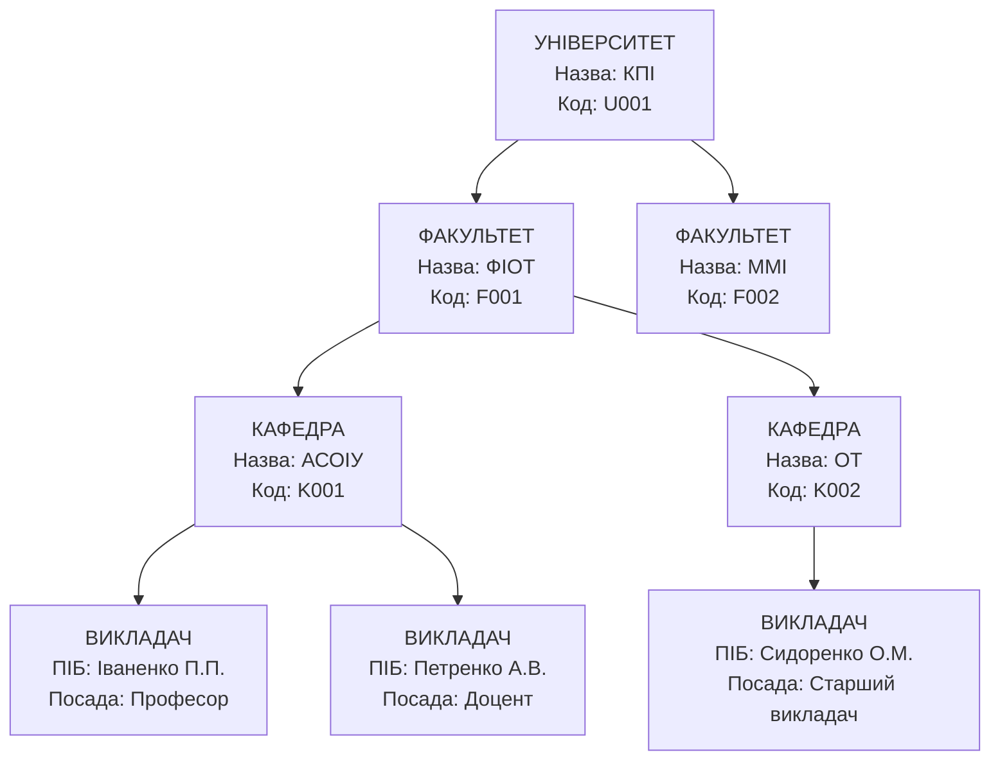
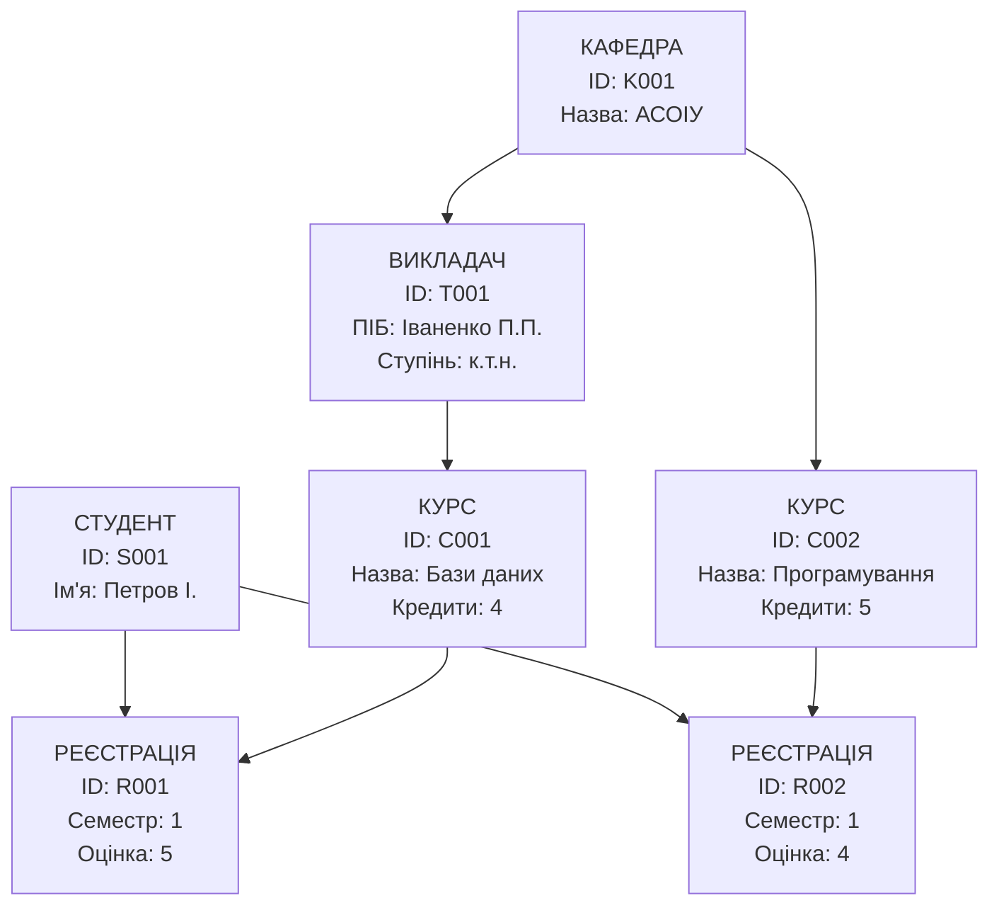
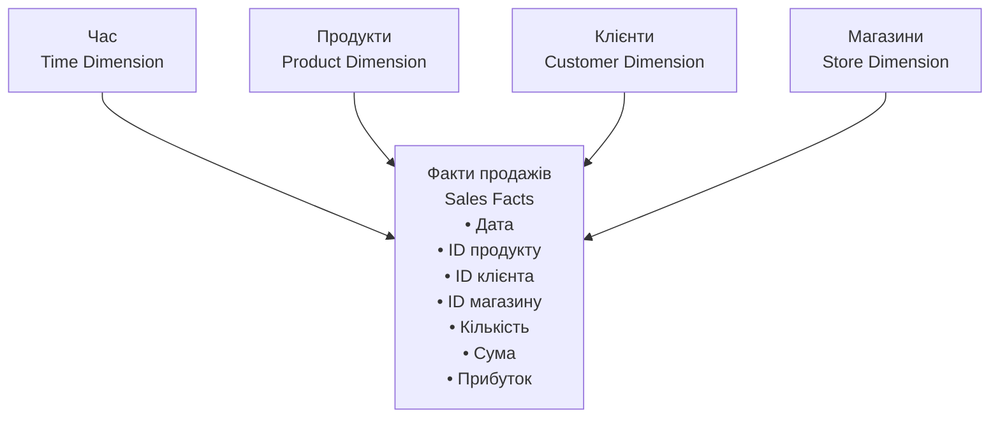
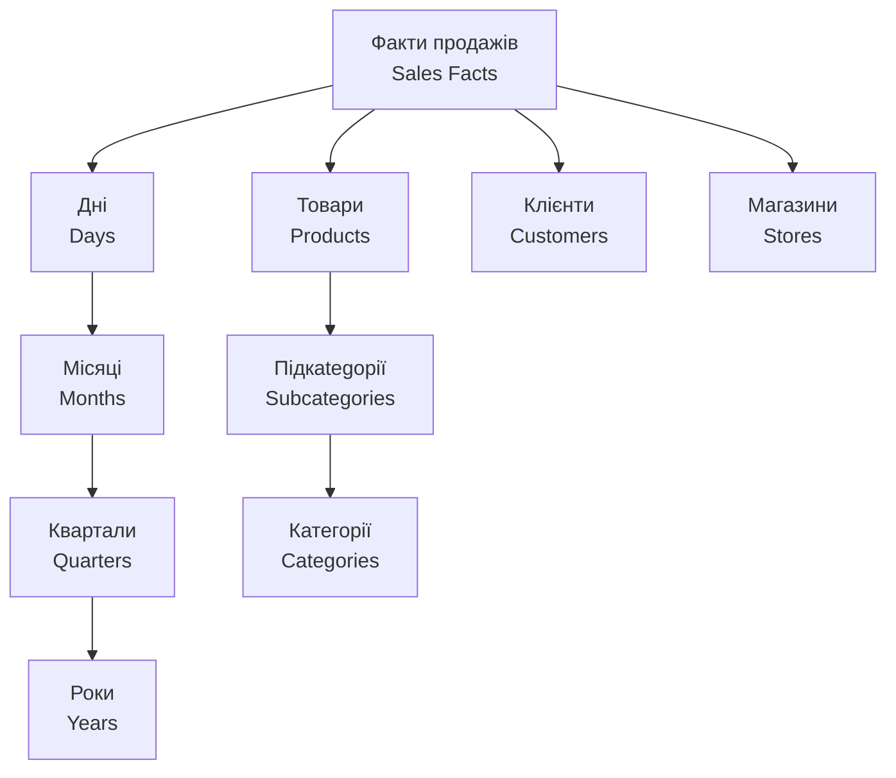

# Лекція 3. Моделі представлення даних

## Вступ

Модель даних є фундаментальною основою для проектування та функціонування будь-якої системи управління базами даних. Вона визначає, як дані структуруються, як вони пов'язані між собою, які операції можуть виконуватися над ними та які обмеження застосовуються для забезпечення цілісності. Правильний вибір моделі даних критично впливає на ефективність системи, її гнучкість та можливості розширення.

Протягом історії розвитку баз даних було запропоновано кілька різних підходів до моделювання даних. Кожен з них відповідав на конкретні потреби свого часу та мав певні переваги і недоліки. Розуміння особливостей кожної моделі допомагає приймати обґрунтовані рішення при проектуванні сучасних інформаційних систем.

**Модель даних** — це абстрактний інструмент для опису реального світу за допомогою понять, які можуть бути зрозумілі комп'ютеру. вона включає три основні компоненти:

- Структурний компонент — визначає, як організовані дані (таблиці, ієрархії, графи тощо).
- Маніпуляційний компонент — описує операції, які можна виконувати з даними (вибірка, вставка, оновлення, видалення).
- Цілісний компонент — встановлює правила та обмеження, які забезпечують коректність даних.

## Концептуальні моделі даних

### Ієрархічна модель

Ієрархічна модель була однією з перших спроб структуризації даних на логічному рівні. Вона організовує дані у вигляді дерева, де кожен елемент (вузол) може мати декілька нащадків, але тільки одного батька. Така структура природно відображає багато реальних ситуацій: організаційні структури компаній, класифікацію товарів, географічні поділи тощо.

#### Основні характеристики ієрархічної моделі

Структура дерева: Дані організовані у вигляді перевернутого дерева з кореневим сегментом на вершині. Кожен сегмент відповідає типу запису, а кожен екземпляр сегмента — конкретному запису.

Зв'язки типу "один-до-багатьох": Один батьківський запис може мати багато дочірніх записів, але кожен дочірній запис має рівно одного батька. Це створює природну ієрархію залежностей.

Навігаційний доступ: Для досягнення конкретного запису необхідно пройти шлях від кореня дерева через усі проміжні рівні. Це забезпечує передбачуваність доступу, але може бути неефективним для складних запитів.

Фізична близькість: Пов'язані записи часто зберігаються фізично поруч на носії, що забезпечує швидкий послідовний доступ до всієї ієрархії.

#### Приклад ієрархічної структури



У цій структурі для отримання інформації про викладача Іваненка необхідно пройти шлях: Університет → Факультет ФІОТ → Кафедра АСОІУ → Викладач Іваненко.

#### Переваги ієрархічної моделі

- Швидкодія: Навігація по заздалегідь визначених шляхах виконується дуже швидко, оскільки фізичне розміщення даних оптимізовано для таких операцій.
- Природність: Багато предметних областей мають природну ієрархічну структуру, яка легко відображається в цій моделі.
- Простота розуміння: Деревоподібна структура інтуїтивно зрозуміла користувачам та розробникам.
- Ефективність зберігання: Відсутність складних зв'язків дозволяє компактно зберігати дані.
- Цілісність: Батько-дочірні зв'язки автоматично забезпечують посилальну цілісність.

#### Недоліки ієрархічної моделі

- Обмежена гнучкість: Складно або неможливо представити зв'язки "багато-до-багатьох" та "багато-до-одного", що не відповідають ієрархії.
- Дублювання даних: Якщо запис повинен бути доступний через різні шляхи, його доводиться дублювати в різних гілках дерева.
- Складність реструктуризації: Зміна ієрархії вимагає повної перебудови бази даних та модифікації всіх програм, що з нею працюють.
- Залежність від фізичної структури: Програми повинні знати точні шляхи доступу до даних, що створює тісну залежність між логікою додатка та організацією даних.

#### Області застосування

Ієрархічна модель залишається актуальною в областях, де дані мають природну деревоподібну структуру:

- Файлові системи операційних систем.
- Організаційні структури підприємств.
- Каталоги товарів та послуг.
- Географічні класифікатори (країна → область → місто).
- XML-документи та веб-структури.

### Мережева модель

Мережева модель виникла як розширення ієрархічної моделі для подолання її основного обмеження — неможливості ефективно представляти складні зв'язки. Вона дозволяє кожному запису мати кілька батьківських записів, створюючи мережеву (графову) структуру зв'язків.

#### Основні характеристики мережевої моделі

Графова структура: Дані організовані у вигляді направленого графа, де вузли представляють типи записів, а ребра — зв'язки між ними.

Набори (Sets): Зв'язки між записами організовані у вигляді наборів, де кожен набір містить один тип власника (owner) та один або більше типів членів (members).

Багатобатьківські зв'язки: На відміну від ієрархічної моделі, запис може бути членом кількох наборів одночасно, що дозволяє моделювати складні зв'язки.

Навігаційний доступ: Як і в ієрархічній моделі, доступ до даних здійснюється через навігацію по зв'язках, але можливих шляхів значно більше.

#### Приклад мережевої структури



У цій структурі студент може бути зареєстрований на кілька курсів, курс може викладати кілька викладачів, а викладач може працювати на кількох кафедрах.

#### Переваги мережевої моделі

- Гнучкість моделювання: Можливість представлення зв'язків "багато-до-багатьох" робить модель значно більш універсальною.
- Ефективність зв'язків: Фізичні покажчики забезпечують швидкий перехід між пов'язаними записами.
- Менше дублювання: Порівняно з ієрархічною моделлю, дані дублюються значно рідше.
- Підтримка складних структур: Можливість моделювання складних предметних областей з багатьма перехресними зв'язками.

#### Недоліки мережевої моделі

- Складність програмування: Розробникам необхідно детально знати структуру мережі та писати навігаційний код для доступу до даних.
- Відсутність стандартів: На відміну від SQL для реляційних баз даних, для мережевих СУБД не існувало universal стандартів.
- Складність адміністрування: Управління складними мережевими структурами вимагає високої кваліфікації адміністраторів.
- Залежність від фізичної структури: Зміни в структурі мережі можуть вплинути на всі програми, що працюють з базою даних.
- Проблема цілісності: Складніше забезпечити посилальну цілісність у мережі порівняно з деревом.

### Реляційна модель

Реляційна модель, запропонована Едгаром Коддом у 1970 році, стала революційним кроком у розвитку баз даних. Вона базується на строгій математичній основі — реляційній алгебрі та теорії множин — що забезпечує її концептуальну простоту та потужність.

#### Основні принципи реляційної моделі

Відношення (Relations): Дані організовані у вигляді відношень, які зазвичай представляються як таблиці. Кожне відношення має ім'я та складається з атрибутів (стовпців) та кортежів (рядків).

**Атомарність значень**: Кожна комірка таблиці містить атомарне (неподільне) значення. Це означає, що в одному полі не можна зберігати список значень або складні структури.

**Унікальність кортежів**: Кожен рядок у відношенні повинен бути унікальним. Це забезпечується первинним ключем — атрибутом або комбінацією атрибутів, що однозначно ідентифікує кожен кортеж.

Невпорядкованість: Рядки та стовпці в таблиці не мають визначеного порядку. Результат запиту може повертати дані в будь-якій послідовності, якщо не вказано явне сортування.

#### Ключові поняття реляційної моделі

**Домен** — це множина допустимих значень для атрибута. Наприклад, домен для атрибута "вік" може бути множиною цілих чисел від 0 до 150.

**Кортеж** — це упорядкований набір значень атрибутів, що відповідає одному рядку таблиці.

**Відношення** — це множина кортежів з однаковою структурою атрибутів.

**Схема відношення** — це опис структури відношення, що включає назви атрибутів та їх домени.

#### Приклад реляційної структури

```sql
-- Таблиця студентів
CREATE TABLE students (
    student_id INT PRIMARY KEY,
    first_name VARCHAR(50) NOT NULL,
    last_name VARCHAR(50) NOT NULL,
    group_name VARCHAR(10),
    birth_date DATE,
    email VARCHAR(100) UNIQUE
);

-- Таблиця курсів
CREATE TABLE courses (
    course_id INT PRIMARY KEY,
    course_name VARCHAR(100) NOT NULL,
    credits INT CHECK (credits > 0),
    teacher_name VARCHAR(100)
);

-- Таблиця реєстрацій (зв'язок багато-до-багатьох)
CREATE TABLE enrollments (
    student_id INT,
    course_id INT,
    enrollment_date DATE DEFAULT CURRENT_DATE,
    grade DECIMAL(3,2),
    PRIMARY KEY (student_id, course_id),
    FOREIGN KEY (student_id) REFERENCES students(student_id),
    FOREIGN KEY (course_id) REFERENCES courses(course_id)
);
```

#### Переваги реляційної моделі

- **Математична строгість**: Реляційна алгебра забезпечує теоретичну основу для операцій з даними, що гарантує коректність та передбачуваність результатів.
- **Незалежність даних**: Логічна структура даних не залежить від фізичного способу їх зберігання, що дозволяє змінювати фізичну організацію без впливу на програми.
- **Декларативність**: Мова SQL дозволяє описувати, які дані потрібні, не вказуючи, як їх отримати. Оптимізатор запитів самостійно визначає найефективніший спосіб виконання.
- Гнучкість: Можливість створювати довільні зв'язки між таблицями через зовнішні ключі та об'єднання.
- **Стандартизація**: SQL є міжнародним стандартом, що забезпечує переносимість між різними СУБД.
- Цілісність даних: Вбудовані механізми забезпечення посилальної цілісності, обмежень домену та бізнес-правил.

#### Недоліки реляційної моделі

- Об'єктно-реляційний розрив: Складність відображення об'єктно-орієнтованих структур програм у реляційні таблиці.
- Обмеження при роботі з ієрархіями: Представлення деревоподібних структур вимагає складних запитів або додаткових таблиць.
- Продуктивність складних запитів: Об'єднання великої кількості таблиць може бути ресурсозатратним.
- Жорсткість схеми: Зміна структури таблиць може бути складною в продакшн-системах.

#### Області застосування

Реляційна модель найкраще підходить для:

- Транзакційних систем (OLTP).
- Фінансових додатків.
- Систем управління ресурсами підприємства (ERP).
- Систем управління взаємовідносинами з клієнтами (CRM).
- Вебдодатків з структурованими даними.

## Об'єктно-орієнтовані та об'єктно-реляційні розширення

### Об'єктно-орієнтована модель

Об'єктно-орієнтована модель даних виникла в 1980-х роках як відповідь на потреби розробників, які працювали з об'єктно-орієнтованими мовами програмування. Головна ідея полягала в тому, щоб зберігати дані в тому ж вигляді, в якому вони існують у програмі — як об'єкти з властивостями та методами.

#### Основні принципи об'єктно-орієнтованої моделі

**Інкапсуляція**: Об'єкт поєднує в собі дані (атрибути) та код, який їх обробляє (методи). Це забезпечує цілісність об'єкта та приховує деталі реалізації.

**Успадкування**: Можливість створювати нові типи об'єктів на основі існуючих, успадковуючи їх властивості та поведінку. Це забезпечує повторне використання коду та створення ієрархій типів.

**Поліморфізм**: Один інтерфейс може мати різні реалізації в залежності від типу об'єкта. Це дозволяє писати гнучкий код, який працює з об'єктами різних типів.

**Ідентичність об'єктів**: Кожен об'єкт має унікальний ідентифікатор (OID), який не залежить від значень його атрибутів.

#### Переваги об'єктно-орієнтованої моделі

- Природність моделювання: Об'єкти бази даних прямо відповідають об'єктам програми, що усуває необхідність в складному відображенні.
- Підтримка складних типів: Можливість зберігання мультимедійних даних, геометричних об'єктів, часових рядів тощо.
- Повторне використання: Успадкування та поліморфізм дозволяють створювати бібліотеки повторно використовуваних компонентів.
- Бізнес-логіка в базі даних: Методи об'єктів можуть містити складну бізнес-логіку, що виконується безпосередньо в базі даних.

#### Недоліки об'єктно-орієнтованої моделі

- Відсутність стандартизації: На відміну від SQL, немає загальноприйнятих стандартів для об'єктних баз даних.
- Складність оптимізації: Методи об'єктів можуть містити довільний код, що ускладнює оптимізацію запитів.
- Обмежена підтримка запитів: Декларативні мови запитів менш розвинені порівняно з SQL.
- Продуктивність: Накладні витрати на управління об'єктами можуть знижувати продуктивність.

### Об'єктно-реляційна модель

Об'єктно-реляційна модель представляє компроміс між реляційним та об'єктним підходами. Вона розширює реляційну модель об'єктно-орієнтованими можливостями, зберігаючи при цьому сумісність з SQL та перевіреними часом реляційними принципами.

#### Основні можливості об'єктно-реляційних СУБД

Користувацькі типи даних: Можливість визначення власних складних типів даних, що виходять за межі стандартних скалярних типів.

Вкладені таблиці: Атрибут може містити не просте значення, а цілу таблицю або масив значень.

Об'єктні посилання: Можливість створювати посилання між об'єктами, що зберігаються в різних таблицях.

Методи типів: Користувацькі типи можуть мати асоційовані з ними функції та процедури.

Успадкування таблиць: Можливість створювати нові таблиці на основі існуючих з успадкуванням структури та поведінки.

#### Приклад об'єктно-реляційних можливостей

```sql
-- Визначення користувацького типу
CREATE TYPE address_type AS (
    street VARCHAR(100),
    city VARCHAR(50),
    postal_code VARCHAR(10),
    country VARCHAR(50)
);

-- Тип з методами
CREATE TYPE person_type AS (
    first_name VARCHAR(50),
    last_name VARCHAR(50),
    birth_date DATE
);

-- Додавання методу до типу
CREATE FUNCTION get_age(person person_type) RETURNS INTEGER
AS $$
    SELECT EXTRACT(year FROM age(CURRENT_DATE, person.birth_date))::INTEGER;
$$ LANGUAGE SQL;

-- Використання в таблиці
CREATE TABLE employees (
    employee_id SERIAL PRIMARY KEY,
    personal_info person_type,
    addresses address_type ARRAY,
    skills TEXT[]
);
```

#### Переваги об'єктно-реляційної моделі

- Зворотна сумісність: Існуючі реляційні додатки продовжують працювати без змін.
- Поступовість міграції: Можна поступово додавати об'єктні можливості до існуючих систем.
- **Стандартизація**: SQL:1999 та наступні стандарти включають об'єктно-реляційні розширення.
- Гнучкість: Можливість вибирати між реляційним та об'єктним підходами залежно від конкретних потреб.

#### Недоліки об'єктно-реляційної моделі

- Складність: Поєднання двох парадигм може створювати концептуальну складність.
- Часткова реалізація: Багато СУБД реалізують тільки частину об'єктно-реляційних можливостей.
- Продуктивність: Об'єктні розширення можуть знижувати продуктивність традиційних реляційних операцій.

## Семіструктуровані моделі: XML, JSON та їх застосування

Семіструктуровані дані займають проміжне положення між структурованими (реляційними) та неструктурованими даними. Вони мають певну структуру, але вона не є жорсткою та може варіюватися між різними записами. Два найпопулярніші формати семіструктурованих даних — **XML** та **JSON**.

### XML (eXtensible Markup Language)

XML — це мова розмітки, розроблена для зберігання та передачі структурованих даних. Вона використовує теги для позначення елементів та їх ієрархічних відносин.

#### Основні характеристики XML

**Ієрархічна структура**: XML-документи організовані як дерева елементів з кореневим елементом на вершині.

**Самоописність**: Структура та зміст документа описуються безпосередньо в ньому за допомогою тегів.

Розширюваність: Можна визначати власні теги та атрибути відповідно до потреб конкретної предметної області.

Валідація: XML Schema або DTD дозволяють визначити правила структури та змісту документів.

#### Приклад XML-документа

```xml
<?xml version="1.0" encoding="UTF-8"?>
<students>
    <student id="S001">
        <personal_info>
            <first_name>Іван</first_name>
            <last_name>Петров</last_name>
            <birth_date>2003-05-15</birth_date>
        </personal_info>
        <academic_info>
            <group>КН-21</group>
            <year_enrolled>2021</year_enrolled>
        </academic_info>
        <courses>
            <course id="C001" name="Бази даних" credits="4"/>
            <course id="C002" name="Програмування" credits="5"/>
        </courses>
        <contacts>
            <email>ivan.petrov@example.com</email>
            <phone>+380501234567</phone>
        </contacts>
    </student>
</students>
```

#### Переваги XML

- **Стандартизація**: XML є відкритим стандартом W3C з широкою підтримкою.
- Читабельність: Текстовий формат легко читається людиною та обробляється програмами.
- Багатофункціональність: Підтримка атрибутів, простори імен, коментарі, інструкції обробки.
- Валідація: Можливість строгої перевірки структури та змісту.
- Трансформація: XSLT дозволяє перетворювати XML-документи в різні формати.

#### Недоліки XML

- Багатослів'я: Теги та атрибути створюють значні накладні витрати на розмір документа.
- Складність парсингу: Обробка XML вимагає більше ресурсів порівняно з простішими форматами.
- Надмірна гнучкість: Можливість створювати різні структури для однієї предметної області може ускладнити інтеграцію.

### JSON (JavaScript Object Notation)

JSON — це легкий формат обміну даними, який легко читається людиною та обробляється комп'ютером. Незважаючи на назву, JSON не залежить від JavaScript та широко використовується в різних мовах програмування.

#### Основні характеристики JSON

**Простота**: JSON має мінімальний синтаксис з обмеженим набором типів даних.

**Компактність**: Відсутність закриваючих тегів робить JSON значно компактнішим за XML.

Природність для програмістів: Структура JSON дуже схожа на об'єкти та масиви в більшості мов програмування.

Широка підтримка: Практично всі сучасні мови програмування мають вбудовану підтримку JSON.

#### Приклад JSON-документа

```json
{
  "students": [
    {
      "id": "S001",
      "personal_info": {
        "first_name": "Іван",
        "last_name": "Петров",
        "birth_date": "2003-05-15"
      },
      "academic_info": {
        "group": "КН-21",
        "year_enrolled": 2021,
        "gpa": 4.5
      },
      "courses": [
        {
          "id": "C001",
          "name": "Бази даних",
          "credits": 4,
          "grade": "A"
        },
        {
          "id": "C002",
          "name": "Програмування",
          "credits": 5,
          "grade": "B+"
        }
      ],
      "contacts": {
        "email": "ivan.petrov@example.com",
        "phone": "+380501234567",
        "social_media": [
          {
            "platform": "Telegram",
            "handle": "@ivan_petrov"
          }
        ]
      }
    }
  ]
}
```

#### Переваги JSON

- **Компактність**: Менший розмір документів порівняно з XML.
- **Швидкість парсингу**: Простий синтаксис забезпечує швидку обробку.
- Природність: Прямо відповідає структурам даних у мовах програмування.
- Читабельність: Легко читається та редагується людиною.

#### Недоліки JSON

- Обмеженість типів: Підтримка тільки основних типів даних (рядки, числа, логічні значення, масиви, об'єкти).
- Відсутність коментарів: Неможливо додавати коментарі безпосередньо в JSON.
- Відсутність валідації: Немає вбудованих механізмів перевірки структури (хоча існують зовнішні схеми як JSON Schema).

### Застосування семіструктурованих моделей

#### Веб-сервіси та API

JSON став стандартом де-факто для REST API через свою простоту та компактність. XML використовується в SOAP веб-сервісах та корпоративних системах інтеграції, де важливі строга типізація та валідація.

#### Конфігураційні файли

Як JSON, так і XML широко використовуються для зберігання конфігурацій додатків. JSON переважає у веб-розробці, тоді як XML популярний у корпоративних Java-додатках.

#### Документо-орієнтовані бази даних

NoSQL бази даних як MongoDB, CouchDB використовують JSON-подібні формати для зберігання документів. Це дозволяє зберігати складні, вкладені структури без необхідності попереднього визначення схеми.

#### Обмін даними між системами

Семіструктуровані формати ідеально підходять для інтеграції різнорідних систем, особливо коли структура даних може змінюватися або не є повністю передбачуваною.

## Багатовимірні моделі для аналітичних систем (OLAP)

Багатовимірні моделі даних розроблені спеціально для аналітичної обробки інформації та підтримки прийняття рішень. На відміну від транзакційних систем (OLTP), які оптимізовані для швидкої обробки окремих операцій, аналітичні системи (OLAP) призначені для аналізу великих обсягів історичних даних.

### Концепція багатовимірності

**Багатовимірна модель** розглядає дані як багатовимірний куб (гіперкуб), де кожен вимір представляє певний аспект аналізу, а комірки куба містять числові показники (міри).

#### Основні компоненти багатовимірної моделі

**Факти (Facts)** — це кількісні дані, які аналізуються. Зазвичай це числові показники бізнесу: продажі, прибуток, кількість товарів, витрати тощо.

**Виміри (Dimensions)** — це аспекти, за якими аналізуються факти. Типові виміри: час, географія, продукти, клієнти, канали продажів.

**Міри (Measures)** — це функції агрегації, які застосовуються до фактів: сума, середнє значення, кількість, максимум, мінімум.

**Ієрархії (Hierarchies)** — це структури всередині вимірів, які дозволяють аналізувати дані на різних рівнях деталізації.

### Схеми організації даних

#### Схема "зірка" (Star Schema)

Найпростіша та найпопулярніша схема для побудови сховищ даних. Вона складається з центральної таблиці фактів, оточеної таблицями вимірів.



Переваги схеми "зірка":

- Простота розуміння та реалізації.
- Швидкі запити через мінімум об'єднань.
- Ефективна робота з OLAP інструментами.
- Денормалізація вимірів спрощує запити.

Недоліки:

- Дублювання даних у таблицях вимірів.
- Складність оновлення при змінах у ієрархіях.
- Більший розмір таблиць вимірів.

#### Схема "сніжинка" (Snowflake Schema)

Нормалізована версія схеми "зірка", де таблиці вимірів додатково розбиваються на пов'язані таблиці відповідно до ієрархій.



Переваги схеми "сніжинка":

- Менше дублювання даних.
- Легше підтримувати ієрархії.
- Краща нормалізація.

Недоліки:

- Більше об'єднань у запитах.
- Складніша для розуміння.
- Повільніші запити.

### OLAP операції

#### Slice (Зріз)

Вибір підмножини багатовимірного куба шляхом фіксації одного або кількох вимірів на конкретних значеннях.

Приклад: Аналіз продажів тільки за 2023 рік (фіксація виміру часу).

#### Dice (Кубик)

Вибір підкуба шляхом встановлення діапазонів значень для кількох вимірів одночасно.

Приклад: Продажі комп'ютерів і планшетів у Києві та Львові за останній квартал.

#### Drill Down (Деталізація)

Перехід з більш агрегованого рівня до більш детального в рамках ієрархії виміру.

Приклад: Перехід від річних продажів до щомісячних, потім до щоденних.

#### Roll Up (Згортання)

Протилежна операція до Drill Down — перехід від детального рівня до більш агрегованого.

Приклад: Перехід від щоденних продажів до щомісячних.

#### Pivot (Поворот)

Зміна орієнтації куба — переміщення вимірів між осями для отримання різних поглядів на дані.

### Типи OLAP систем

#### MOLAP (Multidimensional OLAP)

Дані зберігаються у спеціалізованих багатовимірних структурах.

Переваги:
- Найшвидша продуктивність запитів.
- Оптимізовані алгоритми агрегації.
- Ефективне стиснення даних.

Недоліки:
- Обмеження масштабованості.
- Складність ETL процесів.
- Вимогливість до ресурсів при побудові кубів.

#### ROLAP (Relational OLAP)

Дані зберігаються у реляційних таблицях, а багатовимірність емулюється через SQL запити.

Переваги:
- Висока масштабованість.
- Використання існуючої реляційної інфраструктури.
- Гнучкість у визначенні структур.

Недоліки:
- Повільніші запити порівняно з MOLAP.
- Складні SQL запити для багатовимірних операцій.

#### HOLAP (Hybrid OLAP)

Комбінує підходи MOLAP та ROLAP — деталені дані в реляційних таблицях, агрегати в багатовимірних структурах.

### Переваги багатовимірних моделей

- Інтуїтивність: Багатовимірне подання природно відповідає людському сприйняттю аналітичної інформації.
- Швидкість аналізу: Попередньо розраховані агрегати забезпечують швидкі відповіді на аналітичні запити.
- Гнучкість перегляду: Легкість зміни перспектив аналізу через OLAP операції.
- Підтримка складних розрахунків: Можливість визначення бізнес-правил та розрахункових показників.

### Недоліки багатовимірних моделей

- Складність підтримки: Зміни у структурі даних вимагають перебудови кубів.
- Ресурсоємність: Побудова та оновлення багатовимірних структур потребує значних ресурсів.
- Обмеженість запитів: Оптимізація під конкретні типи аналітичних запитів може обмежувати гнучкість.

## Критерії вибору моделі даних для конкретних застосувань

Вибір відповідної моделі даних є одним з найважливіших рішень при проектуванні інформаційної системи. Правильний вибір може забезпечити ефективність, масштабованість та простоту підтримки, тоді як неправильний — призвести до проблем продуктивності, складності розробки та високої вартості експлуатації.

### Характеристики даних

#### Структурованість даних

Високо структуровані дані з фіксованою схемою та чітко визначеними зв'язками найкраще підходять для реляційної моделі. Прикладами є фінансові дані, інформація про співробітників, інвентаризаційні дані.

Семіструктуровані дані з гнучкою або змінною структурою краще зберігати в документо-орієнтованих базах даних або використовувати JSON/XML у реляційних СУБД. Приклади: каталоги товарів, профілі користувачів, конфігурації.

Неструктуровані дані як тексти, зображення, відео потребують спеціалізованих рішень або blob-зберігання в традиційних СУБД.

#### Складність зв'язків

Прості зв'язки типу "один-до-багатьох" ефективно підтримуються всіма моделями.

Складні мережеві зв'язки краще моделювати за допомогою графових баз даних або мережевих моделей.

Ієрархічні структури природно відображаються в ієрархічних базах даних або можуть ефективно зберігатися у вигляді JSON/XML.

#### Об'єм даних

Малі та середні об'єми (до терабайтів) ефективно обробляються традиційними реляційними СУБД.

Великі дані (петабайти та більше) потребують розподілених рішень: NoSQL бази даних, розподілені файлові системи, хмарні сховища.

### Характеристики навантаження

#### Співвідношення читання та запису

Інтенсивне читання добре підтримується реляційними СУБД з індексами, кеш-системами типу Redis, колонковими сховищами для аналітики.

Інтенсивний запис краще обробляється NoSQL системами, які оптимізовані для швидкої вставки даних.

Збалансоване навантаження ефективно обробляється традиційними реляційними СУБД з правильною конфігурацією.

#### Типи запитів

**Транзакційні запити (OLTP)** з частими оновленнями окремих записів оптимально підтримуються реляційними СУБД.

**Аналітичні запити (OLAP)** з агрегацією великих об'ємів даних краще виконуються колонковими СУБД або спеціалізованими аналітичними платформами.

Повнотекстовий пошук вимагає спеціалізованих рішень як Elasticsearch або вбудованих можливостей NoSQL баз даних.

### Вимоги до консистентності

#### ACID властивості

**Строга консистентність** необхідна для фінансових систем, де втрата або дублювання транзакцій неприпустимі. Це вимагає традиційних реляційних СУБД з підтримкою ACID.

**Eventual consistency** прийнятна для багатьох вебдодатків, соціальних мереж, системи рекомендацій, де короткочасна неконсистентність не критична.

#### Розподілені транзакції

Локальні транзакції ефективно підтримуються одновузловими СУБД.

Розподілені транзакції складні у реалізації та можуть знижувати продуктивність. Часто краще проектувати систему так, щоб уникати їх необхідності.

### Вимоги до масштабованості

#### Вертикальне масштабування

Збільшення потужності одного сервера підходить для багатьох традиційних додатків з помірним зростанням навантаження.

#### Горизонтальне масштабування

Додавання нових серверів необхідне для високонавантажених систем. NoSQL бази даних зазвичай краще підтримують горизонтальне масштабування.

### Експлуатаційні вимоги

#### Доступність команди

Досвідчена SQL команда може ефективно працювати з реляційними СУБД та складними запитами.

Команда з досвідом у конкретних NoSQL технологіях необхідна для успішної експлуатації документо-орієнтованих, графових або колонкових баз даних.

#### Бюджет та ресурси

Обмежений бюджет може схилити до використання відкритих рішень як PostgreSQL, MongoDB Community Edition.

Корпоративні вимоги можуть виправдати витрати на комерційні рішення з розширеною підтримкою.

### Рекомендації для типових сценаріїв

#### Корпоративні додатки (ERP, CRM)

Рекомендація: Реляційна модель (PostgreSQL, Oracle, SQL Server).

Обґрунтування: Складні бізнес-правила, потреба в транзакційності, структурованість даних, необхідність звітності.

#### Вебдодатки та мобільні додатки

Рекомендація: Гібридний підхід - реляційна база для основних даних + Redis для кешування + документо-орієнтована для гнучких даних.

Обґрунтування: Різноманітність типів даних, потреба в швидкодії, гнучкість розробки.

#### Аналітичні системи

Рекомендація: Багатовимірна модель або колонкові СУБД (ClickHouse, Apache Druid).

Обґрунтування: Складні аналітичні запити, великі об'єми даних, потреба в агрегації.

#### Соціальні мережі

Рекомендація: Графові бази даних (Neo4j) для соціального графу + документо-орієнтовані для контенту.

Обґрунтування: Складні зв'язки між користувачами, різноманітний контент, масштабованість.

#### IoT системи

Рекомендація: Часові ряди баз даних (InfluxDB, TimescaleDB).

Обґрунтування: Великі об'єми часових даних, потреба в швидкій вставці, аналіз трендів.

## Висновки

Вибір моделі даних має базуватися на ретельному аналізі специфічних вимог проєкту. Не існує універсального рішення, яке підходило б для всіх ситуацій. Кожна модель має свої переваги та недоліки, які проявляються по-різному залежно від контексту використання.

Сучасні системи часто використовують поліглот-персистенс підхід, коли різні типи даних зберігаються в найбільш підходящих для них сховищах. Наприклад, транзакційні дані — в реляційній базі, документи — в MongoDB, графи зв'язків — в Neo4j, а аналітичні дані — в колонковій СУБД.

При виборі моделі важливо враховувати не тільки поточні потреби, але й перспективи розвитку системи. Міграція між різними моделями даних може бути складною та дорогою, тому краще одразу заклати основи для майбутнього зростання.

Розуміння принципів роботи різних моделей даних дозволяє архітекторам та розробникам приймати обґрунтовані рішення та створювати ефективні, масштабовані системи, які відповідають реальним потребам бізнесу.
