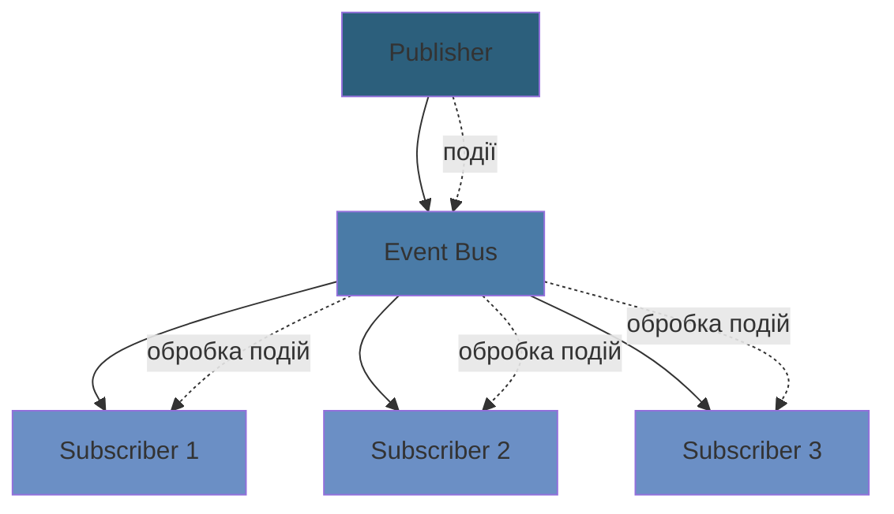
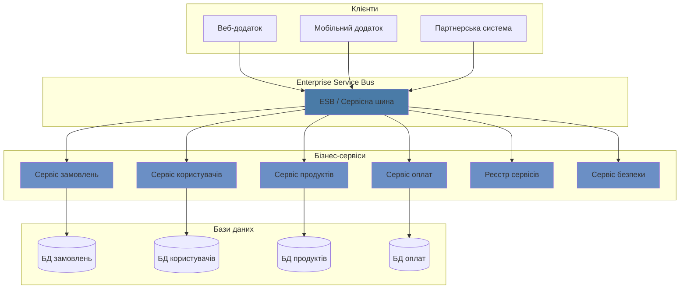

# Архітектура програмного забезпечення
## основні концепції та патерни

---

## Архітектура програмного забезпечення

Архітектура програмного забезпечення (Software Architecture) - це фундаментальна організація системи, виражена в її компонентах, їх відносинах між собою та з середовищем, а також принципи, що керують її проектуванням та еволюцією.

---

## Значення архітектури

- **Забезпечує структурну цілісність системи**
- **Спрощує розуміння складних систем**
- **Полегшує комунікацію між зацікавленими сторонами**
- **Дозволяє приймати ключові проектні рішення на ранніх етапах**

---

## Ключові характеристики якості архітектури

### Масштабованість
- Вертикальна масштабованість
- Горизонтальна масштабованість
- Масштабованість даних

### Надійність
- Відмовостійкість
- Відновлюваність
- Доступність

### Безпека
- Автентифікація
- Авторизація
- Захист даних

### Продуктивність
- Час відгуку
- Пропускна здатність
- Використання ресурсів

---

## Архітектурні патерни

- **Клієнт-серверна архітектура**
- **Багатошарова архітектура**
- **Мікросервісна архітектура**
- **Монолітна архітектура**
- **Event-driven архітектура**
- **Service-Oriented Architecture (SOA)**

---

## Монолітна архітектура

Монолітна архітектура представляє собою єдиний, неподільний блок коду, де всі компоненти програми тісно пов'язані між собою та працюють як єдине ціле.

### Переваги:
- Простота розробки та відлагодження
- Легке розгортання (один артефакт)
- Простіша крос-компонентна комунікація
- Швидка продуктивність (немає мережевих затримок)

### Недоліки:
- Складність підтримки при зростанні проекту
- Обмежена масштабованість
- Складність впровадження змін
- Обмеження у виборі технологій

### Застосування
- Невеликі проекти
- MVP (мінімально життєздатний продукт)
- Прості корпоративні додатки

```mermaid
graph TD
    A[Моноліт] --> B[Користувацький інтерфейс]
    A --> C[Бізнес-логіка]
    A --> D[Доступ до даних]
    A --> E[(База даних)]

    style A fill:#2C5F7C
    style B fill:#4A7BA7
    style C fill:#4A7BA7
    style D fill:#4A7BA7
    style E fill:#1A4B5C
```

---

## Багатошарова архітектура (N-tier)

Архітектурний патерн, що розділяє систему на логічні шари, кожен з яких має свою відповідальність.

### Переваги:
- Чітке розділення відповідальності
- Можливість повторного використання компонентів
- Легше тестування
- Простіша підтримка

### Недоліки:
- Можлива надмірна складність
- Ризик створення "анемічних" шарів
- Потенційні проблеми продуктивності

### Типові шари
- Presentation Layer (UI)
- Application Layer (API)
- Data Access Layer (DAL)
- Database Layer

```mermaid
graph TD
    A[Рівень представлення] --> B[Рівень бізнес-логіки]
    B --> C[Рівень доступу до даних]
    C --> D[(База даних)]

    style A fill:#2C5F7C
    style B fill:#2C5F7C
    style C fill:#2C5F7C
    style D fill:#1A4B5C
```

---

## Мікросервісна архітектура

Архітектурний стиль, де додаток будується як набір маленьких незалежних сервісів, кожен з яких відповідає за конкретну бізнес-функцію.

### Переваги:
- Висока масштабованість
- Технологічна гнучкість
- Ізоляція відмов
- Незалежне розгортання
- Легше впровадження інновацій

### Недоліки:
- Складність розподілених систем
- Витрати на міжсервісну комунікацію
- Складність забезпечення консистентності даних
- Складність моніторингу та відлагодження

### Ключові компоненти
- API Gateway
- Service Discovery
- Message Broker
- Configuration Server
- Monitoring & Logging

```mermaid
graph TD
    A[Клієнт] --> B[API Gateway]
    B --> C[Сервіс автентифікації]
    B --> D[Сервіс замовлень]
    B --> E[Сервіс користувачів]
    B --> F[Сервіс продуктів]

    D --> G[(БД замовлень)]
    E --> H[(БД користувачів)]
    F --> I[(БД продуктів)]

    style A fill:#2C5F7C
    style B fill:#4A7BA7
    style C fill:#6B8FC5
    style D fill:#6B8FC5
    style E fill:#6B8FC5
    style F fill:#6B8FC5
    style G fill:#1A4B5C
    style H fill:#1A4B5C
    style I fill:#1A4B5C
```

---

## Event-Driven архітектура

Архітектурний патерн, заснований на створенні, виявленні та обробці подій.

### Переваги:
- Слабка зв'язність компонентів
- Хороша масштабованість
- Гнучкість при змінах
- Асинхронна обробка

### Недоліки:
- Складність відстеження потоку виконання
- Можливі проблеми з послідовністю подій
- Складність тестування
- Потенційні проблеми з консистентністю

---

## Клієнт-серверна архітектура

Розподілена архітектура, де навантаження розділене між постачальниками послуг (серверами) та запитувачами послуг (клієнтами).

### Переваги:
- Централізоване зберігання даних
- Централізоване управління ресурсами
- Легке оновлення серверної частини
- Безпека даних

### Недоліки:
- Залежність від сервера
- Необхідність постійного з'єднання
- Можливі проблеми масштабування сервера
- Вартість серверної інфраструктури

### Варіації
- 2-tier архітектура
- 3-tier архітектура
- Multi-tier архітектура

```mermaid
graph TD
    A[Клієнт 1] --> D[Сервер]
    B[Клієнт 2] --> D
    C[Клієнт 3] --> D
    D --> E[(База даних)]

    A -.->|запити| D
    B -.->|запити| D
    C -.->|запити| D
    D -.->|дані| E

    style A fill:#2C5F7C
    style B fill:#2C5F7C
    style C fill:#2C5F7C
    style D fill:#4A7BA7
    style E fill:#1A4B5C
```

---

## Service-Oriented Architecture (SOA)

Архітектурний стиль, де функціональність представлена у вигляді сервісів, доступних через стандартизовані інтерфейси.

### Переваги:
- Повторне використання сервісів
- Стандартизація інтерфейсів
- Легка інтеграція
- Бізнес-орієнтованість

### Недоліки:
- Складність управління
- Потенційна надмірність
- Витрати на інфраструктуру
- Складність забезпечення безпеки

---

## Рекомендації щодо вибору архітектури

### Фактори вибору

#### Масштаб проекту
- **Малі проекти:** моноліт
- **Середні:** багатошарова архітектура
- **Великі:** мікросервіси

#### Команда
- Розмір команди
- Досвід розробників
- Географічне розташування

#### Бізнес-вимоги
- Швидкість розробки
- Масштабованість
- Надійність
- Безпека

#### Технічні обмеження
- Існуюча інфраструктура
- Бюджет
- Часові обмеження
- Вимоги до продуктивності

---

## Типові сценарії застосування

### Стартап/MVP
- **Архітектура:** Монолітна архітектура, Багатошарова архітектура
- **Фокус:** Швидкий вихід на ринок, Простота розробки

### Корпоративний додаток
- **Архітектура:** Багатошарова архітектура, SOA
- **Фокус:** Акцент на надійність та безпеку

### Високонавантажена система
- **Архітектура:** Мікросервісна архітектура, Event-driven архітектура
- **Фокус:** Фокус на масштабованість

### Розподілена система
- **Архітектура:** Мікросервіси, Event-driven
- **Фокус:** Акцент на незалежність компонентів

---

## Висновки

Вибір архітектури програмного забезпечення є критично важливим рішенням, що впливає на:

- **Швидкість розробки** та час виходу продукту на ринок
- **Масштабованість** та здатність системи рости
- **Підтримуваність** коду в довгостроковій перспективі
- **Продуктивність** та ефективність використання ресурсів

**Ключове правило:** Починайте просто, ускладнюйте поступово відповідно до потреб бізнесу та технічних вимог.
