# Архітектура програмного забезпечення
## основні концепції та патерни

---

## Архітектура програмного забезпечення

Архітектура програмного забезпечення (Software Architecture) - це фундаментальна організація системи, виражена в її компонентах, їх відносинах між собою та з середовищем, а також принципи, що керують її проектуванням та еволюцією.

---

## Значення архітектури

- **Забезпечує структурну цілісність системи**
- **Спрощує розуміння складних систем**
- **Полегшує комунікацію між зацікавленими сторонами**
- **Дозволяє приймати ключові проектні рішення на ранніх етапах**

---

## Ключові характеристики якості архітектури

### Масштабованість
- Вертикальна масштабованість
- Горизонтальна масштабованість
- Масштабованість даних

### Надійність
- Відмовостійкість
- Відновлюваність
- Доступність

### Безпека
- Автентифікація
- Авторизація
- Захист даних

### Продуктивність
- Час відгуку
- Пропускна здатність
- Використання ресурсів

---

## Архітектурні патерни

- **Клієнт-серверна архітектура**
- **Багатошарова архітектура**
- **Мікросервісна архітектура**
- **Монолітна архітектура**
- **Event-driven архітектура**
- **Service-Oriented Architecture (SOA)**

---

## Монолітна архітектура

Монолітна архітектура представляє собою єдиний, неподільний блок коду, де всі компоненти програми тісно пов'язані між собою та працюють як єдине ціле.

<div class="grid cards" markdown>

- :material-plus: __Переваги__:
  ---
  Простота розробки та відлагодження
  Легке розгортання (один артефакт)
  Простіша крос-компонентна комунікація
  Швидка продуктивність (немає мережевих затримок)

- :material-minus:  __Недоліки__:
  ---
  Складність підтримки при зростанні проекту
  Обмежена масштабованість
  Складність впровадження змін
  Обмеження у виборі технологій
</div>


### Застосування
- Невеликі проекти
- MVP (мінімально життєздатний продукт)
- Прості корпоративні додатки

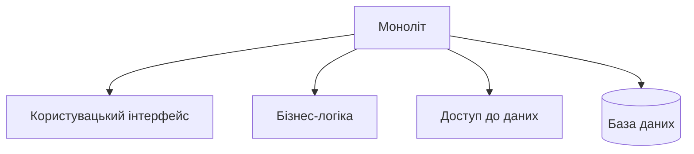

---

## Багатошарова архітектура (N-tier)

Архітектурний патерн, що розділяє систему на логічні шари, кожен з яких має свою відповідальність.

### Переваги:
- Чітке розділення відповідальності
- Можливість повторного використання компонентів
- Легше тестування
- Простіша підтримка

### Недоліки:
- Можлива надмірна складність
- Ризик створення "анемічних" шарів
- Потенційні проблеми продуктивності

### Типові шари
- Presentation Layer (UI)
- Application Layer (API)
- Data Access Layer (DAL)
- Database Layer

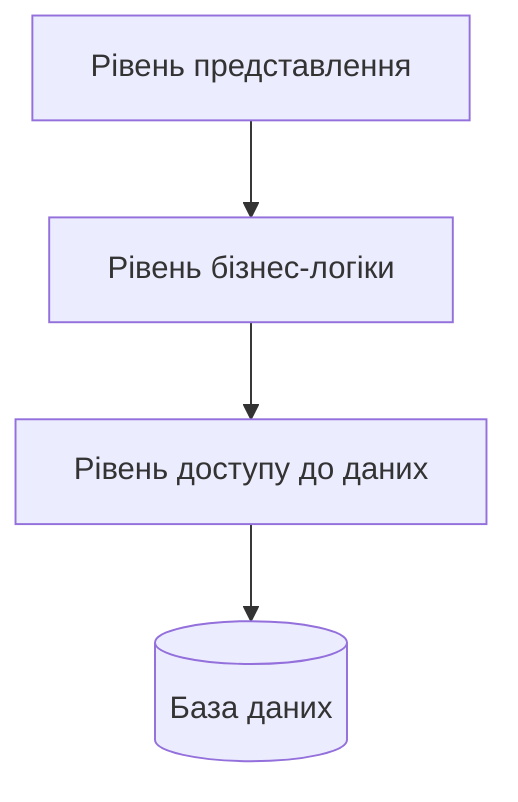

---

## Мікросервісна архітектура

Архітектурний стиль, де додаток будується як набір маленьких незалежних сервісів, кожен з яких відповідає за конкретну бізнес-функцію.

### Переваги:
- Висока масштабованість
- Технологічна гнучкість
- Ізоляція відмов
- Незалежне розгортання
- Легше впровадження інновацій

### Недоліки:
- Складність розподілених систем
- Витрати на міжсервісну комунікацію
- Складність забезпечення консистентності даних
- Складність моніторингу та відлагодження

### Ключові компоненти
- API Gateway
- Service Discovery
- Message Broker
- Configuration Server
- Monitoring & Logging

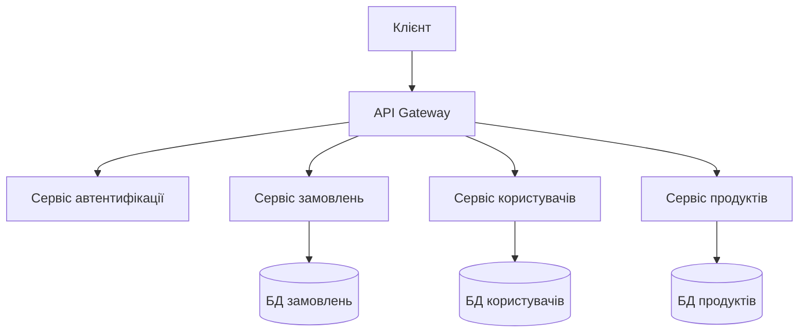

---

## Event-Driven архітектура

Архітектурний патерн, заснований на створенні, виявленні та обробці подій.

### Переваги:
- Слабка зв'язність компонентів
- Хороша масштабованість
- Гнучкість при змінах
- Асинхронна обробка

### Недоліки:
- Складність відстеження потоку виконання
- Можливі проблеми з послідовністю подій
- Складність тестування
- Потенційні проблеми з консистентністю

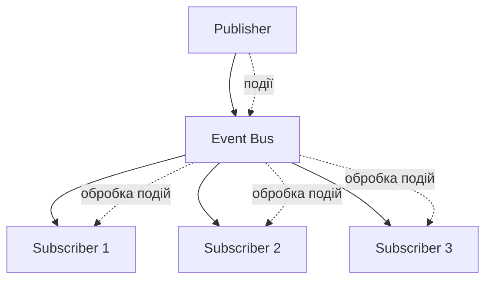

---

## Клієнт-серверна архітектура

Розподілена архітектура, де навантаження розділене між постачальниками послуг (серверами) та запитувачами послуг (клієнтами).

### Переваги:
- Централізоване зберігання даних
- Централізоване управління ресурсами
- Легке оновлення серверної частини
- Безпека даних

### Недоліки:
- Залежність від сервера
- Необхідність постійного з'єднання
- Можливі проблеми масштабування сервера
- Вартість серверної інфраструктури

### Варіації
- 2-tier архітектура
- 3-tier архітектура
- Multi-tier архітектура

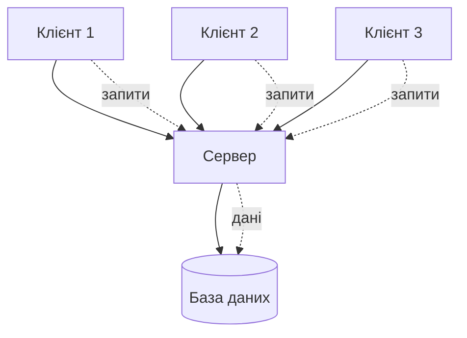

---

## Service-Oriented Architecture (SOA)

Архітектурний стиль, де функціональність представлена у вигляді сервісів, доступних через стандартизовані інтерфейси.

### Переваги:
- Повторне використання сервісів
- Стандартизація інтерфейсів
- Легка інтеграція
- Бізнес-орієнтованість

### Недоліки:
- Складність управління
- Потенційна надмірність
- Витрати на інфраструктуру
- Складність забезпечення безпеки

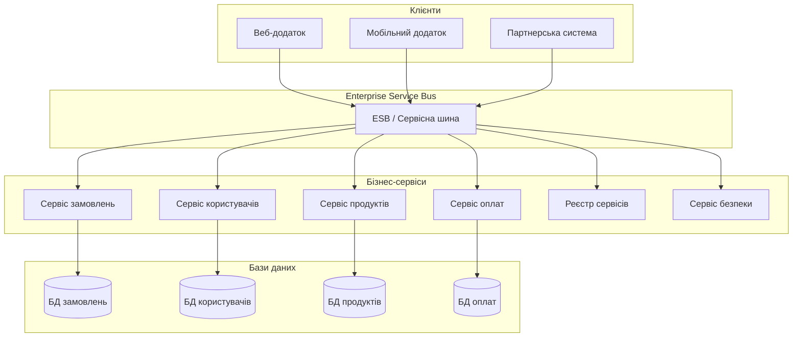

---

## Рекомендації щодо вибору архітектури

### Фактори вибору

#### Масштаб проекту
- **Малі проекти:** моноліт
- **Середні:** багатошарова архітектура
- **Великі:** мікросервіси

#### Команда
- Розмір команди
- Досвід розробників
- Географічне розташування

#### Бізнес-вимоги
- Швидкість розробки
- Масштабованість
- Надійність
- Безпека

#### Технічні обмеження
- Існуюча інфраструктура
- Бюджет
- Часові обмеження
- Вимоги до продуктивності

---

## Типові сценарії застосування

### Стартап/MVP
- **Архітектура:** Монолітна архітектура, Багатошарова архітектура
- **Фокус:** Швидкий вихід на ринок, Простота розробки

### Корпоративний додаток
- **Архітектура:** Багатошарова архітектура, SOA
- **Фокус:** Акцент на надійність та безпеку

### Високонавантажена система
- **Архітектура:** Мікросервісна архітектура, Event-driven архітектура
- **Фокус:** Фокус на масштабованість

### Розподілена система
- **Архітектура:** Мікросервіси, Event-driven
- **Фокус:** Акцент на незалежність компонентів

---

## Висновки

Вибір архітектури програмного забезпечення є критично важливим рішенням, що впливає на:

- **Швидкість розробки** та час виходу продукту на ринок
- **Масштабованість** та здатність системи рости
- **Підтримуваність** коду в довгостроковій перспективі
- **Продуктивність** та ефективність використання ресурсів

**Ключове правило:** Починайте просто, ускладнюйте поступово відповідно до потреб бізнесу та технічних вимог.


# Бази даних. Реляційні бази даних

---

## Вступ до баз даних

---

## База даних (БД)

**База даних (БД)** - це організована структура даних, що зберігається та обробляється в обчислювальних системах. БД створена для задоволення інформаційних потреб користувачів шляхом централізованого управління даними.

### Основні характеристики баз даних:

1. **Інтегрованість** - єдине, централізоване управління даними
2. **Постійність** - дані зберігаються на постійній основі
3. **Незалежність даних** - зміна структури не впливає на роботу додатків
4. **Спільне використання** - одночасний доступ багатьох користувачів
5. **Цілісність** - забезпечення точності та несуперечності даних

---

## Система управління базами даних (СУБД)

**СУБД** - це комплекс програмного забезпечення, що забезпечує управління створенням, підтримкою та використанням баз даних.

### Основні функції СУБД:

#### 1. Управління даними:
- Визначення структури даних
- Маніпулювання даними
- Контроль цілісності

#### 2. Забезпечення безпеки:
- Автентифікація користувачів
- Авторизація доступу
- Шифрування даних

#### 3. Управління транзакціями:
- Забезпечення атомарності операцій
- Відновлення після збоїв
- Контроль паралельного доступу

#### 4. Оптимізація продуктивності:
- Індексування даних
- Оптимізація запитів
- Кешування

---

## Популярні СУБД

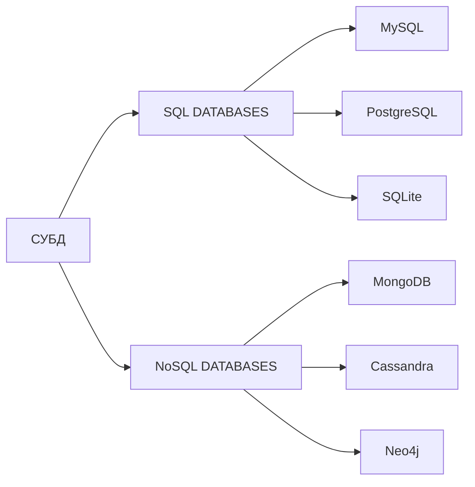

---

## Причини використання баз даних

### 1. Управління великими обсягами даних
У сучасному світі організації працюють з величезними обсягами інформації. Без систем управління базами даних ефективно керувати такими об'ємами даних практично неможливо.

### 2. Забезпечення цілісності даних
Цілісність даних – це їх точність, несуперечливість та надійність протягом усього життєвого циклу.

### 3. Забезпечення паралельного доступу
У сучасних системах часто необхідно забезпечити одночасну роботу багатьох користувачів з одними й тими ж даними.

### 4. Безпека даних
Сучасні СУБД надають комплексні механізми для захисту даних.

---

## Класифікація СУБД за моделлю даних

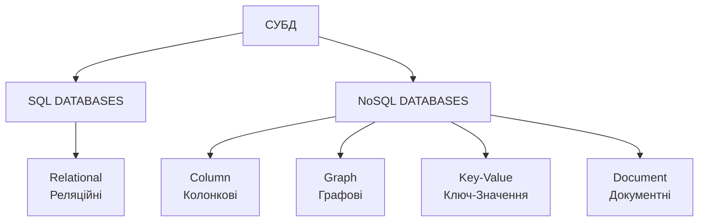

---

## Реляційні бази даних

**Реляційна база даних** - це структурована колекція даних, що організована відповідно до реляційної моделі даних.

### Популярні реляційні СУБД:
- MySQL
- PostgreSQL
- SQLite

---

## Основні поняття реляційної моделі даних

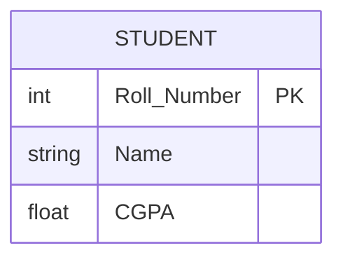

### Основні компоненти:
- **Таблиця (відношення)** - структура з рядків і стовпців
- **Запис (кортеж)** - горизонтальний рядок таблиці
- **Поле (атрибут)** - вертикальний стовпець таблиці
- **Первинний ключ (Primary Key)** - унікально ідентифікує кожен запис
- **Зовнішній ключ (Foreign Key)** - посилається на первинний ключ іншої таблиці

---

## Типи зв'язків

### 1. Один до одного (1:1)
Кожному запису першої таблиці відповідає один запис другої таблиці

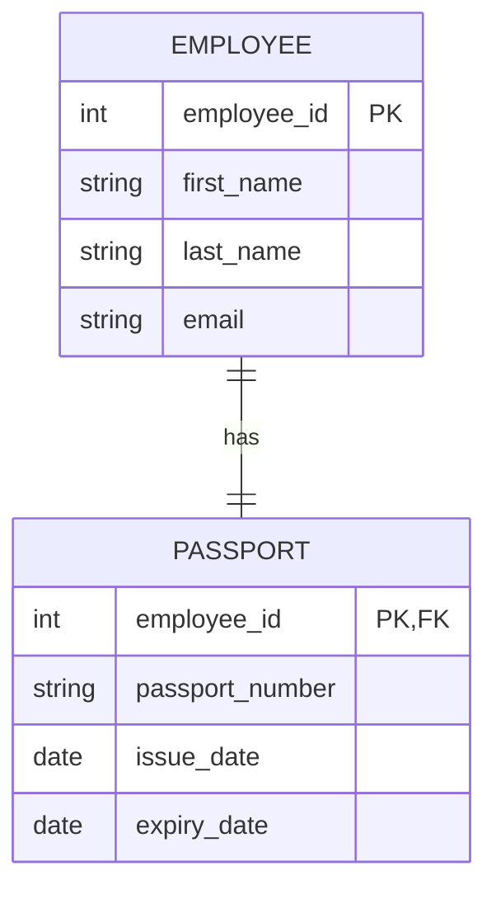

### 2. Один до багатьох (1:N)
Одному запису першої таблиці відповідає багато записів другої

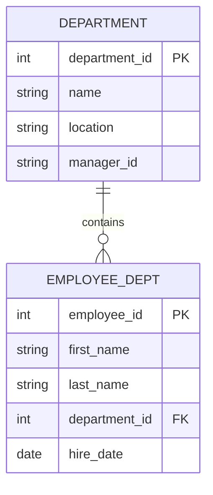

### 3. Багато до багатьох (M:N)
Реалізується через проміжну таблицю

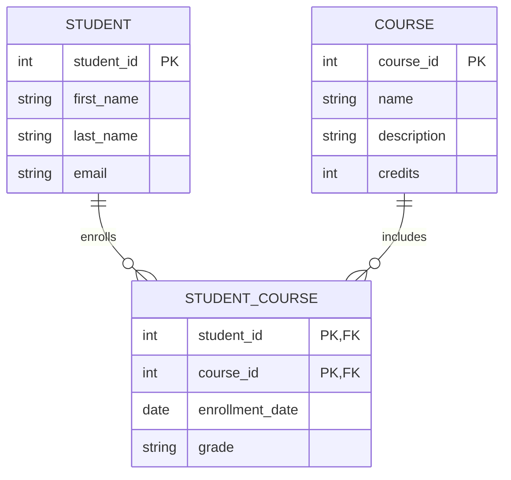

---

## Приклад комплексної схеми

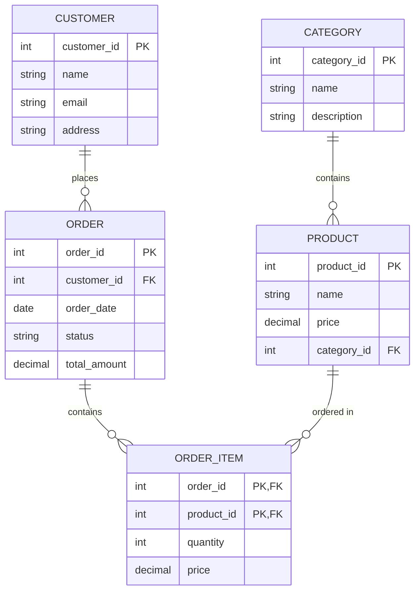

---

## Коли використовувати реляційні бази даних

### Ознаки необхідності використання реляційної БД:

#### 1. Структуровані дані з чіткими зв'язками
- Банківська система
- Система управління навчальним закладом

#### 2. Потреба в ACID-транзакціях
- E-commerce
- Фінансові операції
- Бронювання

#### 3. Складні запити та аналітика
- Звіти
- Аналітика
- Агрегація даних

#### 4. Забезпечення цілісності даних
- Фінансові операції
- Облік товарів
- Критичні бізнес-процеси

---

## Переваги використання реляційних БД

### ✅ Надійність
- Перевірена часом технологія
- Стабільна робота
- Передбачувана поведінка

### ✅ Підтримка
- Велика спільнота
- Багато інструментів
- Доступність фахівців

### ✅ Масштабованість
- Вертикальне масштабування
- Реплікація
- Партиціонування

### ✅ Безпека
- Вбудовані механізми безпеки
- Контроль доступу
- Аудит дій

---

## Обмеження та недоліки

### ❌ Коли НЕ використовувати реляційні БД:

#### 1. Жорстка схема даних
- Складно змінювати структуру
- Потрібне попереднє проектування
- Обмежена гнучкість

#### 2. Вертикальне масштабування
- Обмеження на розмір даних
- Висока вартість масштабування
- Складність розподілення

#### 3. Продуктивність
- Складні JOIN операції
- Обмеження на кількість з'єднань
- Витрати на підтримку індексів

### Альтернативи:
- Великі обсяги неструктурованих даних
- Потреба в горизонтальному масштабуванні
- Гнучка схема даних

---

## Мова SQL

**SQL (Structured Query Language)** - це стандартизована мова програмування, призначена для управління даними в реляційних базах даних.

### Основні характеристики SQL:
- **Декларативна мова** (описуємо ЩО потрібно отримати, а не ЯК)
- **Не чутлива до регістру** (хоча є конвенції написання)
- **Базується на реляційній алгебрі**
- **Підтримує роботу з наборами даних**

### Приклад створення таблиці:
```sql
-- Створення таблиці
CREATE TABLE employees (
    employee_id INT PRIMARY KEY AUTO_INCREMENT,
    first_name VARCHAR(50) NOT NULL,
    last_name VARCHAR(50) NOT NULL,
    email VARCHAR(100) UNIQUE,
    hire_date DATE DEFAULT CURRENT_DATE,
    salary DECIMAL(10,2) CHECK (salary > 0),
    department_id INT,
    FOREIGN KEY (department_id) REFERENCES departments(department_id)
);
```

---

## Приклади SQL запитів

### Вибір з умовами:
```sql
-- Вибір з умовами
SELECT
    first_name,
    last_name,
    salary
FROM employees
WHERE salary > 50000
AND department_id = 2;
```

### Вставка одного рядка:
```sql
-- Вставка одного рядка
INSERT INTO employees (first_name, last_name, salary)
VALUES ('John', 'Doe', 50000);
```

### Вставка кількох рядків:
```sql
-- Вставка кількох рядків
INSERT INTO employees (first_name, last_name, salary)
VALUES
    ('Jane', 'Smith', 55000),
    ('Bob', 'Johnson', 45000);
```

### Видалення:
```sql
-- Просте видалення
DELETE FROM employees
WHERE termination_date < '2023-01-01';

-- Видалення з підзапитом
DELETE FROM employees
WHERE employee_id IN (
    SELECT employee_id
    FROM performance_reviews
    WHERE rating < 2.0
);
```

---

## Приклади взаємодії з реляційною БД

### Архітектура веб-додатку

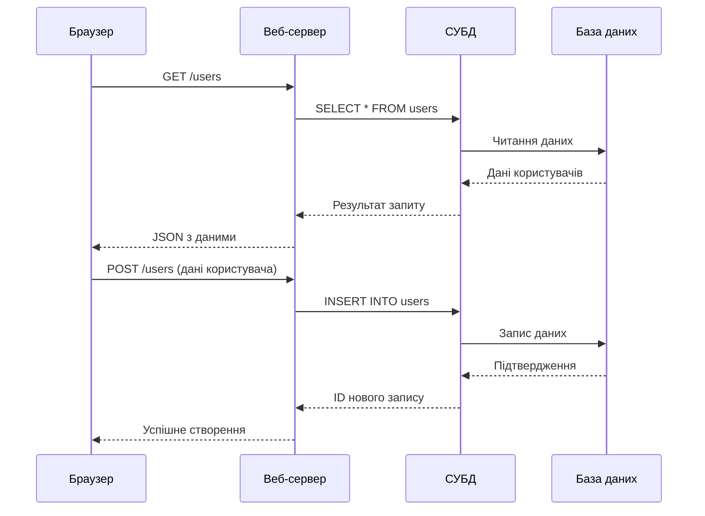

### Flask додаток з SQLite

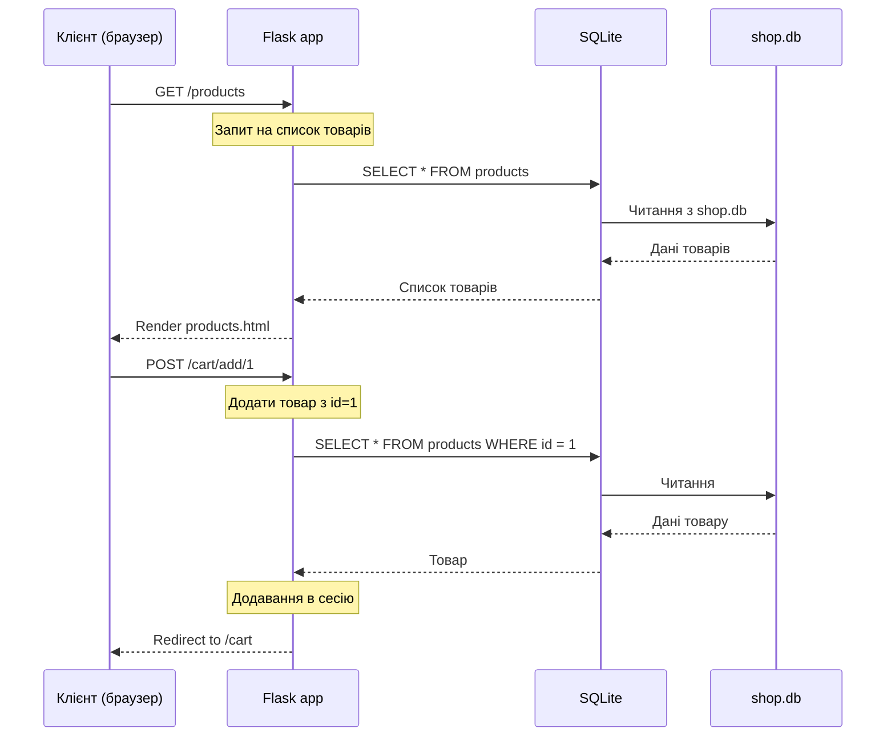

---

## Висновки

### Реляційні бази даних залишаються:
- **Основою** для більшості бізнес-додатків
- **Надійним вибором** для структурованих даних
- **Стандартом** для транзакційних систем

### Вибирайте реляційні БД, коли:
- Дані мають чітку структуру
- Потрібна висока узгодженість
- Необхідні складні запити
- Важлива надійність транзакцій

### Розглядайте альтернативи, коли:
- Потрібне горизонтальне масштабування
- Дані неструктуровані або часто змінюються
- Необхідна висока продуктивність читання
