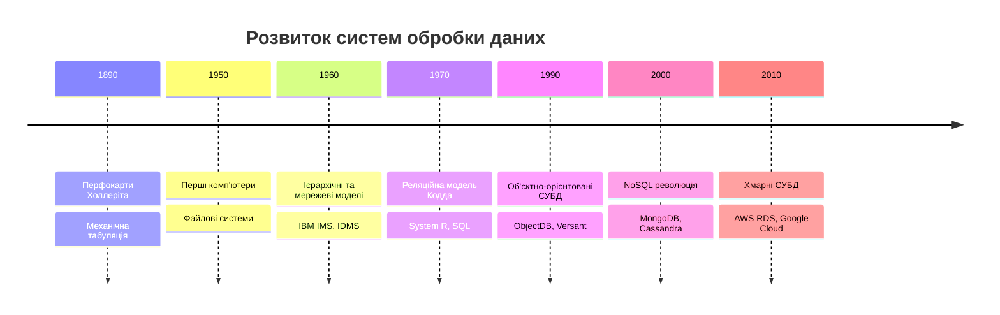
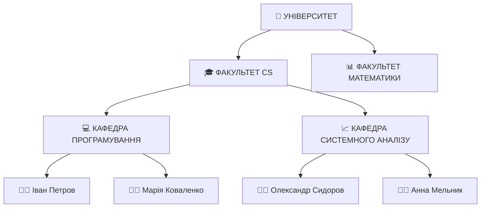
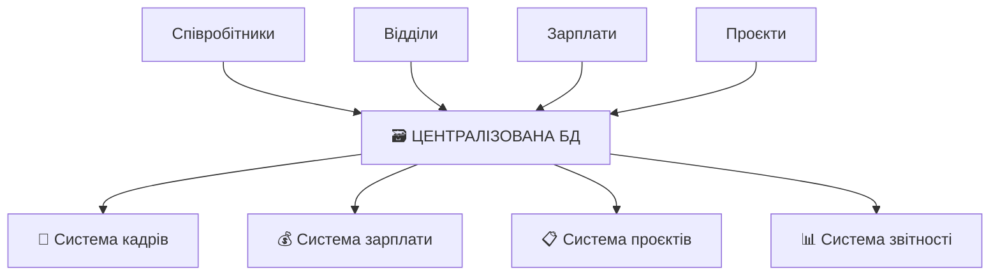
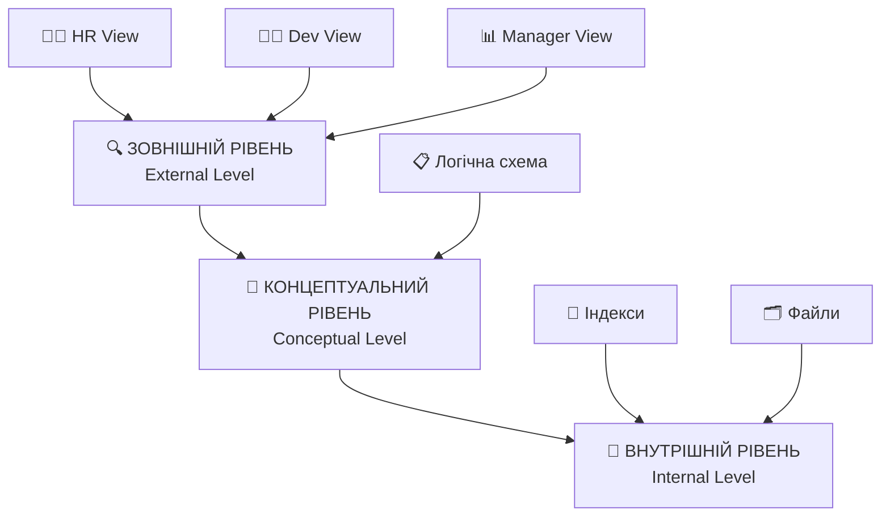
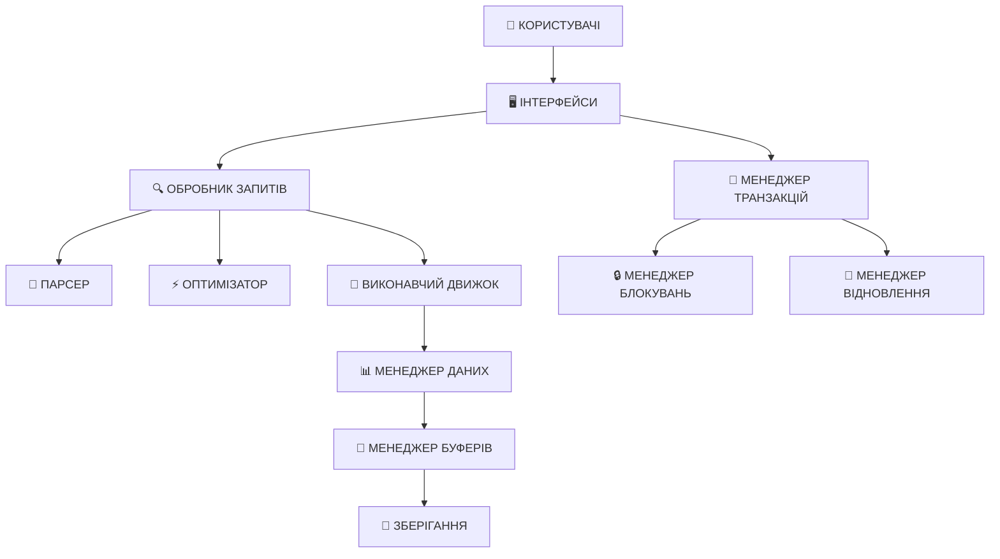
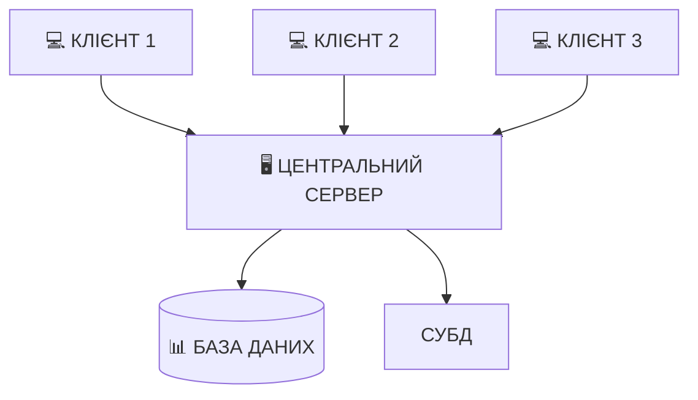
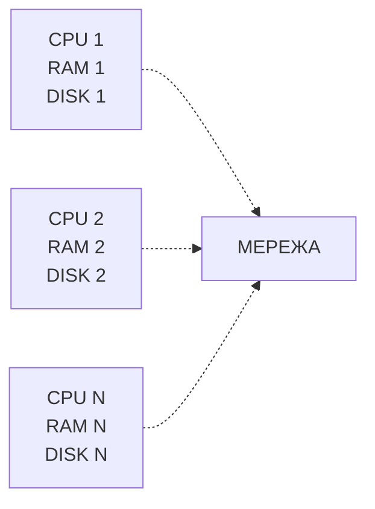
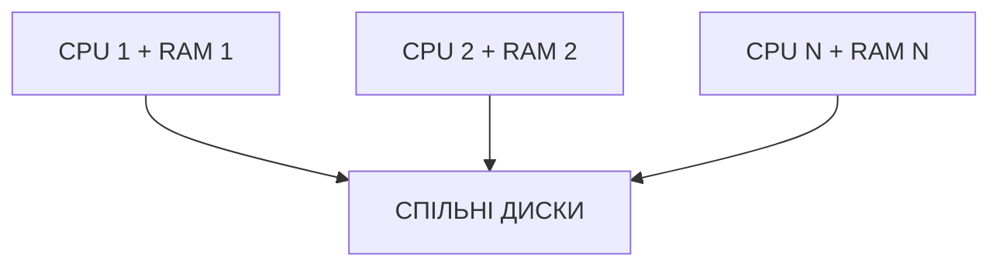
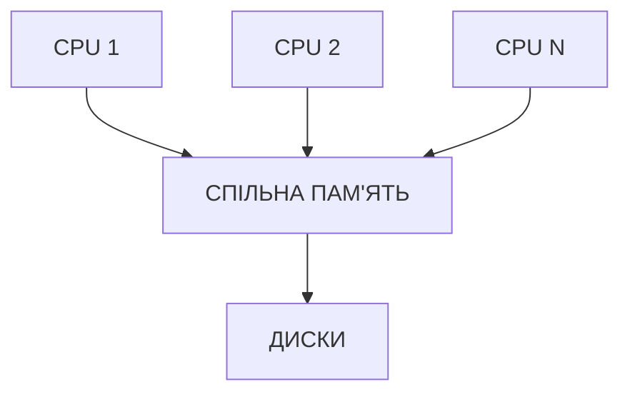

# Еволюція систем управління даними

## План лекції

1. Історичний розвиток систем обробки даних
2. Проблеми файлово-орієнтованих систем
3. Концепція баз даних
4. Класифікація СУБД
5. Сучасні тенденції

## **📚 Основні поняття:**

**База даних (БД)** — організована колекція взаємопов'язаних даних, що зберігаються в комп'ютерній системі та служать для задоволення інформаційних потреб організації.

**Система управління базами даних (СУБД)** — комплекс програмних засобів, призначених для створення структури нової бази даних, наповнення її змістом, редагування змісту та візуалізації інформації.

**Дані** — факти, що можуть бути записані та мають неявне значення.

**Інформація** — оброблені дані, що мають значення та цінність для користувача.

## **1. Історичний розвиток**



## Доісторія: Перфокарти (1890)

## Ера файлових систем (1950-1960)

### 📁 **Характеристики періоду:**

- 🖥️ **Централізована обробка** на мейнфреймах
- 📋 **Орієнтованість на застосування** — кожна програма мала власні файли
- ⏭️ **Послідовний доступ** — магнітні стрічки
- 🔄 **Пакетна обробка** — накопичення та нічна обробка

### Структура файлової системи 1960-х

```
PAYROLL_SYSTEM/
├── EMPLOYEES.DAT    (співробітники)
├── DEPARTMENTS.DAT  (відділи)
└── SALARIES.DAT     (зарплати)

INVENTORY_SYSTEM/
├── PRODUCTS.DAT     (товари)
├── SUPPLIERS.DAT    (постачальники)
└── ORDERS.DAT       (замовлення)
```

## Перехід до дискового зберігання

### 💽 **Революція жорстких дисків (1960-ті):**

- ⚡ **Швидкий доступ** до довільного запису
- 🔄 **Оновлення на місці** замість перезапису
- 💬 **Інтерактивна робота** з даними
- 📊 **Перші системи управління файлами:** IBM ISAM

### Ієрархічна модель (1960-1970)



**✅ Переваги:** Швидкий доступ, природна структура
**❌ Недоліки:** Жорстка структура, дублювання даних

## Реляційна революція (1970)

### 🎯 **Едгар Кодд — IBM Research**

> **"A Relational Model of Data for Large Shared Data Banks"**

### Ключові ідеї:

- 🔢 **Математична основа** — реляційна алгебра
- 🔗 **Логічна незалежність** від фізичної структури
- 📝 **Декларативний підхід** — що потрібно, а не як отримати
- 📋 **Таблична організація** даних

## 12 правил Кодда (1985)

### 🏛️ **Фундамент реляційних СУБД:**

1. **Правило інформації** — дані тільки в таблицях
2. **Гарантований доступ** — через ключ + назву стовпця
3. **Null-значення** — систематична обробка
4. **Динамічний каталог** — метадані як звичайні дані
5. **Повнота мови** — DDL, DML, безпека
6. **Оновлення представлень**

...і ще 6 правил для справжньої реляційної СУБД

## **2. Проблеми файлових систем**

## Основні проблеми файлових систем

### 1. 📊 **Надмірність даних**

```
ФАЙЛ: EMPLOYEES.DAT
+--------+-----------+------------+
| emp_id | dept_name | dept_phone |
+--------+-----------+------------+
| E001   | ІТ Відділ | 555-1234   |
| E002   | ІТ Відділ | 555-1234   | ← Дублювання
+--------+-----------+------------+

ФАЙЛ: DEPARTMENTS.DAT
+-----------+------------+--------+
| dept_name | dept_phone | budget |
+-----------+------------+--------+
| ІТ Відділ | 555-1234   | 500000 | ← Дублювання
+-----------+------------+--------+
```

**❌ Наслідки:** Марнотратство місця, проблеми оновлення, неузгодженість

## 2. Залежність від структури

### 💻 **Приклад COBOL коду 1960-х:**

```cobol
01 EMPLOYEE-RECORD.
   05 EMP-ID      PIC X(5).
   05 EMP-NAME    PIC X(30).
   05 EMP-SALARY  PIC 9(7)V99.

PROCEDURE DIVISION.
READ-EMPLOYEE.
    READ EMPLOYEE-FILE
        AT END MOVE 'Y' TO EOF-FLAG.
```

### 🔄 **Зміна структури = модифікація всіх програм**

- Додати поле "дата прийняття" → переписати ВСІ програми
- Змінити довжину поля → перекомпілювати ВСЕ
- Конвертувати існуючі файли

## 3. Складності інтеграції

### 🏝️ **"Острови інформації"**

```
КАДРИ:              ЗАРПЛАТА:           ПРОЄКТИ:
employee.dat        payroll.dat         projects.dat
├── emp_code        ├── employee_num    ├── worker_id
├── full_name       ├── emp_name        ├── person_name
└── position        └── salary          └── role
```

**❓ Проблема:** Як зрозуміти, що `emp_code = employee_num = worker_id`?

**❌ Результат:**

- Ручне встановлення зв'язків
- Спеціальні програми інтеграції
- Конфлікти в даних

## 4. Проблеми паралельного доступу

### ⚠️ **Втрата оновлення (Lost Update)**

| Час | Програма A | Програма B | Баланс |
|-----|------------|------------|---------|
| T1  | READ 1000  |            | 1000    |
| T2  |            | READ 1000  | 1000    |
| T3  | -100       |            | 1000    |
| T4  |            | -50        | 1000    |
| T5  | WRITE 900  |            | 900     |
| T6  |            | WRITE 950  | **950** |

**💸 Результат:** Втрачено операцію -100! Замість 850 маємо 950.

## 5. Безпека та відновлення

### 🔒 **Обмежені можливості:**

- Контроль тільки на рівні **цілого файлу**
- Відсутність **аудиту операцій**
- Немає **транзакційної моделі**
- Складне **відновлення після збоїв**

### ⚡ **При збої системи:**

- Часткові оновлення
- Невідомий стан даних
- Ручне відновлення цілісності
- Довгі простої

## **3. Концепція баз даних**

## Фундаментальні принципи БД

### 🎯 **Центральна ідея: "Єдине джерело істини"**



### ✅ **Результати:**
- Ліквідація дублювання
- Гарантія узгодженості
- Централізоване адміністрування
- Спрощення оновлень

## Незалежність даних

### 🔄 **Два типи незалежності:**

**Логічна незалежність:**
- Додавання таблиць не впливає на існуючі програми
- Зміна зв'язків не торкається незалежних операцій

**Фізична незалежність:**
- Зміна індексів прозора для користувачів
- Перенесення на інші диски непомітне
- Зміна алгоритмів зберігання

```sql
-- Логічне представлення незмінне
SELECT employee_name, department, salary
FROM employee_view;

-- Фізична реалізація може змінюватися:
-- ✓ Додавання індексів
-- ✓ Розбиття таблиць
-- ✓ Зміна дискового розміщення
```

## Архітектура ANSI-SPARC

### 🏗️ **Трирівнева архітектура (1975):**



### **Рівень 1: Зовнішній** — індивідуальні представлення
### **Рівень 2: Концептуальний** — повна логічна структура
### **Рівень 3: Внутрішній** — фізичне зберігання

## Переваги трирівневої архітектури

### 1. 🔄 **Незалежність даних**
- Зміни на внутрішньому рівні ↛ концептуальний
- Зміни на концептуальному ↛ зовнішній

### 2. 🎭 **Гнучкість представлень**
- Різні погляди на одні дані
- Спеціалізовані інтерфейси

### 3. 🔒 **Безпека**
- Контроль на рівні представлень
- Приховування чутливої інформації

### 4. ⚡ **Продуктивність**
- Оптимізація на внутрішньому рівні
- Незалежне налаштування

## Компоненти СУБД



## **4. Класифікація СУБД**

## За моделями даних

### 📊 **Основні типи:**

1. **🌳 Ієрархічні** — дерево записів
2. **🕸️ Мережеві** — складні зв'язки
3. **📋 Реляційні** — таблиці + SQL
4. **🎯 Об'єктно-орієнтовані** — об'єкти + методи
5. **📄 NoSQL** — документи, графи, ключ-значення

### Порівняння моделей

| Модель | Структура | Переваги | Недоліки |
|--------|-----------|----------|----------|
| 🌳 Ієрархічна | Дерево | Швидкість | Жорсткість |
| 🕸️ Мережева | Граф | Складні зв'язки | Складність |
| 📋 Реляційна | Таблиці | Гнучкість, SQL | Об'єктно-реляційний розрив |
| 🎯 ОО | Об'єкти | Природність | Нестандартність |
| 📄 NoSQL | Різна | Масштабованість | Консистентність |

## Реляційна модель детально

### 📋 **Приклад структури:**

```sql
-- Таблиця студентів
CREATE TABLE students (
    student_id INT PRIMARY KEY,
    first_name VARCHAR(50) NOT NULL,
    last_name VARCHAR(50) NOT NULL,
    group_name VARCHAR(10),
    email VARCHAR(100) UNIQUE
);

-- Таблиця курсів
CREATE TABLE courses (
    course_id INT PRIMARY KEY,
    course_name VARCHAR(100) NOT NULL,
    credits INT CHECK (credits > 0),
    teacher_id INT
);

-- Зв'язок багато-до-багатьох
CREATE TABLE enrollments (
    student_id INT,
    course_id INT,
    grade CHAR(2),
    FOREIGN KEY (student_id) REFERENCES students(student_id),
    FOREIGN KEY (course_id) REFERENCES courses(course_id)
);
```

## NoSQL різновиди

### 1. 📄 **Document-орієнтовані (MongoDB)**

```json
{
  "student_id": "S001",
  "name": {
    "first": "Іван",
    "last": "Петров"
  },
  "group": "КН-21",
  "courses": [
    {
      "course_id": "C001",
      "name": "Бази даних",
      "grade": "A"
    }
  ]
}
```

### 2. 🗝️ **Key-Value (Redis)**

```python
# Простий ключ-значення
r.set("user:1001:name", "Іван Петров")

# Структуровані дані
r.hset("user:1001", {
    "name": "Іван Петров",
    "group": "КН-21",
    "status": "active"
})
```

## За архітектурою

### 1. 🏢 **Централізовані СУБД**



**✅ Переваги:** Простота, централізоване управління
**❌ Недоліки:** Єдина точка відмови, обмежена масштабованість

### 2. 🌐 **Розподілені СУБД**

**Горизонтальне розбиття (Sharding):**
```
Вузол 1: студенти КН-21, КН-22
Вузол 2: студенти КН-23, КН-24
Вузол 3: студенти КН-25, КН-26

-- Локальний запит
SELECT * FROM students WHERE group_name = 'КН-21'; -- Тільки Вузол 1

-- Розподілений запит
SELECT COUNT(*) FROM students; -- Всі вузли → агрегація
```

## Паралельні архітектури

### 🔄 **Три моделі:**

**1. Shared-Nothing:**

**Переваги:** Лінійна масштабованість

**2. Shared-Disk:**

**Переваги:** Простота розширення

**3. Shared-Memory:**

**Переваги:** Швидка комунікація

## **5. Сучасні тенденції**

## Хмарні СУБД (DBaaS)

### ☁️ **Database as a Service:**

- **AWS:** RDS, Aurora, DynamoDB
- **Google:** Cloud SQL, Firestore, BigQuery
- **Azure:** SQL Database, Cosmos DB
- **MongoDB:** Atlas

### ✅ **Переваги хмарних БД:**

- 📈 **Автоматичне масштабування**
- 🔧 **Керована інфраструктура**
- 🌍 **Глобальна доступність**
- 💰 **Оплата за використання**
- 🛡️ **Вбудована відмовостійкість**


## Тенденції розвитку

### 🚀 **Сучасні напрямки:**

1. **🤖 AI/ML інтеграція**
    - Автоматична оптимізація запитів
    - Прогнозування навантаження
    - Машинне навчання над даними

2. **⚡ Serverless бази даних**
    - AWS Aurora Serverless
    - PlanetScale (MySQL)
    - Neon (PostgreSQL)

3. **🔗 Multi-model бази**
    - Azure Cosmos DB
    - ArangoDB
    - OrientDB

4. **📊 Реального часу**
    - Apache Kafka + ksqlDB
    - Apache Pulsar
    - Event sourcing

## Вибір СУБД

### 📋 **Практичні рекомендації:**

- **Транзакційні системи** → PostgreSQL, MySQL
- **Аналітика** → ClickHouse, BigQuery
- **Документи** → MongoDB, Elasticsearch
- **Кеш** → Redis, Memcached
- **Графи** → Neo4j, Amazon Neptune
