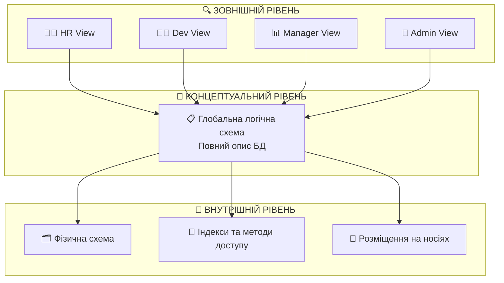
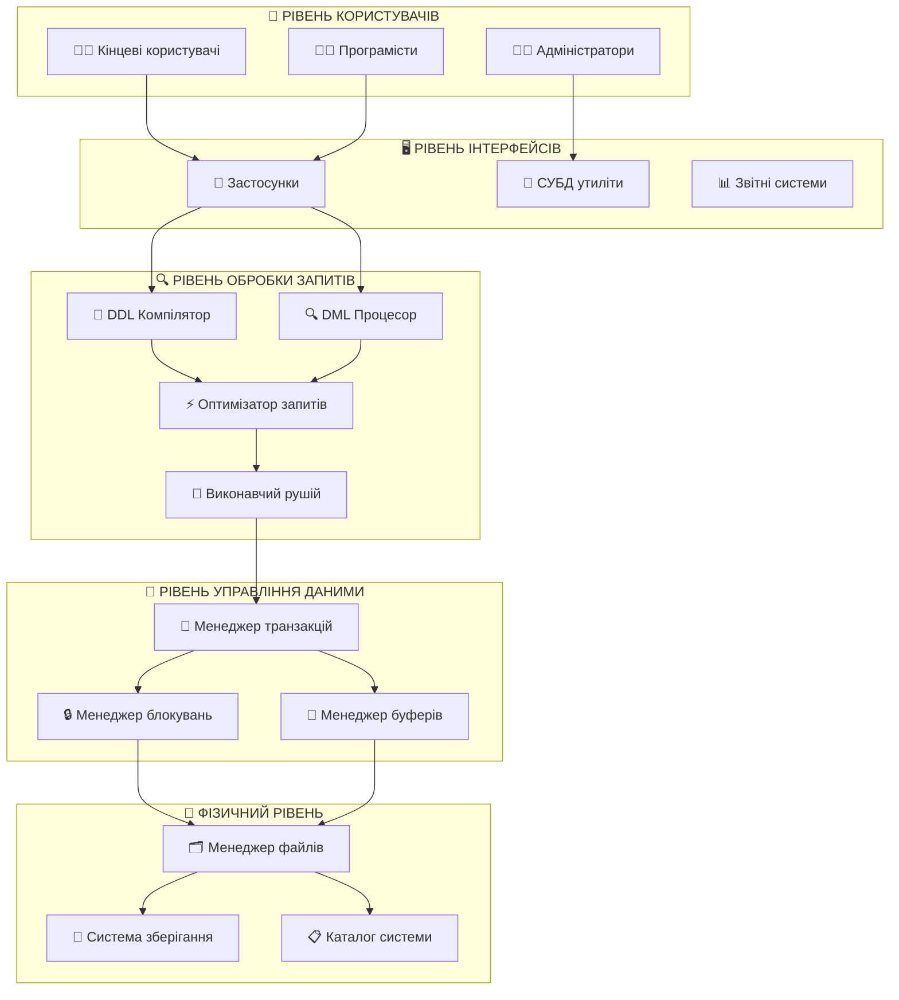
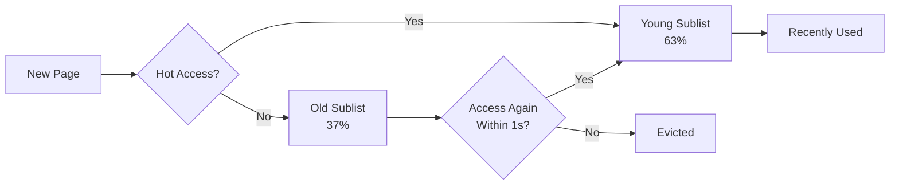
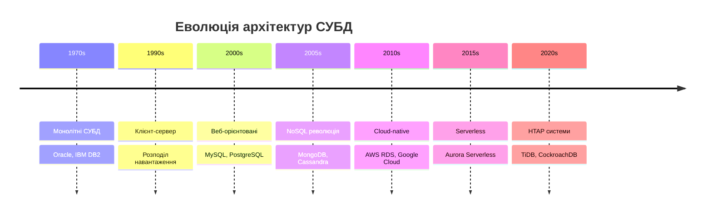
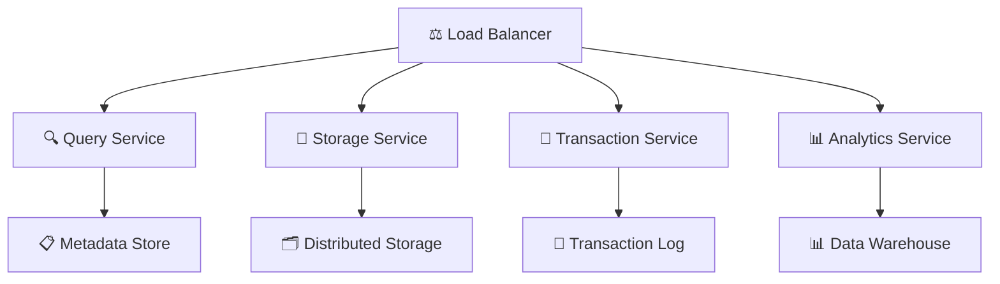

# Архітектура систем управління базами даних

## План лекції

1. Трирівнева архітектура ANSI/SPARC
2. Логічна та фізична незалежність даних
3. Компонентна архітектура СУБД
4. Каталог системи (метабаза)
5. Різноманітність сучасних архітектур

## **🎯 Основні поняття:**

**Трирівнева архітектура ANSI/SPARC** — концептуальна модель організації СУБД у вигляді трьох логічно незалежних рівнів: зовнішнього, концептуального та внутрішнього.

**Логічна незалежність даних** — можливість модифікувати концептуальну схему без зміни зовнішніх представлень та програм користувачів.

**Фізична незалежність даних** — можливість змінювати внутрішню схему без впливу на концептуальну схему та програми користувачів.

**Каталог системи** — сукупність системних таблиць з метаданими про структуру бази даних.

## **1. Трирівнева архітектура ANSI/SPARC**

## Історичний контекст (1975)

### 🏛️ **Передумови створення:**

- 🔗 **Тісний зв'язок** програм з фізичною структурою
- 🔄 **Складність модифікації** без впливу на програми
- 📏 **Відсутність стандартів** організації СУБД
- 🔒 **Проблеми безпеки** на різних рівнях

### Рішення: Трирівнева модель



## Зовнішній рівень (External Level)

### 👥 **Рівень індивідуальних користувачів**

**Основні характеристики:**

- 🎯 **Персоналізація** — кожен бачить тільки потрібні дані
- 🔒 **Безпека** — обмеження доступу до конфіденційної інформації
- 🎭 **Спрощення** — приховування складності повної структури
- 🧮 **Обчислення** — агреговані та похідні поля

### Приклад представлення для HR

```sql
-- Представлення для відділу кадрів
CREATE VIEW hr_employee_info AS
SELECT
    e.employee_id,
    e.first_name,
    e.last_name,
    e.position,
    e.hire_date,
    d.department_name,
    e.phone,
    e.email
FROM employees e
JOIN departments d ON e.department_id = d.department_id
WHERE e.status = 'ACTIVE';
-- Зарплата прихована від HR!
```

## Типи зовнішніх представлень

### 📊 **1. Селективні представлення**

```sql
-- Тільки активні ІТ співробітники
CREATE VIEW it_active_employees AS
SELECT employee_id, first_name, last_name, position
FROM employees
WHERE department_id = 1 AND status = 'ACTIVE';
```

### 🔗 **2. З'єднувальні представлення**

```sql
-- Інформація про проєкти з командою
CREATE VIEW project_team_details AS
SELECT
    p.project_name,
    CONCAT(e.first_name, ' ', e.last_name) AS team_member,
    pa.role_in_project,
    pa.allocation_percentage
FROM projects p
JOIN project_assignments pa ON p.project_id = pa.project_id
JOIN employees e ON pa.employee_id = e.employee_id;
```

### 📈 **3. Агрегатні представлення**

```sql
-- Статистика по відділах
CREATE VIEW department_statistics AS
SELECT
    d.department_name,
    COUNT(e.employee_id) AS employee_count,
    AVG(DATEDIFF(CURRENT_DATE, e.hire_date) / 365.25) AS avg_years,
    COUNT(CASE WHEN e.status = 'ACTIVE' THEN 1 END) AS active_count
FROM departments d
LEFT JOIN employees e ON d.department_id = e.department_id
GROUP BY d.department_id, d.department_name;
```

## Концептуальний рівень (Conceptual Level)

### 🌐 **Рівень спільноти користувачів**

**Ключові особливості:**

- 📚 **Повнота** — опис усіх сутностей, атрибутів, зв'язків
- 🔗 **Зв'язки** — визначення всіх типів відношень між сутностями
- ⚖️ **Бізнес-правила** — всі обмеження цілісності
- 📊 **Метадані** — інформація про структуру БД

### Приклад концептуальної схеми

```sql
-- Повна структура з усіма обмеженнями
CREATE TABLE employees (
    employee_id INT PRIMARY KEY AUTO_INCREMENT,
    first_name VARCHAR(50) NOT NULL,
    last_name VARCHAR(50) NOT NULL,
    birth_date DATE NOT NULL,
    hire_date DATE DEFAULT (CURRENT_DATE),
    position_id INT NOT NULL,
    department_id INT NOT NULL,
    salary DECIMAL(10,2) CHECK (salary > 0),
    email VARCHAR(100) UNIQUE,

    FOREIGN KEY (position_id) REFERENCES positions(position_id),
    FOREIGN KEY (department_id) REFERENCES departments(department_id),
    CONSTRAINT chk_age CHECK (birth_date <= DATE_SUB(CURRENT_DATE, INTERVAL 16 YEAR))
);
```

## Бізнес-правила на концептуальному рівні

### ⚙️ **Складні тригери та обмеження**

```sql
-- Тригер перевірки навантаження співробітника
DELIMITER //
CREATE TRIGGER trg_check_workload
BEFORE INSERT ON project_assignments
FOR EACH ROW
BEGIN
    DECLARE total_allocation DECIMAL(5,2);

    SELECT COALESCE(SUM(allocation_percentage), 0) INTO total_allocation
    FROM project_assignments
    WHERE employee_id = NEW.employee_id AND status = 'ACTIVE';

    IF (total_allocation + NEW.allocation_percentage) > 100 THEN
        SIGNAL SQLSTATE '45000'
        SET MESSAGE_TEXT = 'Навантаження не може перевищувати 100%';
    END IF;
END //
DELIMITER ;
```

## Внутрішній рівень (Internal Level)

### 💾 **Рівень фізичного зберігання**

**Основні компоненти:**

- 🗂️ **Фізичні структури** — способи зберігання на дисках
- 📇 **Індекси** — методи швидкого доступу до даних
- 💾 **Буферизація** — управління оперативною пам'яттю
- 🗄️ **Партиціювання** — розбиття великих таблиць

### Приклади фізичних оптимізацій

```sql
-- Партиціювання по роках
CREATE TABLE project_logs (
    log_id BIGINT AUTO_INCREMENT,
    project_id INT NOT NULL,
    log_date DATE NOT NULL,
    log_message TEXT,
    PRIMARY KEY (log_id, log_date)
)
PARTITION BY RANGE (YEAR(log_date)) (
    PARTITION p_2022 VALUES LESS THAN (2023),
    PARTITION p_2023 VALUES LESS THAN (2024),
    PARTITION p_2024 VALUES LESS THAN (2025)
);
```

## Стратегії індексування

### 📇 **Типи індексів для різних потреб**

```sql
-- B-Tree для загального використання
CREATE INDEX idx_employee_department ON employees(department_id);

-- Композитний для складних запитів
CREATE INDEX idx_dept_status_hire ON employees(department_id, status, hire_date);

-- Часткові для специфічних умов
CREATE INDEX idx_active_employees ON employees(hire_date)
WHERE status = 'ACTIVE';

-- Повнотекстові для пошуку
CREATE FULLTEXT INDEX idx_employee_search
ON employees(first_name, last_name);
```

## **2. Незалежність даних**

## Логічна незалежність

### 🔄 **Зміни концептуальної схеми без впливу на програми**

**✅ Що можна робити безпечно:**

- ➕ **Додавання нових таблиць**
- ➕ **Додавання нових стовпців**
- ➕ **Створення нових зв'язків**
- ➕ **Додавання індексів**

```sql
-- Додавання нового стовпця
ALTER TABLE employees
ADD COLUMN middle_name VARCHAR(50),
ADD COLUMN phone VARCHAR(20);

-- Існуючі представлення продовжують працювати!
SELECT * FROM hr_employee_info; -- ✅ Працює
```

### Приклад додавання функціональності

```sql
-- Додавання таблиці навичок
CREATE TABLE employee_skills (
    skill_id INT PRIMARY KEY AUTO_INCREMENT,
    employee_id INT,
    skill_name VARCHAR(100),
    skill_level ENUM('BEGINNER', 'INTERMEDIATE', 'ADVANCED'),
    FOREIGN KEY (employee_id) REFERENCES employees(employee_id)
);

-- Старі програми працюють без змін
-- Нові програми можуть використовувати розширену функціональність
```

## Обмеження логічної незалежності

### ⚠️ **Що може зламати існуючі програми:**

```sql
-- ❌ НЕБЕЗПЕЧНО: Видалення стовпців
-- ALTER TABLE employees DROP COLUMN department_id;

-- ❌ НЕБЕЗПЕЧНО: Зміна типів даних
-- ALTER TABLE employees MODIFY COLUMN salary VARCHAR(20);

-- ✅ БЕЗПЕЧНО: Поетапна міграція
ALTER TABLE employees ADD COLUMN salary_new DECIMAL(10,2);
-- 1. Міграція даних
-- 2. Оновлення представлень
-- 3. Видалення старого стовпця
-- 4. Перейменування нового
```

## Фізична незалежність

### 💽 **Зміни зберігання без впливу на логіку**

**Приклади фізичних змін:**

```sql
-- Перенесення на SSD диск
CREATE TABLESPACE ssd_space LOCATION '/ssd/mysql/data';
ALTER TABLE employees TABLESPACE ssd_space;

-- Додавання індексів для швидкодії
CREATE INDEX idx_employee_hire_date ON employees(hire_date);

-- Зміна механізму зберігання
ALTER TABLE employees ENGINE=InnoDB;

-- Програми користувачів працюють без змін! ✅
SELECT * FROM employees WHERE department_id = 5;
```

## Переваги фізичної незалежності

### 🚀 **Оптимізація без простоїв**

```sql
-- Моніторинг використання індексів
SELECT
    TABLE_NAME,
    INDEX_NAME,
    CARDINALITY,
    INDEX_TYPE
FROM INFORMATION_SCHEMA.STATISTICS
WHERE TABLE_SCHEMA = 'company_db'
ORDER BY CARDINALITY DESC;

-- Оптимізація на основі статистики
DROP INDEX idx_rarely_used ON employees;
CREATE INDEX idx_frequently_used ON employees(department_id, status);
```

**Результат:** Програми працюють швидше без жодних змін у коді! 🎯

## **3. Компонентна архітектура СУБД**

## Загальна структура



## DDL/DML Компілятори

### 📝 **DDL Компілятор - Визначення структури**

```sql
-- Обробка DDL команди
CREATE TABLE employees (
    employee_id INT PRIMARY KEY AUTO_INCREMENT,
    first_name VARCHAR(50) NOT NULL,
    email VARCHAR(100) UNIQUE,
    salary DECIMAL(10,2) CHECK (salary > 0)
);

-- DDL компілятор виконує:
-- 1. ✅ Перевірку синтаксису
-- 2. 🔍 Валідацію типів даних
-- 3. ⚖️ Перевірку обмежень
-- 4. 🔗 Перевірку посилань
-- 5. 📋 Генерацію метаданих
```

### 🔍 **DML Процесор - Маніпулювання даними**

```sql
-- Складний запит для обробки
SELECT
    d.department_name,
    COUNT(e.employee_id) as employee_count,
    AVG(e.salary) as avg_salary
FROM departments d
LEFT JOIN employees e ON d.department_id = e.department_id
WHERE d.budget > 100000
GROUP BY d.department_id, d.department_name
HAVING COUNT(e.employee_id) > 5
ORDER BY avg_salary DESC;
```

**DML процесор створює дерево запиту:**

```
ORDER BY(avg_salary DESC)
  └── HAVING(COUNT > 5)
      └── GROUP BY(dept_id, dept_name)
          └── AGGREGATE(COUNT, AVG)
              └── SELECTION(budget > 100000)
                  └── JOIN(LEFT JOIN)
                      ├── SCAN(departments)
                      └── SCAN(employees)
```

## Оптимізатор запитів

### ⚡ **Вибір найкращого плану виконання**

```sql
-- Запит з багатьма можливими планами
SELECT e.first_name, d.department_name, p.project_name
FROM employees e
JOIN departments d ON e.department_id = d.department_id
JOIN project_assignments pa ON e.employee_id = pa.employee_id
JOIN projects p ON pa.project_id = p.project_id
WHERE d.location = 'Київ' AND p.status = 'ACTIVE';
```

### Типи оптимізації

**1. 📊 Статистична оптимізація**

```sql
-- Збір статистики для прийняття рішень
ANALYZE TABLE employees UPDATE HISTOGRAM ON department_id, salary;

-- Оптимізатор знає:
-- - В departments 5 записів з 'Київ' (10% таблиці)
-- - В projects 50 'ACTIVE' проєктів (25% таблиці)
-- - В employees 1000 записів загалом
```

**2. 🧮 Алгебраїчна оптимізація**

```sql
-- Проштовхування селекції (selection pushdown)
-- Замість: JOIN всіх таблиць → потім WHERE
-- Краще: WHERE спочатку → потім JOIN менших результатів

-- План 1 (неоптимальний):
-- JOIN(employees, departments, projects) → WHERE(location='Київ')

-- План 2 (оптимальний):
-- WHERE departments(location='Київ') → JOIN → WHERE projects(status='ACTIVE') → JOIN
```

**3. 🔗 Вибір алгоритму JOIN**

| Алгоритм | Найкраще для | Складність |
|----------|-------------|-------------|
| 🔄 **Nested Loop** | Малі таблиці | O(n×m) |
| # **Hash Join** | Середні таблиці | O(n+m) |
| 📊 **Sort-Merge** | Великі сортовані | O(n log n + m log m) |

## Менеджер буферів

### 💾 **Управління оперативною пам'яттю**

```sql
-- Налаштування буферного пулу
SET GLOBAL innodb_buffer_pool_size = 8589934592; -- 8GB
SET GLOBAL innodb_buffer_pool_instances = 8;     -- 8 екземплярів

-- Моніторинг ефективності
SELECT
    POOL_SIZE,
    FREE_BUFFERS,
    DATABASE_PAGES,
    MODIFIED_DATABASE_PAGES
FROM INFORMATION_SCHEMA.INNODB_BUFFER_POOL_STATS;
```

### Алгоритми заміщення сторінок

**🔄 LRU з модифікаціями (InnoDB):**



**Переваги:**
- 🔥 **Гарячі дані** залишаються в пам'яті
- 🧹 **Сканування** не витискає корисні дані
- ⚡ **Адаптивність** до патернів доступу

## Менеджер транзакцій

### 🔄 **Забезпечення властивостей ACID**

```sql
-- Приклад атомарної транзакції
START TRANSACTION;

-- Зменшення балансу відправника
UPDATE accounts SET balance = balance - 1000 WHERE account_id = 'ACC001';

-- Перевірка достатності коштів
IF (SELECT balance FROM accounts WHERE account_id = 'ACC001') < 0 THEN
    ROLLBACK; -- ❌ Скасування всієї транзакції
    SIGNAL SQLSTATE '45000' SET MESSAGE_TEXT = 'Недостатньо коштів';
END IF;

-- Збільшення балансу отримувача
UPDATE accounts SET balance = balance + 1000 WHERE account_id = 'ACC002';

COMMIT; -- ✅ Підтвердження всіх змін
```

### Рівні ізоляції транзакцій

| Рівень | Брудне читання | Неповторювані читання | Фантомні записи |
|--------|----------------|----------------------|-----------------|
| 📖 **READ UNCOMMITTED** | ❌ Можливо | ❌ Можливо | ❌ Можливо |
| 📗 **READ COMMITTED** | ✅ Неможливо | ❌ Можливо | ❌ Можливо |
| 📘 **REPEATABLE READ** | ✅ Неможливо | ✅ Неможливо | ❌ Можливо |
| 📕 **SERIALIZABLE** | ✅ Неможливо | ✅ Неможливо | ✅ Неможливо |

### Приклад проблеми Phantom Reads

```sql
-- Транзакція A:
START TRANSACTION;
SELECT COUNT(*) FROM employees WHERE salary > 50000; -- Результат: 150
-- ... інші операції ...
SELECT COUNT(*) FROM employees WHERE salary > 50000; -- Результат: 151 👻
COMMIT;

-- Транзакція B (паралельно):
START TRANSACTION;
INSERT INTO employees (first_name, last_name, salary, department_id)
VALUES ('Новий', 'Співробітник', 55000, 1); -- 👻 Phantom!
COMMIT;
```

## **4. Каталог системи (метабаза)**

## Структура каталогу

### 📋 **Метадані про структуру БД**

```sql
-- Інформація про таблиці
SELECT
    TABLE_NAME,
    ENGINE,
    TABLE_ROWS,
    ROUND((DATA_LENGTH + INDEX_LENGTH) / 1024 / 1024, 2) AS size_mb,
    CREATE_TIME,
    UPDATE_TIME
FROM INFORMATION_SCHEMA.TABLES
WHERE TABLE_SCHEMA = 'company_db'
ORDER BY size_mb DESC;
```

### Опис стовпців

```sql
-- Детальна інформація про структуру таблиці
SELECT
    COLUMN_NAME,
    DATA_TYPE,
    IS_NULLABLE,
    COLUMN_DEFAULT,
    COLUMN_KEY,
    EXTRA,
    COLUMN_COMMENT
FROM INFORMATION_SCHEMA.COLUMNS
WHERE TABLE_SCHEMA = 'company_db'
  AND TABLE_NAME = 'employees'
ORDER BY ORDINAL_POSITION;
```

## Практичне використання каталогу

### 🔍 **Аналіз розміру БД**

```sql
-- ТОП-5 найбільших таблиць
SELECT
    TABLE_NAME,
    ROUND(((DATA_LENGTH + INDEX_LENGTH) / 1024 / 1024), 2) AS 'Size (MB)',
    ROUND((INDEX_LENGTH / DATA_LENGTH), 2) AS 'Index/Data Ratio',
    TABLE_ROWS
FROM INFORMATION_SCHEMA.TABLES
WHERE TABLE_SCHEMA = 'company_db'
ORDER BY (DATA_LENGTH + INDEX_LENGTH) DESC
LIMIT 5;
```

### 📊 **Аналіз ефективності індексів**

```sql
-- Індекси з низькою селективністю
SELECT
    TABLE_NAME,
    INDEX_NAME,
    ROUND(CARDINALITY / t.TABLE_ROWS * 100, 2) AS selectivity_percent
FROM INFORMATION_SCHEMA.STATISTICS s
JOIN INFORMATION_SCHEMA.TABLES t USING (TABLE_SCHEMA, TABLE_NAME)
WHERE s.TABLE_SCHEMA = 'company_db'
  AND s.INDEX_NAME != 'PRIMARY'
HAVING selectivity_percent < 10 -- Низька селективність
ORDER BY selectivity_percent ASC;
```

### 🔗 **Аналіз зв'язків між таблицями**

```sql
-- Карта зовнішніх ключів
SELECT
    TABLE_NAME,
    COLUMN_NAME,
    REFERENCED_TABLE_NAME,
    REFERENCED_COLUMN_NAME,
    DELETE_RULE,
    UPDATE_RULE
FROM INFORMATION_SCHEMA.KEY_COLUMN_USAGE
WHERE CONSTRAINT_SCHEMA = 'company_db'
  AND REFERENCED_TABLE_NAME IS NOT NULL
ORDER BY TABLE_NAME;
```

## Автоматизація через каталог

### 🤖 **Генерація адміністративних команд**

```sql
-- Генерація команд оптимізації
SELECT
    CONCAT('OPTIMIZE TABLE ', TABLE_SCHEMA, '.', TABLE_NAME, ';')
FROM INFORMATION_SCHEMA.TABLES
WHERE TABLE_SCHEMA = 'company_db'
  AND ENGINE = 'InnoDB'
  AND UPDATE_TIME < DATE_SUB(NOW(), INTERVAL 30 DAY);

-- Результат:
-- OPTIMIZE TABLE company_db.old_logs;
-- OPTIMIZE TABLE company_db.archived_data;
```

### 📋 **Генерація документації**

```sql
-- Автоматична документація схеми
SELECT
    CONCAT('## Таблиця: ', TABLE_NAME, '\n',
           '- **Записів:** ', IFNULL(TABLE_ROWS, 0), '\n',
           '- **Розмір:** ', ROUND((DATA_LENGTH + INDEX_LENGTH)/1024/1024, 2), ' MB\n',
           '- **Створено:** ', CREATE_TIME, '\n',
           '- **Оновлено:** ', UPDATE_TIME, '\n'
    ) as documentation
FROM INFORMATION_SCHEMA.TABLES
WHERE TABLE_SCHEMA = 'company_db'
  AND TABLE_TYPE = 'BASE TABLE';
```

## **5. Сучасні архітектури СУБД**

## Еволюція архітектурних підходів

### 📈 **Від монолітних до розподілених**



## Типи сучасних архітектур

### 1. 🏢 **Монолітна архітектура**

**✅ Переваги:**
- 🎯 Простота розгортання
- ⚡ Ефективна взаємодія компонентів
- 🔒 Легкість забезпечення ACID
- 🎛️ Централізований контроль

**❌ Недоліки:**
- ❌ Єдина точка відмови
- 📈 Складність масштабування
- 🔧 Обмежена гнучкість

**Приклад: Oracle Database**

### 2. 🧩 **Мікросервісна архітектура**



**Приклад: Amazon Aurora**

### 3. ☁️ **Serverless архітектура**

```javascript
// AWS Aurora Serverless - автомасштабування
const params = {
    resourceArn: 'aurora-cluster-arn',
    secretArn: 'secret-arn',
    database: 'company_db',
    sql: 'SELECT COUNT(*) FROM employees'
};

// Не потрібно керувати з'єднаннями або серверами!
rdsData.executeStatement(params);
```

**✅ Переваги serverless:**
- 📈 **Автомасштабування** на основі навантаження
- 💰 **Оплата за використання**
- 🔧 **Нульове адміністрування**
- ⚡ **Миттєве масштабування**

## Спеціалізовані архітектури

### 📊 **Колонкова архітектура (ClickHouse)**

```sql
-- Оптимізація для аналітики
CREATE TABLE sales_analytics (
    date Date,
    product_id UInt32,
    sales_amount Decimal(15,2),
    quantity UInt32
) ENGINE = MergeTree()
PARTITION BY toYYYYMM(date)
ORDER BY (date, product_id);

-- Швидкий аналітичний запит
SELECT
    toMonth(date) as month,
    sum(sales_amount) as total_sales
FROM sales_analytics
WHERE date >= '2024-01-01'
GROUP BY month;
```

### 📄 **Document-орієнтована (MongoDB)**

```javascript
// Гнучка схема для веб-додатків
db.employees.insertOne({
    _id: ObjectId(),
    name: "Іван Петров",
    department: {
        id: 1,
        name: "ІТ Відділ",
        location: "Київ"
    },
    skills: ["JavaScript", "Python", "MongoDB"],
    projects: [
        {
            name: "Вебдодаток",
            role: "Lead Developer",
            status: "active"
        }
    ]
});

// Запит з nested структурами
db.employees.find({
    "department.name": "ІТ Відділ",
    "skills": { $in: ["Python", "JavaScript"] }
});
```

### ⏰ **Time-Series (InfluxDB)**

```sql
-- Оптимізація для IoT та моніторингу
-- Зберігання метрик серверів
server_metrics,host=web01,region=kyiv cpu=75.2,memory=60.5,disk_io=1250

-- Аналіз трендів
SELECT
    MEAN("cpu") AS avg_cpu,
    PERCENTILE("cpu", 95) AS p95_cpu
FROM "server_metrics"
WHERE time >= now() - 1h
GROUP BY time(5m), "host";
```

### 🌐 **Графова архітектура (Neo4j)**

```cypher
// Моделювання складних зв'язків
CREATE (emp:Employee {name: 'Іван Петров'})
CREATE (dept:Department {name: 'ІТ Відділ'})
CREATE (proj:Project {name: 'Новий сайт'})

CREATE (emp)-[:WORKS_IN]->(dept)
CREATE (emp)-[:ASSIGNED_TO {role: 'Lead Developer'}]->(proj)

// Пошук шляхів в організаційній мережі
MATCH path = (emp:Employee)-[:WORKS_IN*..3]-(colleague:Employee)
WHERE emp.name = 'Іван Петров'
RETURN colleague.name, length(path)
```

### 📋 **Матриця вибору**

| Сценарій | Рекомендована архітектура | СУБД |
|----------|--------------------------|------|
| 💼 **Бізнес-додatok** | Монолітна реляційна | PostgreSQL, MySQL |
| 📊 **Аналітика** | Колонкова | ClickHouse, BigQuery |
| 🌐 **Веб-додаток** | Document-oriented | MongoDB, Firestore |
| 🏪 **E-commerce** | HTAP гібридна | TiDB, CockroachDB |
| 📱 **IoT/Моніторинг** | Time-Series | InfluxDB, TimescaleDB |
| 🌍 **Глобальний сервіс** | Розподілена | Cassandra, DynamoDB |

## **Висновки**

### 🎯 **Ключові принципи архітектури СУБД**

1. **🏗️ Трирівнева архітектура** — фундамент сучасних СУБД
    - Зовнішній рівень забезпечує персоналізацію
    - Концептуальний рівень містить бізнес-логіку
    - Внутрішній рівень оптимізує продуктивність
2. **🔄 Незалежність даних** — ключ до гнучкості
    - Логічна незалежність дозволяє еволюцію схеми
    - Фізична незалежність забезпечує оптимізацію
3. **🧩 Компонентна архітектура** — розподіл відповідальності
    - Кожен компонент має чіткі функції
    - Взаємодія через стандартні інтерфейси
